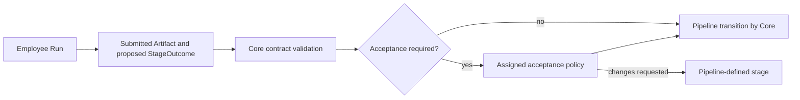
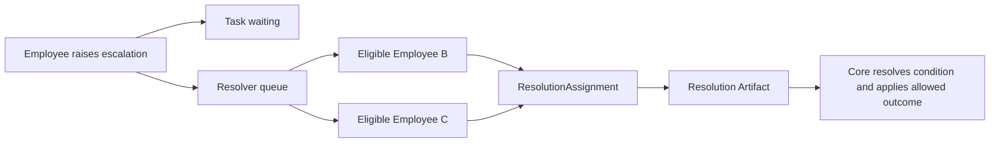

# Forge: абстракция Employee

**Статус:** Draft 0.1, обсуждается
**Дата:** 3 сентября 2026
**Область:** project-scoped исполнитель, его контекст, память, права и escalation.

## 1. Определение

`Employee` — устойчивая identity исполнителя внутри одного `Project`. Он не
равен LLM provider, model session, process или отдельному `Run`: один Employee
может выполнить много Run, временно сменить runtime и сохранить историю своей
работы.

Employee получает право действовать только в scope выданного `Run` и его Lease
либо ограниченного `ResolutionAssignment`. System Manager создаёт, включает,
выключает и retire Employee; Core назначает Run и применяет результаты. Human,
system actor или в будущем другой механизм может конфигурировать Employee, но
эта абстракция не предполагает, что им обязательно управляет LLM.

## 2. Состав Employee

| Группа | Поля и смысл |
|---|---|
| Identity | `employee_id`, `project_id`, stable name/key, creator и timestamps |
| Role | display role, специализация, разрешённые capabilities и eligibility для stages/resolver queues |
| Runtime profile | допустимые provider/runtime profiles, tool policy reference, resource limits; provider session не хранится в Employee как identity |
| Prompt profile | версии system policy и employee prompt, применяемые к новым Run |
| Memory policy | personal-memory namespace, правила чтения Project knowledge и публикации в неё |
| Scheduling | `enabled`, `disabled` или `retired`; weight/availability policy и допустимые concurrency limits |
| History | Run, submitted Artifacts, escalation/resolution history и immutable Events |

`enabled` означает eligibility для новых назначений. `disabled` временно
запрещает новые Run, но сохраняет identity и историю. `retired` окончательно
исключает Employee из scheduling и resolver queues; физическое удаление не
допускается, если есть история. `busy`, `idle`, `unreachable` и число активных
Run — операционные projections, а не lifecycle status Employee.

## 3. Контекст Run и prompts

Employee не получает один неразделённый prompt. Core собирает контекст Run из
слоёв с разным владельцем и назначением:

| Слой | Владелец | Содержание |
|---|---|---|
| System policy | Platform/Core | Непреодолимые правила безопасности, protocol и поведения runtime. Employee и project System Manager не меняют её в обычной работе. |
| Employee prompt | Project/System Manager | Кто этот Employee, его роль, инженерная специализация, рабочие правила и ограничения. |
| Run contract | Task + PipelineVersion + System Manager command | Task intent, DoD, stage, scope, optional immediate `TaskHandoff`, Artifacts, `TaskWorkSurface` и режим доступа к ней, текущая control-инструкция и разрешённые capabilities. |
| Retrieved memory | Memory service | Релевантные personal notes и разрешённые knowledge entries Project. |

При выдаче Run Core фиксирует версии prompt profile и execution-spec revision.
Правка employee prompt влияет на последующие Run, но не меняет уже исполняемую
работу без отдельной auditable control-команды.

## 4. Память и project knowledge

Личная память Employee хранится в Forge canonical store, но не является общим
доступом к его таблицам. Persistent `EmployeeMemoryEntry` создаёт Summarizer из
Run, Handoff, Artifacts и source-linked событий; Employee не записывает такую
память напрямую. Он может приложить к Task structured observation или
`lesson_candidate`, который останется attributed input до обработки Summarizer.

Memory service предоставляет scoped retrieval, а не raw storage access.
AgentMemory может быть его implementation adapter: Forge передаёт в него
projection entry с Employee scope, visibility, revision и source refs, затем
повторно проверяет эти поля в canonical store перед выдачей результата Run.

Project knowledge — отдельное общее пространство. Employee может читать board,
Task summaries и по необходимости запрашивать доступную информацию о другой
Task: lifecycle, stage, blockers, публичный progress, immediate TaskHandoff и
принятые Artifacts. Он
не получает чужие private notes, сырые transcripts Run, provider secrets и
закрытые черновики.

Employee может предложить knowledge entry только через Artifact/observation, но
не публикует persistent memory или authoritative knowledge сам. Human создаёт
или редактирует readable knowledge page явной командой; её revision и derived
ProjectKnowledgeEntry проходят тот же ingestion/index path. Поэтому человек и
Employee видят одну Project knowledge base в разных представлениях: UI читает
current canonical revision, а Run получает только scoped retrieval snapshot.
Authoritative Project knowledge получает только принятые Artifacts, Decisions
или entries, прошедшие назначенную acceptance policy. Summarizer может добавить
derived summary о наблюдённых фактах, в том числе о незавершённом исследовании;
такая запись помечается как derived, содержит ссылки на источники и не выдаётся
за принятое решение. Так личная память не становится неконтролируемым источником
фактов для всего Project.

## 5. Работа с Task и Artifact

Employee не записывает lifecycle Task, current stage, priority, PipelineVersion
или assignment. В активном Run он может:

- читать выданный scope и разрешённые project projections;
- выполнять разрешённые stage actions;
- записывать progress и submitted Artifacts;
- отправлять typed `StageOutcome`;
- запрашивать clarification, block или escalation;
- предложить новую Task, dependency или изменение, если это разрешает capability.

Core принимает `StageOutcome` только от holder активного Lease. Submitted
Artifact прикрепляется к Task, а отдельный `ArtifactAcceptance` record фиксирует
его пригодность для конкретного contract. Core проверяет только явно заданную
форму Artifact; PipelineVersion для каждого outcome решает, достаточно ли
submission или требуется отдельный acceptor. Если acceptance требуется,
Employee-автор не может принять Artifact единолично.

Даже reviewer Employee не переносит Task между колонками. Он создаёт review
Artifact и typed outcome; Core проверяет его authority и применяет transition,
описанный PipelineVersion.

## 6. Escalation и resolver queues

Employee может на любой разрешённой stage вызвать `raise_escalation`. Core
сохраняет `Escalation` с type, вопросом, evidence, impact, вариантами и
recommendation; создаёт wait condition `escalation_pending`; безопасно завершает
или останавливает Run; переводит Task в `waiting` с `resume_to = in_progress`.

Типы escalation включают `action_approval`, `clarification`,
`scope_or_policy_conflict`, `stale_or_invalid_task`, `technical_decision` и
`blocked`. Конкретный Project может иметь дополнительные categories, но Core
всегда хранит typed reason и route policy.

Employee не имеет прямой власти над другим Employee. Вместо этого Project
задаёт `EscalationRoute`: candidate resolver queue по типу escalation, роли,
Pipeline/stage или policy, а также обязательный human fallback. Один Employee
может состоять в нескольких resolver queues; этим реализуется операционная
иерархия без единственного начальника.

System Manager выдаёт один `ResolutionAssignment` подходящему свободному
resolver, пока его собственный ResolutionLease сереализует routing. Resolver
может отказаться; timeout или недоступность возвращают item в management queue,
расширяют route или направляют его Human. Изначальный Employee не держит процесс
«во сне»: его Run закончен, а Task и Artifacts сохраняют контекст до resolution.

Resolver Employee может authoritatively разрешить обычный технический вопрос
только в пределах своей resolver-role и outcome keys, выданных в Assignment. Для
destructive approval и `cancel_task` по умолчанию нужен Human либо actor с явно
делегированной management capability. Resolution может продолжить текущую stage,
запросить management change или передать escalation дальше, но не выбирает
произвольную stage. Отмена Task остаётся отдельной командой с обязательным
`cancellation_reason_id`.

## 7. Взаимодействие с System Manager

System Manager может направить Employee control message, запросить soft stop,
force-stop его Run, выключить или retire Employee. Эти команды не позволяют
Manager подменить outcome Run или объявить Task успешной.

Employee может сообщить System Manager о проблеме и поднять escalation. Он не
может сам создать себе Lease, назначить другого Employee, изменить очередь,
переключить Pipeline или остановить чужой Run. Resolver role также не даёт
таких полномочий: она разрешает только принять выданный ResolutionAssignment и
отправить допустимый resolution outcome.

## 8. Неподвижные правила

1. Employee принадлежит ровно одному Project и не равен конкретному provider
   session или Run.
2. Core выдаёт Run/Lease или System Manager выдаёт ResolutionAssignment;
   Employee не создаёт себе scope сам.
3. Права в Run — пересечение capabilities Employee, stage contract и выданного
   scope.
4. Employee не меняет lifecycle/stage Task напрямую.
5. Автор Artifact не принимает его единолично, если Artifact влияет на путь
   Pipeline или terminal result.
6. Личная память изолирована; общая knowledge base содержит только принятые
   знания согласно policy.
7. Read-only project visibility не даёт доступа к чужим private notes,
   transcripts или secrets.
8. Employee не управляет другим Employee напрямую; resolver queues выдают
   ограниченный ResolutionAssignment.
9. Escalation останавливает текущую работу безопасно и переводит Task в
   `waiting`; её resolution проходит Core и Pipeline rules.
