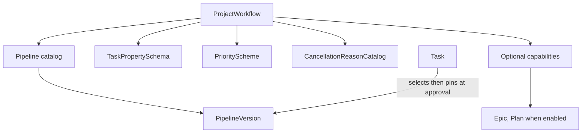
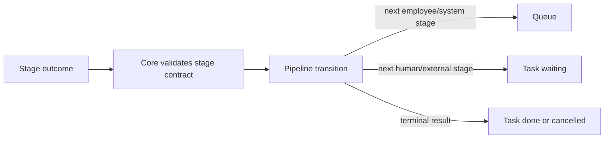

# Forge: абстракция Pipeline

**Статус:** Draft 0.2, обсуждается
**Дата:** 3 сентября 2026
**Область:** Pipeline, его версии, stages и связь с Task lifecycle.

## 1. Определение

`Pipeline` — именованный шаблон исполнимого пути Task. Он задаёт stages,
допустимые outcomes, переходы и terminal conditions. Pipeline не задаёт
инженерный смысл Task, не владеет её lifecycle и не является доской.

Pipeline отвечает на вопрос: «какие действия и результаты требуются, чтобы
выполнить эту Task?» Например, один delivery pipeline проходит `work →
verification → review → integration`, другой — `work → deploy`, а analysis
pipeline — `investigation → synthesis → verdict`.

Core не содержит фиксированного списка stages. `grooming`, `work`, `test`,
`review`, `integration` и `deploy` — имена, определённые PipelineVersion.
`deploy` ничем не отличается от другой stage на уровне модели: у него просто
другой executor contract, capabilities и outcome.

## 2. Граница Pipeline и ProjectWorkflow

`ProjectWorkflow` объединяет проектную конфигурацию. В него входят Pipeline
catalog, `TaskPropertySchema`, `PriorityScheme`, `CancellationReasonCatalog`,
board mappings и optional planning capabilities проекта, например `Epic` или
`Plan`.

`Epic` и `Plan` не являются Pipeline stages. Project может не включать их
вовсе. Если capability включена, stage может читать или создавать допустимые
связи с её объектами, но Pipeline не меняет их собственную доменную модель.
`Issue` также не является отдельной aggregate Core: входящий report моделируется
как Task с выбранными Pipeline и project-defined properties.



## 3. Pipeline и PipelineVersion

`Pipeline` имеет стабильную identity и human-readable name, например
`delivery-standard` или `analysis`. Это каталог версий, а не mutable граф. Его
собственные изменяемые указатели — current `default_version_id` для новых Task и
soft-deletion marker (`deleted_at`); оба изменения аудируются.

`PipelineVersion` фиксирует полный граф. Она создаётся только уже валидной и
сразу immutable: у неё нет mutable draft-state, её нельзя редактировать и нельзя
удалить. Исправление или изменение процесса означает создание следующей
`PipelineVersion` в том же Pipeline.

`PipelineVersion` содержит:

- `pipeline_id`, version number и author/time создания;
- applicability: поддерживаемый `TaskKind` и optional property predicates;
- один entry stage;
- definitions stages и transitions;
- terminal conditions;
- default board presentation stages;
- retry, timeout и resource rules для stages;
- required capabilities и outcome contracts.

При `create_task` Core выбирает current `default_version_id` указанного Pipeline
по TaskKind и properties либо получает версию явно. Эта версия сохраняется как
target version draft; при `approve_task` Core закрепляет её в Task execution
revision. После смены `default_version_id` новые Task с этим Pipeline получают
новую версию, а уже существующие Task не меняются.

Новый независимый Pipeline создаётся, когда нужен отдельный именованный путь и
его требуется явно назначать Task. Новый PipelineVersion создаётся, когда
сохраняется identity Pipeline, но меняется его граф: после назначения её default
версией она будет выбрана для новых Task этого Pipeline.

## 4. Stage

`Stage` — один шаг Pipeline, а не status Task и не тип Task. Stage может быть
исполнен человеком, Employee, deterministic system action или внешней
интеграцией.

| Поле stage | Смысл |
|---|---|
| `stage_id`, display name | Стабильная identity и понятное имя, например `review` |
| `executor_kind` | `human`, `employee`, `system` или `external` |
| `stage_contract` | Цель шага, доступный scope и ожидаемый structured outcome |
| `artifact_requirements_by_outcome` | Для каждого outcome: нужные виды Artifact, cardinality и механические требования к typed properties |
| `acceptance_policy` | Достаточен ли submitted Artifact или нужен отдельный machine, independent Employee либо human acceptance |
| `capabilities` | Разрешённые действия в пределах stage |
| `resources`, timeout, retry | Default `ResourceProfile`, timeout и правила нормального stage retry; итоговый Run budget ограничен Project ceiling |
| `board_presentation` | Default column/name для projection Pipeline |

Stage не меняет Task напрямую. Executor возвращает typed outcome; Core проверяет
contract и применяет разрешённый transition. Pipeline retry rule применим к
явному stage failure outcome. Он не даёт молчаливо повторить потерянный или
force-stopped Run, если тот мог уже сделать side effect: этот случай требует
явного management resume/reassign.

У Stage нет глобального правила вроде «каждая work stage требует MR». Для каждого
outcome PipelineVersion задаёт собственные `ArtifactRequirement`: например,
`work_completed` требует непустой change summary, MR reference опционален, а
`cancelled` не требует delivery Artifact. Core проверяет только declared форму:
существование Artifact, тип, cardinality и тип/непустоту указанных properties.
Он не проверяет качество плана, действительность ссылки или правдивость отчёта.
Невозможность предоставить required Artifact должна иметь разрешённый outcome
или escalation route, а не неявное исключение.

Если outcome требует acceptance, его policy указывает, кто её даёт и должен ли
acceptor быть независим от автора. Если policy допускает submission без отдельной
acceptance, это явное решение Pipeline. Следующая review/test stage может
оценивать качество Artifact, но Core никогда не подменяет такую оценку.

Когда entry point или transition приводит в stage с `executor_kind = human` или `external`, Core
создаёт `TaskWaitCondition` и переводит Task в `waiting`. Полученный outcome
такого stage проходит ту же валидацию и тот же граф переходов, что outcome
Employee. Поэтому Pipeline, а не Core, задаёт: approval ведёт к следующему
stage, `done`, `cancelled` или возврату на доработку. Если transition имеет
terminal result `cancelled`, outcome contract обязан потребовать валидный
`cancellation_reason_id` из каталога Project.

`grooming` может быть первой manual или Employee stage. Тогда Task в `ready`
готова не обязательно к implementation, а к entry stage своего Pipeline.

## 5. Transition

`Transition` связывает stage с возможным следующим шагом. Он содержит:

- исходный `stage_id`;
- outcome key, например `accepted`, `failed`, `changes_requested` или
  `decision_required` или `needs_management_change`;
- optional guards: Task properties, наличие Artifact, policy condition;
- следующий stage либо terminal result;
- эффект: enqueue следующую stage, перевести Task в `waiting` или завершить её.

Pipeline определяет только переход stages. Core применяет lifecycle переходы:
после первого начатого stage Task становится `in_progress`; при blocker она
становится `waiting`; после terminal success contract — `done`, а после terminal
cancellation contract — `cancelled`.

Escalation не обходит граф. Paused stage объявляет те же outcome keys, которые
доступны её resolver: например `continue`, `needs_management_change` или иной
явный route. Core отклоняет resolution, пытающуюся перейти в stage без такого
transition. `needs_management_change` сохраняет Task в `waiting`, пока System
Manager не выполнит отдельную допустимую команду.

Перед началом stage Core также проверяет применимые `TaskDependency` gates.
Dependency не является transition Pipeline: она только запрещает начать
конкретный stage, пока не выполнено её условие.



## 6. Lifecycle и board mapping

Pipeline stages и Task lifecycle отображаются вместе, но не смешиваются.

| Predicate | Default board presentation |
|---|---|
| `lifecycle = draft` | Draft |
| `lifecycle = waiting` | Waiting с active wait conditions |
| `lifecycle = done` | Done |
| `lifecycle = cancelled` | Cancelled |
| `lifecycle = ready` или `in_progress` | Column текущего Pipeline stage |

PipelineVersion задаёт default presentation каждой stage. Позднее отдельный
BoardView может переопределить эти колонки, не меняя runtime semantics.

## 7. Версионирование и migration

Автор создаёт новую полную PipelineVersion вместо изменения старой. Core
валидирует её при создании. System Manager отдельной командой может сделать
созданную версию `default_version_id` Pipeline для новых Task; сам граф версии
при этом не меняется.

Удаление Pipeline всегда мягкое: Core выставляет `deleted_at` и запрещает
назначать такой Pipeline новым Task. PipelineVersion не удаляется никогда.
Существующие Task сохраняют pinned version и продолжают или завершаются по
обычным правилам lifecycle. Каждая новая Task должна быть явно связана с
действующим Pipeline.

Активная Task остаётся на закреплённой версии. Migration выполняется только
отдельной командой, которая указывает mapping текущего old stage на stage новой
версии, проверяет compatibility outcome contract и фиксирует audit event. Если
mapping невозможен, Task остаётся на старой версии или переходит в `waiting`.

Core отклоняет PipelineVersion без entry stage, с недостижимыми stages, без
terminal route, с неописанными outcomes или с retry cycles без ограничений.
Для циклического графа автор обязан указать immutable `max_stage_visits`:
это общий для одной Task предел входов в stage (счётчик `StageVisit`), а не
неявная попытка конкретного executor. Когда следующий вход превысил предел,
Core переводит Task в `waiting` с `retry_exhausted`. В M0 это не обычная
пауза: `resume` её не снимает, потому что тот же переход всё равно нарушил бы
immutable лимит. Разрешённый выход — manager cancellation; явная migration на
новую PipelineVersion или auditируемое budget override появятся отдельными
командами позднее.

## 8. Примеры

```text
delivery-standard
  work --accepted--> verification --passed--> review --approved--> integration
  verification --failed--> work
  review --changes_requested--> work

delivery-fast
  work --accepted--> deploy

analysis
  investigation --complete--> synthesis --complete--> external_decision
  external_decision --approved--> done
  external_decision --revise--> investigation
  external_decision --rejected--> cancelled
```

Эти три Pipeline могут существовать в одном Project. `TaskKind` и properties
помогают выбрать default, но Task всегда хранит явную закреплённую версию.

## 9. Неподвижные правила

1. Только Core применяет stage transition и lifecycle transition.
2. PipelineVersion не меняется и не удаляется после создания.
3. Pipeline не добавляет Core `TaskKind` и не переписывает его. Имена вроде
   `report`, `issue` или `bug` могут быть project property или presentation, но
   не создают новую сущность Core.
4. Stage name не является lifecycle status.
5. Executor может сообщить outcome, но не выбрать произвольный следующий stage.
6. Optional planning objects, включая Epic/Plan, не становятся обязательными из-за
   существования Pipeline.
7. Core записывает actor, reason и PipelineVersion для каждого transition.
