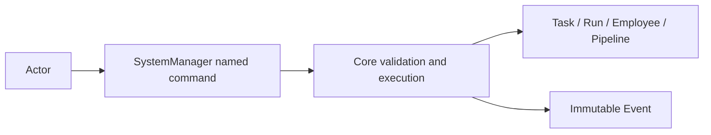
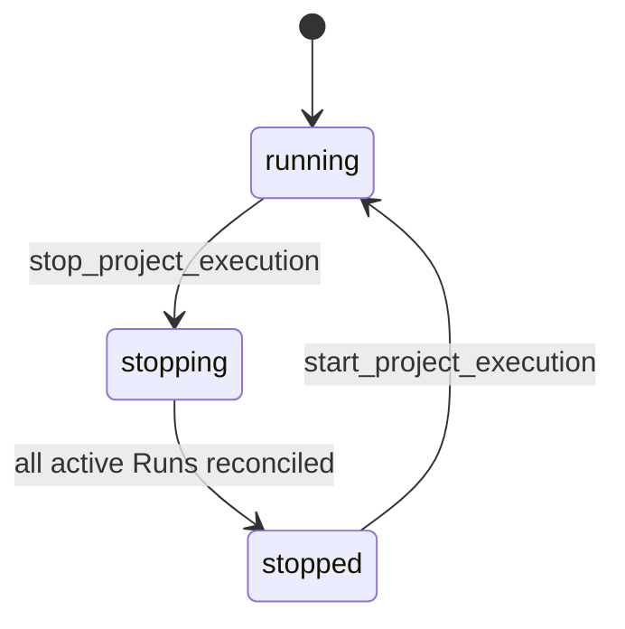
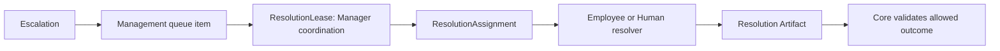

# Forge: абстракция System Manager

**Статус:** Draft 0.1, обсуждается
**Дата:** 3 сентября 2026
**Область:** project-scoped управление Task, Employee, Pipeline и исполнением.

## 1. Определение

`SystemManager` — project-scoped доменный сервис с набором именованных
management commands. Он управляет работой в границах одного `Project`: может
вовремя остановить её, изменить план, настроить исполнителей или возобновить
диспетчеризацию.

SystemManager не является Employee, не владеет Task и не применяет изменения
напрямую. Human, детерминированный system actor или в будущем LLM может вызвать
его команду, но это не меняет её семантику. Core проверяет capability actor,
текущий lifecycle, PipelineVersion, активные Lease и доменные инварианты, затем
создаёт immutable Event и применяет разрешённое изменение.

## 2. Граница полномочий

SystemManager может выполнять любое разрешённое management-действие Project, но
не имеет универсального метода произвольно переписать объект. Каждая операция
существует как именованная команда с typed input, preconditions и audit reason.
Новая возможность появляется через новую доменную команду, а не через
`apply_management_action(payload)`.

| Область | Примеры команд SystemManager |
|---|---|
| Task | `create_task`, `amend_draft`, `approve_task`, `pause_task`, `resume_task`, `schedule_task_resume`, `set_next_run_employee`, `cancel_task`, `archive_task`, change priority, создать новую execution revision по разрешённой правке |
| Dependencies | `create_dependency`, `change_dependency`, `remove_dependency` |
| Pipeline и правила Project | создать Pipeline, создать immutable PipelineVersion, сменить `default_version_id`, мягко удалить Pipeline, изменить schema properties, priority scheme или cancellation-reason catalog |
| Employee | создать, включить, выключить, retire Employee; изменить policy/capabilities в разрешённых границах |
| Run | передать control message, запросить мягкую остановку, принудительно остановить Run, запросить/принять `RunRecoveryAssessment`, запустить recovery/reconciliation |
| Очередь и исполнение | hold/resume dispatch, изменить допустимую policy очереди, отложить `resume_task` до заданного времени, направить следующую attempt конкретному eligible Employee, остановить или запустить исполнение Project, маршрутизировать escalation |

Команда может иметь более строгую capability, чем общая management capability.
Например, actor, имеющий право создать Task, не обязательно вправе force-stop
чужой Run или изменить Pipeline catalog.

## 3. Управление Run и Employee

Остановка инженерной работы и изменение Task lifecycle — разные операции.
SystemManager сначала управляет Run или Employee, а Core затем фиксирует
результат этой операции в Task по правилам Pipeline и recovery.

| Команда | Результат |
|---|---|
| `send_control_message` | Доставляет исполнителю ограниченное control-сообщение в scope его активного Run. Команда не гарантирует остановку и не меняет lifecycle сама по себе. |
| `request_stop_run` | Просит Run дойти до безопасного checkpoint, приложить доступное evidence и прекратиться. После подтверждённой остановки Core создаёт для Task wait condition и по умолчанию переводит её в `waiting`. |
| `force_stop_run` | Отзывает Lease и останавливает процесс/внешнюю execution session. Core отмечает Run interrupted, выполняет reconciliation и переводит незавершённую Task в `waiting` с причиной остановки; Task не становится `cancelled` автоматически. |
| `accept_run_recovery_assessment` | Принимает evidence-backed candidate assessment прерванного Run и выбирает разрешённый recovery action: re-execute, resume, reassign или оставить Task waiting. |
| `retire_employee` | Исключает Employee из будущего scheduling. Для его активных Run Manager явно выбирает policy: завершить, мягко остановить или force-stop. История Employee и Run сохраняется. |

Для остановленной уже начатой Task Core сохраняет `resume_to = in_progress`.
Возобновление Task требует отдельной допустимой команды `resume_task`; запуск
Project сам по себе не обязан автоматически продолжать её старую работу.

Если provider недоступен, Run потерян или исчерпан его budget после возможного
side effect, Manager не ждёт автоматического retry. Он может оставить Task в
`waiting`, вызвать `schedule_task_resume` с заданным временем или зафиксировать
`set_next_run_employee` для другого eligible Employee перед `resume_task`.
Это именованные аудируемые действия; Task по-прежнему принадлежит Project, а не
назначенному Employee.

`schedule_task_resume` создаёт immutable scheduled command с `not_before` и
reason; до срока он не снимает wait condition. В срок Core пытается выполнить
обычный `resume_task` от имени schedule и заново проверяет все active conditions,
Project execution gate и текущую revision. Если любая precondition не выполнена,
Task остаётся `waiting`, а scheduled command получает outcome и при необходимости
создаёт management queue item.

`set_next_run_employee` создаёт одноразовый dispatch constraint, а не меняет
владельца Task. Core проверяет Project boundary и stage eligibility при создании
и повторяет проверку при выдаче Lease. Constraint расходуется только после
выдачи следующего Lease этому Employee; он снимается при terminal Task, смене
execution revision/current stage, явной отмене или недоступности Employee. Core
не заменяет указанного Employee молча: в последнем случае Task остаётся в
`waiting` или возвращается в management queue по policy.

System evaluator может только подготовить `RunRecoveryAssessment`; он не
перезапускает Run и не утверждает отсутствие работы. Manager/human принимает
assessment с evidence и reason. `not_started_confirmed` разрешает re-execution;
`partial_work_observed`, `external_effect_possible` и `unknown` требуют явного
resume, reassign, cancellation или сохранения Task в `waiting`.

## 4. Project execution gate и очередь

Project хранит `execution_state`: `running`, `stopping` или `stopped`.
`stop_project_execution` прежде всего ставит атомарный execution gate. С момента
его фиксации Core не выдаёт новые Lease, не начинает stages, не запускает retry
и не продолжает автоматический dispatch. Уже существующие QueueEntry могут
оставаться в очереди, но не исполняются.

Execution gate также останавливает выдачу новых `ResolutionAssignment` и запуск
`SummarizationJob`. Core продолжает audit, recovery/reconciliation и чтение
canonical истории, чтобы корректно завершить stop и показать наблюдателю её
реальное состояние. После `start_project_execution` отложенные management и
summarization jobs снова допускаются policy очереди.

После закрытия gate Manager задаёт policy активных Run. Для рубильника «стоп
работа» default policy — `force_stop`: Core отзывает Lease, останавливает active
Run и выполняет reconciliation. Пока эта операция завершается, Project находится
в `stopping`; когда активных Run не остаётся — в `stopped`. Soft stop возможен
только как явно выбранная policy и разрешает Run закончить ближайший checkpoint.

`ready`-Task не переводятся массово в `waiting`: они остаются готовы к своей
entry stage, но gate не допускает их в execution. Task, которую остановил
активный Run, получает собственную wait condition и `waiting`. Это отделяет
проектную паузу от индивидуального блокера и не создаёт массовых lifecycle
events при stop/start.

### 4.1. Management queue для escalation

Каждая `Escalation` создаёт management queue item. `ResolutionLease` относится к
System Manager coordination layer, а не к Employee: он сереализует routing и
закрытие одного escalation, не давая двум manager process одновременно назначить
разных resolvers или применить разные outcomes.

Получив ResolutionLease, Manager выбирает `EscalationRoute`, создаёт ограниченный
`ResolutionAssignment` подходящему Employee либо Human и отслеживает deadline.
Assignment даёт только read-only context escalation/Task и право отправить
Resolution Artifact; он не даёт управление Task, чужими Run или очередью. При
decline, timeout или недоступности Manager снимает assignment и продолжает
маршрутизацию по queue policy, вплоть до human fallback.

Assignment содержит список outcome keys paused stage. Resolver выбирает только
из него; он не может потребовать произвольный переход Task. Если выбран
`needs_management_change`, Task остаётся `waiting` до отдельной именованной
команды Manager.

ResolutionLease не меняет lifecycle Task и не является правом выполнить stage.
Когда resolver возвращает Artifact, Core снимает соответствующую wait condition
либо сохраняет Task в `waiting`, если route требует следующего resolver или
явной management-команды.

## 5. Ограничения SystemManager

SystemManager не может:

1. напрямую записать status, stage, PipelineVersion или другие поля Task;
2. перевести Task в lifecycle/stage, который не разрешают Core и Pipeline;
3. обойти pinned PipelineVersion, dependency gate, DoD, approval или
   обязательный `cancellation_reason_id`;
4. выдать себе Lease, подменить Artifact/outcome Run или объявить Task `done`
   без terminal contract;
5. физически удалить Employee, PipelineVersion, Task history или audit Events;
6. выходить за границы Project либо раскрывать provider secrets исполнителям.

Даже force-stop не является обходом Core: он останавливает исполнение, а Core
всё равно определяет, какие Lease отозвать, как записать interrupted Run и куда
может перейти Task.

## 6. Неподвижные правила

1. SystemManager работает в границах ровно одного Project.
2. Он использует только именованные команды с typed input и audit trail.
3. Core остаётся единственным writer lifecycle, Pipeline transitions и
   execution revisions.
4. Остановка Run/Employee не равна отмене Task.
5. Execution gate запрещает новое и автоматическое исполнение до явного
   `start_project_execution`.
6. `ready` Task остаётся `ready` во время project-wide stop; остановленная
   active Task переходит в `waiting`.
7. Retire и soft delete сохраняют историю и ссылки существующих объектов.
