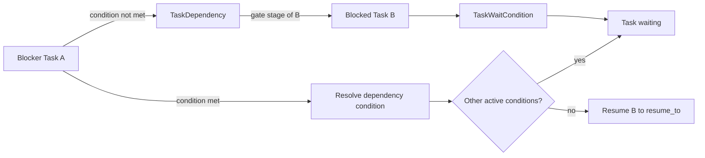

# Forge: зависимости между Task

**Статус:** Draft 0.1, обсуждается
**Дата:** 3 сентября 2026
**Область:** TaskDependency, блокировка stages и связь с Task lifecycle.

## 1. Определение

`TaskDependency` — отдельная направленная связь между двумя Task одного
`Project`. Она выражает правило:

> Blocked Task не может начать указанный stage, пока Blocker Task не выполнит
> монотонное условие.

```text
Task A ──blocks──▶ Task B
```

Запись хранится один раз. Core строит из неё две проекции: у A — `blocks`, у B —
`blocked_by`. Task не содержит самостоятельно редактируемые массивы зависимостей;
иначе две стороны связи могут рассинхронизироваться.

Dependency не заменяет pipeline. Review и verification обычно являются stages
одной Task, а не отдельными TaskDependency. Связь появляется, когда две
самостоятельные инженерные работы имеют порядок или явный информационный gate.

## 2. Состав TaskDependency

| Поле | Смысл |
|---|---|
| `dependency_id`, `project_id` | Stable identity и project boundary |
| `blocker_task_id` | Task A, которая должна удовлетворить условие |
| `blocked_task_id` | Task B, которую нельзя пропустить через gate |
| `gate_stage_id` | Stage B, перед которой проверяется зависимость; по умолчанию entry stage |
| `required_condition` | Монотонное условие на Task A |
| `created_by`, `reason`, timestamps | Audit и объяснение связи |
| `state` | `active`, `satisfied`, `unsatisfiable` или `removed` |

`gate_stage_id` позволяет B пройти ранние stages, например `grooming`, пока A
ещё работает. Когда B доходит до указанного stage, Core проверяет dependency.

## 3. Допустимые условия

Core разрешает только условия, которые после выполнения не могут «отмениться»:

| Condition | Выполнено, когда |
|---|---|
| `task_done` | Blocker Task имеет lifecycle `done` |
| `stage_outcome` | Указанный stage закреплённой PipelineVersion Blocker Task завершён требуемым successful outcome |
| `artifact_accepted` | Указанный Artifact создан и принят согласно своему contract |

Нельзя создавать dependency на временное состояние: `in_progress`, `queued`,
`running`, «находится в review» или произвольную board column. Такие факты не
доказывают, что Blocked Task безопасно продолжать, и могут исчезнуть после retry.

Первая реализация Core поддерживает `task_done`. Поля `required_condition` и
`gate_stage_id` закладываются сразу, чтобы позднее добавить stage/artifact gates
без изменения модели данных.

## 4. Влияние на lifecycle

Когда Scheduler пытается начать gate stage B и находит невыполненную active
dependency, Core создаёт для B `TaskWaitCondition` с ссылкой на dependency.
Если это первая active condition, Task переходит в `waiting` и сохраняет
`resume_to: ready | in_progress`.



Если A завершилась, Core помечает `TaskDependency` как `satisfied` и снимает
только связанное condition B. B остаётся `waiting`, пока есть другие dependency,
manual pause, decision request или иной active blocker.

Отмена A не удовлетворяет `task_done`. Core помечает связь `unsatisfiable`, а B
остаётся в `waiting` с объяснением `blocker_cancelled`, пока уполномоченный actor
не удалит или не изменит dependency.

## 5. Правила создания и изменения

System Manager или human actor с management capability создаёт, меняет и удаляет
dependency. Employee может предложить её с evidence, но не применяет сам.

Core при создании проверяет:

1. обе Task принадлежат одному Project;
2. blocker и blocked не совпадают;
3. нет duplicate active edge с тем же gate и condition;
4. новый hard-block edge не образует cycle;
5. referenced stage/outcome/artifact существует в закреплённом contract.

Граф hard dependencies остаётся ацикличным. Core отклоняет `A → B`, если уже
существует путь `B → … → A`. Cross-project dependencies, OR-conditions и
автоматическое создание dependency выходят за первую версию.

## 6. Примеры

```text
Architecture Task A ──task_done──▶ Implementation stage of Task B

Analysis Task A ──artifact_accepted: Decision──▶ Deploy stage of Task B

Task A cancelled ──task_done──▶ Task B
  => condition is unsatisfiable; Task B remains waiting
```

Dependency задаёт только gate. Она не переводит B на следующий Pipeline stage и
не завершает её: после снятия condition Core возвращает B в `resume_to`, затем
обычный Pipeline продолжает работу.

## 7. Неподвижные правила

1. Одна dependency хранится один раз и навигируется в обе стороны.
2. Только монотонные conditions могут разблокировать Task.
3. Core не допускает self-dependency и cycles hard-block graph.
4. `done` Blocker Task удовлетворяет `task_done`; `cancelled` — нет.
5. Несколько active blockers соединяются логическим AND.
6. Dependency не создаёт новую Task и не заменяет stage Pipeline.
7. Каждое изменение dependency имеет actor, reason и immutable Event.
