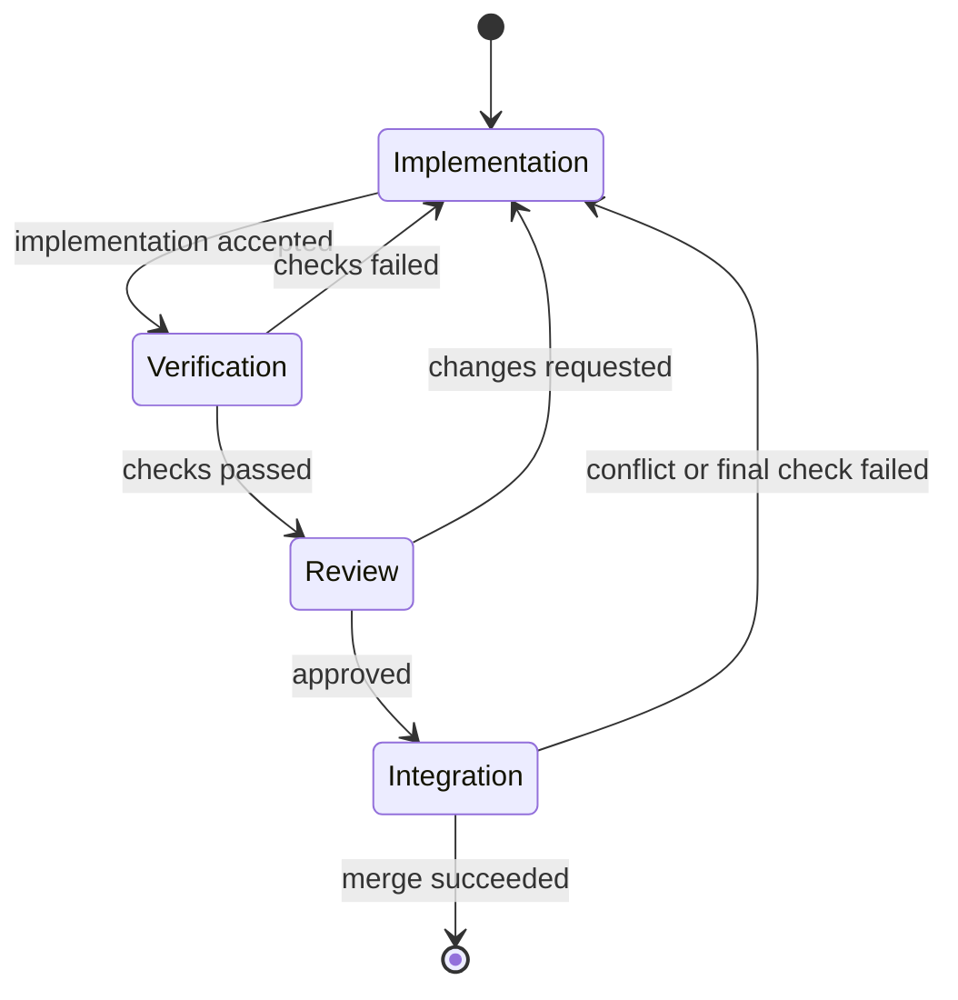
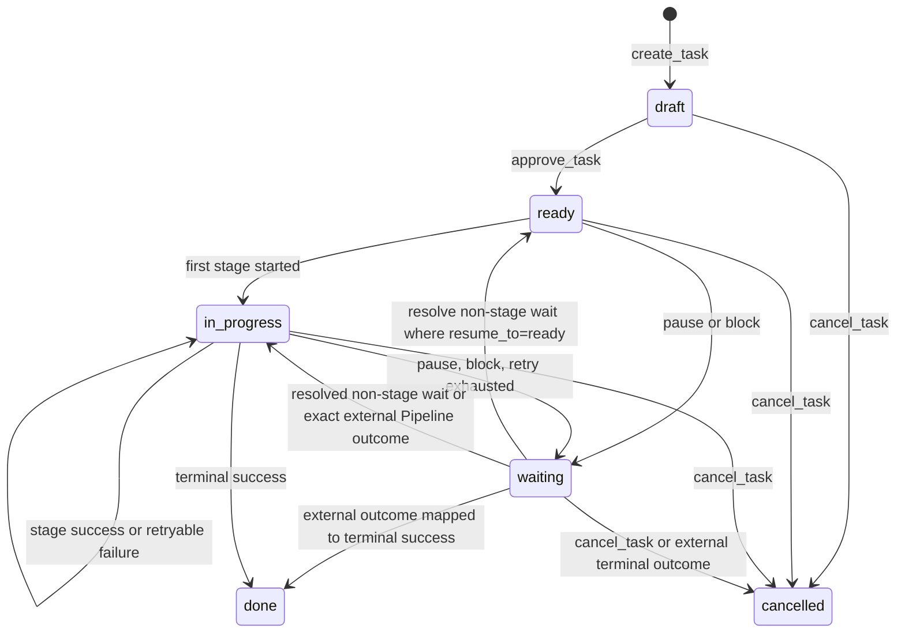

# Forge: абстракция Task

**Статус:** Draft 0.8, обсуждается
**Дата:** 3 сентября 2026
**Область:** доменная абстракция `Task`.

## 1. Определение

`Task` — долговечный контракт на ограниченную инженерную работу в одном `Project`.
Она отвечает на пять вопросов:

1. **Зачем** нужна работа и какой результат считается готовым?
2. **Какого рода** это работа (`TaskKind`) и какие project properties к ней относятся?
3. **Где** она находится в согласованном pipeline?
4. **Что уже произошло**: попытки, результаты и принятые решения?
5. **Можно ли** ей сейчас двигаться автоматически?

Task сохраняет одну identity от создания до terminal результата. Повторная
реализация, неудачная проверка, review comments, смена Employee, crash процесса
или merge conflict создают новую попытку либо Artifact, но не новую Task.

В PRD v0.1 используется имя `WorkItem`. В рамках Core эти два термина пока
синонимичны; этот документ использует `Task` как более короткое рабочее имя.

### 1.1. Чем Task не является

Task не является процессом, отдельной попыткой, очередью, Git worktree,
provider-сессией или логом. Эти объекты могут быть связаны с Task,
но имеют самостоятельный жизненный цикл.

Task также не принадлежит Employee. Она принадлежит `Project`; Employee получает
только ограниченное право выполнить конкретную попытку Task.

Входящий report может стать `analysis`-Task с project-defined property, например
`intake_type = report`. Project сам выбирает, нужны ли ему такие свойства и
какой Pipeline обработает Task.

## 2. Тип, properties и outcome Task

У Task есть обязательный `TaskKind`, project-defined typed properties и
конкретный outcome contract. Эти измерения отвечают на разные вопросы:

- `TaskKind` — какую работу требуется выполнить;
- properties — какие предметные и проектные характеристики есть у этой работы;
- outcome contract — какое доказательство завершения обязательно именно здесь.

### 2.1. TaskKind

В первой версии `TaskKind` — закрытый enum из двух значений:

| Kind | Смысл | Terminal result |
|---|---|---|
| `delivery` | Внести целенаправленное изменение в проект | ChangeSet и выполненный DoD; при соответствующем pipeline — Integration и final SHA |
| `analysis` | Получить проверенное знание о проекте, проблеме или вариантах действия | `AnalysisResult`, соответствующий DoD и acceptance policy закреплённого Pipeline |

`delivery` — точное имя для «прямой работы»: изменение кода, конфигурации,
документации, тестов или иной части проекта. Обычно оно использует workspace,
но конкретные требования определяет PipelineVersion.

`analysis` покрывает и исследование, и подготовку решения. Работа вида «сравнить
варианты миграции и рекомендовать лучший» — это `analysis`: её немедленный
результат не выбор сам по себе, а проверенная информация, варианты и
recommendation.

### 2.2. AnalysisResult и Decision

Успешная `analysis`-Task всегда оставляет outcome Artifact. Технические логи не
обязательны, но verdict без зафиксированного результата невозможен.

| Тип `AnalysisResult` | Когда применяется | Минимальное содержание |
|---|---|---|
| `diagnosis_verdict` | Triage или исследование report/проблемы | Что проверено, что не доказано, verdict и recommendation |
| `research_report` | Сравнение вариантов, investigation или exploration | Evidence, варианты, выводы, recommendation и ограничения |
| `decision_proposal` | Выбор требует authority | Варианты, риски, recommendation и ссылка на evidence |

`Decision` — отдельный authoritative Artifact, а не `TaskKind` и не
автоматический вывод Employee. Он появляется только после явного outcome human
или другого actor с соответствующей capability. Любой Pipeline может перевести
Task в human/external stage, ожидающий Decision. PipelineVersion задаёт, какой
outcome после этого ведёт к следующему stage, `done`, `cancelled` или возврату к
предыдущей работе. Если DoD analysis-Task требует только исследование и
recommendation, Task завершается с `research_report` без Decision.

«Обсуждение» не является TaskKind: обычный разговор не имеет bounded DoD и не
создаёт lifecycle-объект. Он может закончиться созданием `analysis`-Task или
принятым `Decision`, но это отдельные явные действия.

### 2.3. Project-defined typed properties

Проект сам определяет набор свойств Task через `TaskPropertySchema`. Core знает
типы свойств и правила их валидации, но не встраивает в себя понятия конкретного
проекта вроде «риск миграции», «компонент платежей» или «оценка в story points».

Каждое определение свойства содержит stable key, display name, type, optional
default, requiredness и область применения. Минимальные типы: `boolean`,
`text`, `number`, `date`, `enum`, `multi_enum` и typed reference на другой
объект Forge. Project может также иметь свободные labels для поиска, не создавая
для них schema definition.

Примеры определений:

| Key | Type | Обязательность | Возможное назначение |
|---|---|---|---|
| `contains_migrations` | `boolean` | Нет | Маркирует изменение схемы/данных |
| `risk_level` | `enum` | Нет | Отсутствует в проектах, которым риск не нужен |
| `intake_type` | `enum` | Нет | Например: report, incident или иной входящий тип Project |
| `due_date` | `date` | Нет | Дедлайн, если конкретный Project с ним работает |
| `effort_estimate` | `number` | Нет | Локальная оценка: часы, points или иная шкала проекта |
| `work_areas` | `multi_enum` | Нет | Например: test, documentation, infrastructure |

Свойство может быть только informational или быть явным input для Project
Policy/Pipeline selection. Например, policy может требовать дополнительный
Artifact при `contains_migrations = true`; она не даёт свойству права менять
статусы или создавать произвольные transitions. Pipeline, выбранный по property,
всё равно явно закрепляется в Task revision.

В `draft` properties редактируются свободно. После `ready` изменение свойства,
которое влияет на DoD, Pipeline или Policy, создаёт новую execution-spec revision
и требует revalidation. Чисто informational property может меняться отдельной
аудируемой командой без перезапуска pipeline.

### 2.4. PriorityScheme

Priority — не free-form property, потому что scheduler должен сравнивать Task
детерминированно. Но набор уровней полностью принадлежит Project через
`PriorityScheme`:

```text
неважно      level_id=low       rank=10
важно        level_id=normal    rank=50
очень важно  level_id=critical  rank=100
```

Проект может иметь один, три, пять, десять или иное число уровней. Task хранит
stable `priority_level_id`, а scheduler использует текущий rank уровня вместе с
age/fairness policy. Новый Task получает default level проекта; изменение уровня
Task и изменение схемы имеют audit trail. Уровень с существующими Task нельзя
удалить, пока они явно не переназначены либо уровень не помечен retired.

### 2.5. CancellationReasonCatalog

Отмена всегда имеет обязательный `cancellation_reason_id` из project-defined
`CancellationReasonCatalog`; минимально каталог содержит stable reason
`unspecified`. Сам reason — не закрытый enum Core: Project может со временем
пополнять свой каталог, не меняя уже записанные отмены и не теряя фильтрацию по
старым причинам. Свободный текст `cancellation_note` опционален.

`analysis`-Task «проверить report» и `delivery`-Task «исправить подтверждённый
defect» не являются retries друг друга: у них разные DoD и terminal results.
Поэтому подтверждённый diagnosis может стать явным основанием создать связанную
delivery-Task, не нарушая инвариант одной Task на одну инженерную работу.

TaskKind выбирается в `draft`, задаёт default outcome contract и может предложить
default Pipeline. При создании Task Core выбирает current version выбранного
Pipeline и сохраняет её как target version draft. При `approve_task` эта версия
закрепляется в execution-spec revision. Смена default версии позднее не меняет
уже созданные Task, включая draft. Смена Kind или Pipeline после `ready` требует
новой execution revision и обычно новой связанной Task.

## 3. Состав Task

Ниже приведён доменный контракт, а не структура таблицы или API payload.

| Группа | Поля и смысл |
|---|---|
| Identity | `task_id`, `project_id`, stable human-readable key, creator, time создания |
| Intent | title, description, why, Definition of Done, ограничения и границы scope |
| Classification | обязательный `task_kind`, typed property values, optional labels, source (`human`, `external_report`, promoted finding, approved plan) |
| Outcome contract | required artifact kinds, правила terminal success, acceptance evidence |
| Planning | `priority_level_id`, optional Goal/Epic references, assignment/reviewer policy |
| Flow | lifecycle status, выбранные `pipeline_id` и `pipeline_version`, current stage, active wait conditions |
| Revision | immutable execution-spec revision, с которой связаны запущенные попытки |
| Work surface | optional `TaskWorkSurface` reference, его backend, initial base SHA и final SHA при наличии Integration |
| History | упорядоченная лента прикреплённых Artifacts, attempts/Runs, Findings, Decisions и immutable Events |
| Terminal data | completion data либо обязательный `cancellation_reason_id`, optional note, actor и time |

`TaskSpec` — это title, описание, DoD, scope, kind, relevant property values и
другие условия, по которым оценивается результат. В `draft` она редактируется
свободно. При первом переходе в `ready` Core фиксирует execution-spec revision.
Существенная правка активной Task не переписывает историю: создаётся новая
revision с явной причиной и определяется безопасная точка возврата pipeline.

Task владеет связью с каждым своим результатом, но не обязан хранить в своей
записи тяжёлое содержимое файла или внешней страницы. `TaskArtifactLink` хранит
stable ссылку на Artifact, его порядок в ленте, `producer_scope` (`run`,
`resolution_assignment` или `human`), stage, optional Run/ResolutionAssignment,
автора, время, видимость и тип: например `grooming_result`, `plan`, `change_set`,
`verification_report`, `review_result`, `decision` или `research_report`.
Внешний документ прикрепляется как ссылка на конкретную revision, чтобы история
не изменилась вслед за редактированием страницы.

Artifact сначала `submitted`. Отдельный immutable `ArtifactAcceptance` record
фиксирует, принят ли он для конкретного stage contract, кем и с каким outcome.
StageOutcome ссылается на submitted Artifacts. Для каждого outcome
PipelineVersion решает, достаточно ли submission или требуется отдельный
acceptance; Core проверяет только объявленные structure/presence requirements,
а не качество или правдивость содержания. Reviewer создаёт `review_result`,
который при его независимой authority может принять или вернуть Artifact
предыдущего исполнителя; это не требует самоприёмки review Artifact. Human видит
в Task и сами Artifacts, и их current acceptance projection.

После завершения, безопасной остановки или принудительного прерывания stage Core
синхронно записывает immutable `TaskHandoff`. Обычный handoff содержит canonical
actor, `producer_scope`, optional Run/ResolutionAssignment, outcome, timestamp,
`source_stage_id` и `target_stage_id`, ссылки на Artifacts и их acceptance state.
Следующий Employee получает его сразу при выдаче Run; он не ждёт асинхронный
Summary и не полагается на пересказ предыдущего исполнителя.

Force-stop или потеря среды создаёт handoff с `outcome = interrupted`. Он
ссылается на `RunIncident`, сохранённые Artifacts, TaskWorkSurface и последнее
наблюдаемое состояние, но не применяет Pipeline transition и не утверждает, что
stage завершён. Для такого handoff `source_stage_id` и `target_stage_id` равны
прерванному current stage: это явно означает продолжение того же stage, а не
transition. Следующий Run получает этот context для продолжения или проверки.
У entry stage первой Task предыдущего handoff нет; это normal initial context,
а не отсутствующие данные.

Логи, полные outputs, стоимость, queue position, active provider session и
текущий Employee не являются полями Task как источника истины. Они принадлежат
связанным объектам и могут быть показаны в projection.

## 4. Состояние Task

Состояние разделено на три измерения, чтобы не смешивать смысл работы с
техническим состоянием процесса.

| Измерение | Владелец истины | Значение |
|---|---|---|
| Lifecycle | Task | Разрешена ли работа в принципе и является ли она terminal |
| Stage | Task + PipelineVersion | Какая смысловая стадия должна завершиться следующей |
| Activity | QueueEntry/Lease/Run | Есть ли сейчас queued, leased, running или reconciling попытка |

### 4.1. Lifecycle status

| Status | Значение | Допустимое дальнейшее движение |
|---|---|---|
| `draft` | Task описывается и ещё не имеет подтверждённого execution contract | amend, approve, delete draft, cancel |
| `ready` | Contract валиден для entry stage; Task ещё не начала исполнение и может быть передана на него | dispatch, block, cancel |
| `in_progress` | Хотя бы один stage начался; Pipeline может продолжать работу автоматически | stage outcome, block, cancel |
| `waiting` | Contract валиден, но движение остановлено одной или несколькими typed conditions | resume в сохранённый operational status, amend, cancel |
| `done` | Выполнен terminal success condition закреплённого pipeline | только archive; новая работа создаётся отдельной Task |
| `cancelled` | Работа сознательно прекращена | только archive; продолжение требует новой связанной Task |

`queued`, `leased`, `running`, `interrupted` и `reconciling` — не lifecycle
статусы Task. Это Activity её текущей попытки. После начала первого stage Task
остаётся `in_progress` и между attempts/stages, пока Core может продолжать
Pipeline автоматически. Activity показывает, есть ли прямо сейчас очередь,
Lease или работающий Run.

Task переходит в `waiting`, когда у неё есть хотя бы одна active
`TaskWaitCondition`: например dependency, manual pause или исчерпанный retry.
Escalation создаёт condition `escalation_pending` тем же механизмом. При первом переходе Core сохраняет
`resume_to: ready | in_progress`. Он возвращает Task в этот status только после
resolution всех active conditions. Это позволяет заблокировать ещё не начатую
Task из-за зависимости и после resolution вернуть её в `ready`; остановленная в
review Task возвращается в `in_progress`.

`decision_required` для human/external stage — особый stage-owned wait. Его
нельзя снять общей командой `resume_task`: outcome обязан назвать ровно эту
condition и совпасть с текущими `stage_id` и `StageVisit`; затем только
закреплённый `PipelineVersion` выбирает разрешённый переход. Поэтому общий
resume никогда не перепрыгивает manual stage.

`failed` не является terminal lifecycle-статусом. Failure принадлежит конкретной
попытке, verification или review. Если циклический Pipeline исчерпал
`max_stage_visits`, Core переводит Task в `waiting: retry_exhausted`. В M0 это
не обычная пауза: `resume_task` и reassignment её не снимают; единственный
выход — явный `cancel_task`. Будущая версия может добавить отдельную pipeline
migration или budget-override-команду. Incident прерванного Run после возможного
side effect тоже не создаёт неявную новую attempt.

### 4.2. Stage

Stage определяется закреплённой версией Pipeline. Типовой pipeline для задач с
изменением кода выглядит так:



`analysis` может использовать иной Pipeline, например
`investigation → synthesis → verdict`. Если DoD требует authority, transition
ведёт в human/external stage. Его outcome и дальнейший путь определяет
PipelineVersion. Это не меняет lifecycle Task и не вводит новые TaskKind-статусы.

## 5. Переходы

Переход всегда оформляется командой. Actor запрашивает действие; только Core
проверяет права, текущую revision, pipeline, активный Lease и применяет эффект.

| Команда / событие | Кто может инициировать | Из → в | Условия и результат |
|---|---|---|---|
| `create_task` | human или разрешённый manager | — → `draft` | Создаётся identity, intent и TaskKind; pipeline ещё не исполняется |
| `amend_draft` | author/manager | `draft` → `draft` | Меняется mutable TaskSpec без истории attempts |
| `approve_task` | actor с planning capability | `draft` → `ready` | Валидируются DoD, kind, scope и PipelineVersion; фиксируется revision и initial stage |
| `dispatch_stage` | только Core | `ready` → `ready` | Создаётся idempotent QueueEntry для entry stage; lifecycle не меняется |
| `stage_started` | только Core после выдачи stage scope | `ready` → `in_progress` | Начинается первый manual, system или Employee stage; при Employee Run создаётся после Lease |
| successful non-terminal outcome | stage executor через Core | `in_progress` → `in_progress` | Stage переходит по success transition, создаётся следующая очередь или manual action |
| retryable failure | stage executor через Core | `in_progress` → `in_progress` | Pipeline применяет declared failure transition; следующая attempt создаётся при соблюдении policy |
| interrupted Run with possible side effect | Core после reconciliation | `ready`/`in_progress` → `waiting` | Создаются `RunIncident` и interrupted handoff; автоматическая re-execution этого Run запрещена, пока Manager не выберет отдельное безопасное действие |
| exhausted pipeline retry budget | только Core | `in_progress` → `waiting` | Создаётся `retry_exhausted`; в M0 `resume_task` и reassign запрещены, доступен только `cancel_task` |
| `enter_human_or_external_stage` | только Core по transition Pipeline | `ready`/`in_progress` → `waiting` | Создаётся typed wait condition; stage считается начатым, поэтому `resume_to = in_progress`; Run завершён или безопасно остановлен |
| `raise_escalation` | stage executor или System Manager через Core | `ready`/`in_progress` → `waiting` | Создаются `Escalation` и condition `escalation_pending`; Core безопасно завершает/останавливает Run и сохраняет `resume_to = in_progress` |
| `apply_escalation_resolution` | только Core | `waiting` → допустимый результат Pipeline | Resolver возвращает только outcome, разрешённый для paused stage; Core снимает condition и применяет соответствующий transition либо сохраняет `waiting`, если требуется management action |
| `submit_external_outcome` | human/external actor через Core | `waiting` → `waiting`/`in_progress`/`done`/`cancelled` | Core снимает относящееся к stage condition и, если нет иных blockers, применяет ровно тот transition, который задаёт PipelineVersion; `Decision` создаётся только при соответствующем contract; при `cancelled` outcome содержит обязательный `cancellation_reason_id` |
| `pause_task` | actor с management capability | `ready`/`in_progress` → `waiting` | Создаётся `manual_pause` condition; активный Run обрабатывается отдельной pause policy |
| `resolve_wait` / `resume_task` | actor с нужной capability | `waiting` → `resume_to` | Допустимо только для non-stage-owned, non-`retry_exhausted` condition; stage-owned `decision_required` разрешается исключительно точным Pipeline outcome |
| terminal success outcome | только Core из terminal stage | `in_progress` → `done` | Выполнен outcome contract; для delivery при Integration зафиксирован final SHA, для analysis приложен требуемый AnalysisResult и выполнена его declared acceptance policy |
| `cancel_task` | actor с management capability | `draft`/`ready`/`in_progress`/`waiting` → `cancelled` | `cancellation_reason_id`, actor и time обязательны; `cancellation_note` опциональна; активные attempts останавливаются по policy |
| `archive_task` | retention/manager policy | `done`/`cancelled` → terminal archive | Не меняет историю; регулирует доступность и retention |



System Manager не «перетаскивает Task в колонку». Его метод создаёт один из
этих command requests. Переход, которого нет в Pipeline или lifecycle table,
Core отклоняет.

## 6. Владение и права

- `Project` владеет Task и определяет её repository/policy boundary.
- Core — единственный writer lifecycle, stage и execution revision.
- Human или System Manager создаёт management commands в рамках своих
  capabilities.
- Employee получает временно выданный Run scope: может читать назначенный
  contract, прикладывать evidence, сообщать progress, запрашивать решение и
  отправлять typed outcome.
- Employee не может сам назначить себе или другому Employee Task, сменить
  PipelineVersion, изменить priority, завершить Task без валидного terminal
  outcome либо удалить историю.

`assignment_policy` хранит правила подбора исполнителя, а не владельца Task:
например `preferred_employee`, `required_role`, `independent_reviewer` или
`excluded_employee`. Фактический исполнитель всегда виден по Run history.

## 7. Неподвижные инварианты

1. Task имеет ровно одну identity и не размножается при retry, review или
   integration failure.
2. У Task одновременно не более одного активного write-Run и write-Lease на
   связанном `TaskWorkSurface`.
3. Run относится ровно к одной Task, execution-spec revision и Pipeline stage.
4. `done` допустим только после terminal outcome contract закреплённого
   PipelineVersion и требуемых им Artifacts.
5. Успешный terminal outcome, stage transition и следующий QueueEntry
   фиксируются идемпотентно: повторная доставка не дублирует работу.
6. После истечения Lease Core сначала выполняет recovery/reconciliation, а не
   сразу создаёт второго writer.
7. Каждое изменение Task имеет actor, cause/reason, timestamp и immutable Event;
   у `cancelled` дополнительно обязателен `cancellation_reason_id` из каталога
   Project.
8. Task с историей не удаляется физически пользовательской командой; она может
   быть `cancelled` и позже архивирована согласно retention policy.
9. TaskKind и typed properties не разрешают обход Pipeline и не являются заменой DoD.
10. Finding, review comment или failed verification не создаёт Task автоматически.
11. TaskDependency хранится отдельно от Task; Core проецирует `blocks` и
    `blocked_by` из одной связи.

## 8. Связи с другими абстракциями

Task ссылается на, но не поглощает следующие объекты:

| Объект | Связь с Task |
|---|---|
| `PipelineVersion` | Определяет разрешённые stages и transitions для execution revision |
| `Run` | Одна ограниченная попытка выполнить один этап Task |
| `TaskWorkSurface` | Опциональная task-scoped поверхность: Git worktree, filesystem sandbox, external binding или отсутствие workspace |
| `Artifact` | Evidence и выходы, созданные в Task или её Run |
| `Finding` | Наблюдение, связанное с Task; может быть позднее явно promoted в новую Task |
| `Decision` | Authority-результат, который может разблокировать или завершить Task |
| `TaskDependency` | Направленная связь blocker → blocked с gate и условием снятия; описана отдельно |
| `Goal` / `Epic` | Необязательный planning context; не меняет lifecycle Task |

Ни один из этих объектов не вправе самостоятельно переписать Task. Их результат
передаётся Core как команда или событие и проходит таблицу переходов выше.
