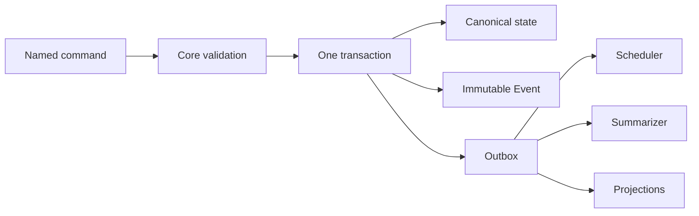
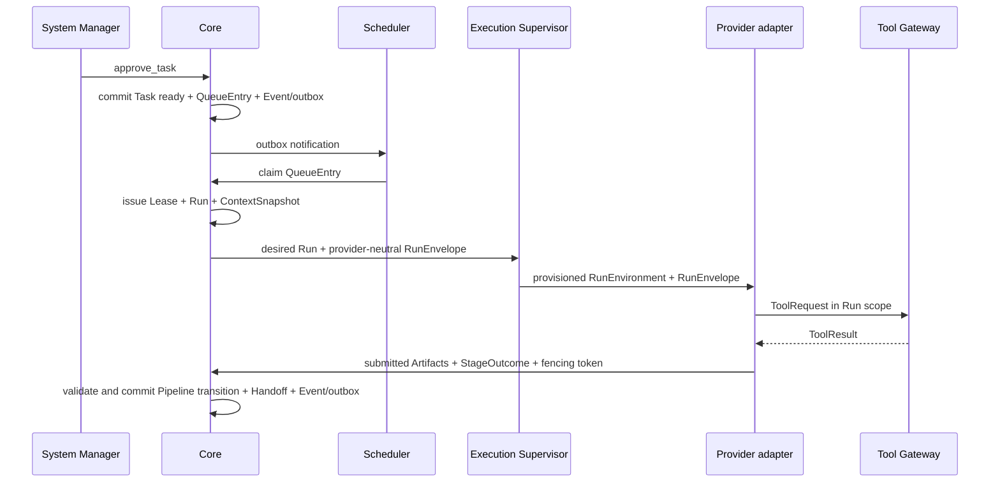

# Forge: Core control plane

**Статус:** Draft 0.1, обсуждается
**Дата:** 4 сентября 2026
**Область:** canonical state, commands, execution, transport и recovery.

## 1. Определение и граница

`Core` — durable control plane Forge. Он хранит canonical состояние Project,
проверяет именованные команды, применяет lifecycle и Pipeline transitions,
выдаёт execution scope и фиксирует audit history. Core не является Employee, LLM
runtime, provider, MCP-client, TaskWorkSurface executor или Summarizer.

Core принимает решения только по зафиксированным правилам: capabilities, Task
lifecycle, PipelineVersion, dependency gates, artifact requirements, lease и
Project execution gate. Он не оценивает инженерное качество Artifact, не
интерпретирует свободный текст как команду и не обходит Pipeline ради удобства
исполнителя.

## 2. Canonical state, Events и outbox

Core хранит текущие canonical записи `Task`, `PipelineVersion`, `Employee`,
`TaskWorkSurface`, `Run`, `RunSpec`, `RunIncident`, `Lease`, `Artifact`,
`RunRecoveryAssessment`, `Escalation` и связанные объекты в транзакционном
хранилище. Events не являются единственным источником состояния: они образуют
неизменяемый audit log успешных доменных изменений.

Одна успешная команда в одной короткой транзакции:

1. читает нужное canonical состояние и проверяет preconditions;
2. изменяет разрешённые записи;
3. добавляет immutable Event с actor, reason, command id и timestamp;
4. добавляет outbox records для асинхронных consumers.

Если проверка не проходит, Core не меняет состояние и возвращает typed refusal.
Каждая команда имеет idempotency key. Повторная доставка не создаёт второй
переход, Artifact, QueueEntry или Event.

Outbox consumer работает at-least-once и дедуплицирует событие по stable id.
Ошибка Scheduler, Summarizer или projection не отменяет уже зафиксированную
команду.

## 3. Command boundary

System Manager, Human, Employee и system actor не меняют canonical records
напрямую. Они отправляют именованные typed commands. Примеры: `approve_task`,
`pause_task`, `cancel_task`, `submit_stage_outcome`, `raise_escalation`,
`force_stop_run` и `start_project_execution`.

Core проверяет actor capability, Project boundary, current revision и expected
version объекта. Employee command дополнительно несёт `run_id`, lease token и
monotonic message sequence. Запоздалый, повторный или принадлежащий другому Run
outcome Core отвергает.

Внешняя работа никогда не исполняется внутри Core transaction. Команда может
только создать QueueEntry, выдать/отозвать Lease, записать Artifact, завершить
Run или изменить Task. Provider call, MCP request, Git operation и LLM inference
выполняются после commit и возвращаются в Core следующей командой.

### 3.1. Связь executor Artifact submission и stage outcome

`ArtifactSubmission` не несёт canonical `ArtifactId`: это предложение в
ограждённой transport-оболочке `ExecutorSubmission` с собственным `message_id`.
Когда executor завершает stage, он обязан явно перечислить в
`StageOutcomeSubmission.artifact_submission_message_ids` только те
предшествующие ArtifactSubmission envelope IDs, которые хочет использовать как
результат этой попытки. Отсутствующий ID не считается процитированным, даже если
он был принят для того же Run.

В той же команде отдельное поле `artifact_ids` остаётся только для уже
присоединённых canonical TaskHistory Artifacts, которые Pipeline допускает как
историческое evidence. Эти два набора не смешиваются. Core атомарно проверяет
каждый envelope ID на точное совпадение `(run_id, lease_fencing_token,
environment_epoch)`, отсутствие дубликатов и принятую ArtifactSubmission, затем
сам создаёт/получает canonical ArtifactId и передаёт объединённый явный набор в
Pipeline validation. Transport не получает права назначать canonical identity
самостоятельно.

## 4. Scheduler, QueueEntry, Lease, Run и Supervisor

Core создаёт QueueEntry идемпотентно для разрешённого stage Task. Для одной
комбинации `task_id`, execution-spec revision и `stage_id` существует не более
одной active QueueEntry. Pipeline может создать следующую attempt после
закрытого stage failure outcome по своей policy. Потерянный/interrupted Run
проходит отдельное conservative recovery правило ниже.

Scheduler перед выдачей проверяет Project execution gate, lifecycle Task,
Pipeline requirements, dependency gates, priority/fairness policy, eligibility
Employee и его concurrency/resource limits. Он выбирает подходящего Employee,
выдаёт Lease, создаёт Run и immutable RunSpec; ни один из этих шагов не
предполагает, что provider немедленно начал работу.

| Объект | Назначение |
|---|---|
| `QueueEntry` | Ожидающая dispatch единица конкретной Task revision/stage |
| `Lease` | Временное, отзывное право Employee выполнять этот stage |
| `Run` | Одна попытка исполнения с зафиксированным context и runtime history |
| `RunSpec` | Immutable desired execution contract: surface, profile, capabilities, network, credentials и budgets |
| `RunIncident` | Canonical record наблюдаемого runtime сбоя, evidence и management state |
| `RunRecoveryAssessment` | Evidence-backed кандидат на решение о последствиях interrupted Run; до acceptance не меняет dispatch |
| `fencing_token` | Monotonic token Lease, который отсекает сообщения старого владельца |

Core сохраняет desired Run state, а отдельный Execution Supervisor сообщает
observed environment state через authenticated local control protocol. Supervisor
provision-ит RunEnvironment, контролирует WorkSurface и provider adapter, но не
меняет Task, Pipeline, Lease или lifecycle. После рестарта Core сравнивает
desired/observed state и идемпотентно reconciles расхождение.

Desired Run state ограничен `provision_requested`, `running`, `stop_requested`,
`force_stop_requested`, `stopped` и `failed`; `failed` — terminal fact,
зафиксированный Core после подтверждённого failure, а не новая команда
Supervisor. Observed state — `unknown`, `provisioning`, `running`, `stopping`,
`stopped`, `failed` или `lost`. Перед каждой новой provision Core увеличивает
`environment_epoch`. Supervisor обязан присылать `run_id`, epoch и монотонный
`sequence` в каждом RunEvent. Core применяет observation только из актуального
epoch и с новым sequence; stale event он аудитирует, но не позволяет ему
переписать observed state. Это отдельная защита для наблюдаемости, не замена
Lease fencing token для write-effect сообщений Employee.

После истечения Lease, heartbeat loss или другого Incident Core сначала
отзывает старый write scope и проверяет, был ли outcome уже зафиксирован. Новый
Lease получает новый fencing token, поэтому оживший старый process не может
приложить Artifact или закрыть stage. Core создаёт `RunRecoveryAssessment` из
доступных Supervisor events, provider status, Tool Gateway audit, WorkSurface
diff, Artifacts и разрешённых log excerpts. Его candidate outcome —
`not_started_confirmed`, `partial_work_observed`, `external_effect_possible` или
`unknown`; только acceptance Manager/human разрешает дальнейшее действие.

`stop_project_execution` запрещает новые QueueEntry dispatch, Lease, Run, retry,
ResolutionAssignment и SummarizationJob. Core продолжает recovery, audit и
чтение canonical истории. `ready` Task остаются `ready`, а безопасно остановленные
active Task получают индивидуальную wait condition.

### 4.1. Restart и boot recovery

Core различает restart своего процесса и reboot execution host. Supervisor
сообщает stable host `boot_id`; Core сохраняет последний наблюдаемый id для
каждого local execution host. Если `boot_id` не изменился, Core reconcilies
desired/observed state с живым Supervisor и не отзывает устойчиво наблюдаемый
Run только из-за своего рестарта.

Новый `boot_id` означает host reboot. Core входит в `reconciling` mode и до
окончания recovery не выдаёт новые Lease или Run. Он отзывает все pre-boot Lease,
создаёт interrupted handoff и RunRecoveryAssessment для каждого незавершённого
Run. Старый process не считается продолжающимся: любое resume/re-execute — это
новый Run с новым Lease/fencing token и canonical handoff. Provider session
может быть использована только внутри этой новой попытки, если её подтверждает
CapabilityProfile.

Project хранит явно выбранный `BootRecoveryPolicy`. Это заранее аудируемое
решение Manager, а не скрытое действие Supervisor:

| Policy | После recovery |
|---|---|
| `manual_hold` | все Task и QueueEntry ждут явной management/human команды |
| `recover_safe_then_hold` | Core автоматически re-executes только accepted `not_started_confirmed`; partial, external-effect и unknown остаются `waiting` |
| `reconcile_then_resume_queue` | выполняет тот же safe recovery, затем снова открывает dispatch обычной очереди; неразрешённые interrupted Task остаются `waiting` |

Default — `recover_safe_then_hold`. В любом policy Core не объявляет старый Run
успешным и не даёт ему прежний write scope. Если recovery assessment невозможно
собрать, outcome остаётся `unknown` и требует management/human решения.

### 4.2. Run budgets и Watchdog

RunSpec фиксирует итоговый resource vector: scheduler reservation, CPU, RAM,
disk, PID, wall-clock, provider tokens/cost/rate, network и tool limits.
Pipeline stage задаёт default `ResourceProfile`; System Manager может сделать
аудируемый override, но Project ceiling ограничивает итог. Каждый лимит несёт
метку `hard`, `soft` или `observed`, поэтому Core не заявляет технически
ненадёжный запрет как hard enforcement.

Supervisor сообщает структурированные RunEvent: provision/start, heartbeat,
provider/tool error, budget signal, stop и exit. Core materializes RunIncident
для `start_failed`, `provider_failed`, `budget_exhausted`, `heartbeat_lost`,
`environment_lost`, `policy_denied` и project-defined причин. Отсутствие
progress не создаёт incident само по себе; Watchdog опирается на liveness,
start deadline и observed environment state.

Policy Incident задаёт допустимую реакцию. При budget exhaustion Supervisor
сначала просит graceful stop, затем после grace period force-stops среду; Core
создаёт `resource_exhausted` wait condition. Если reaction не определена, Core
направляет incident в management queue, а не оставляет Run в неопределённости.

## 5. ContextSnapshot и handoff

Перед запуском Run Core создаёт immutable `ContextSnapshot` и связанный с ним
`RunSpec`. ContextSnapshot включает:

- pinned system policy и employee prompt versions;
- Task execution-spec revision, PipelineVersion, stage, DoD и scope;
- optional immediate `TaskHandoff` с source/target stage и canonical result links;
- разрешённые Task Artifacts и их acceptance state;
- retrieved personal/project memory entries с source, visibility и canonical revision;
- capability scope и Tool Catalog;
- ссылку на RunSpec с WorkSurface, execution profile, network, credentials и
  resource limits;
- current control instruction, если её зафиксировал System Manager.

Память и prompt не подмешиваются в уже выданный Run неявно. Employee может
запросить явный context refresh через Core; Core создаёт новый auditable snapshot
или новый Run согласно policy. Поэтому можно определить, на каких данных был
сделан любой Outcome.

После завершения или безопасной остановки stage Core синхронно создаёт
`TaskHandoff`. При force-stop или lost environment он создаёт interrupted
handoff с ссылкой на RunIncident и partial evidence, но не применяет Pipeline
transition и не называет stage завершённым. Summarizer позже строит более
удобный derived text, но следующий Employee всегда получает canonical handoff и
не ждёт его.
У entry stage первой Task handoff отсутствует: Core выдаёт initial Task context,
а не синтетический результат несуществующей предыдущей stage.

## 6. Provider-neutral transport и Tool Gateway

Core передаёт Supervisor provider-neutral `RunEnvelope`: Run identity,
ContextSnapshot, RunSpec, lease/fencing token, allowed message types, control
channel и Tool Catalog. Supervisor доставляет envelope adapter внутри
RunEnvironment; adapter преобразует provider responses в typed commands Core.

Tool Gateway — единственный mediated transport за границу RunEnvironment. Он
принимает ToolRequest только в scope Run и проверяет capability, Tool Policy,
Project boundary, audit и resource limits. Он может выполнить capability через
HTTP integration или MCP server. Обычный shell внутри выданного sandbox и его
TaskWorkSurface не проходит через Gateway; чужие Task, host resources, сеть,
MCP и secrets — проходят.

Provider-specific native MCP не обходит Gateway. Если provider не поддерживает
MCP, он получает тот же logical Tool Catalog через другой runtime adapter. Так
Task и Pipeline не зависят от provider, а все Employee работают в одинаковых
доменных условиях.

`Provider`, `RuntimeAdapter`, `CredentialBinding` и `CapabilityProfile` —
разные объекты. Core не считает CLI vendor именем provider и не предполагает,
что все adapters одинаково умеют resume, structured events, model selection
или gateway authentication. Полный contract этих объектов и credential modes
определён в `2026-09-04-provider-runtime-domain-model.md`.

Memory retrieval также проходит Gateway/Memory service. Adapter может искать в
AgentMemory, но Core выдаёт в ContextSnapshot только entries, чьи scope,
visibility и revision повторно подтверждены Forge canonical store.

## 7. Сквозной flow

## 8. Неподвижные правила

1. Core — единственный writer canonical lifecycle, stage, execution revision,
   Lease и Pipeline transition.
2. Current state хранится явно; immutable Events и outbox дополняют его, а не
   заменяют.
3. Ни provider, ни MCP server, ни Employee не получают прямой доступ к canonical
   store или право менять Task.
4. Внешняя работа не находится внутри Core transaction.
5. Lease и fencing token обязательны для любых write-effect сообщений Run.
6. Core сначала reconciles истёкший Lease; interrupted Run после возможного
   side effect допускает следующую attempt только по явной management-команде.
7. Каждый Run использует immutable ContextSnapshot.
8. Tool Gateway — единственный mediated transport за границу RunEnvironment;
   native MCP не обходит его.
9. Asynchronous consumer не имеет права отменить canonical command или изменить
   доменный outcome.
