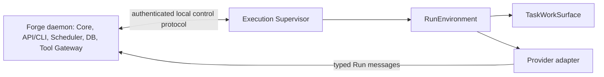

# Forge: execution runtime

**Статус:** Draft 0.1, обсуждается
**Дата:** 4 сентября 2026
**Область:** исполнение `Run`, изоляция, ресурсы, наблюдаемость и recovery.

## 1. Цель и граница

`Execution Runtime` исполняет уже выданный Core `Run`. Он даёт Employee
изолированную рабочую среду, запускает provider adapter, применяет бюджет и
сообщает наблюдаемое состояние. Он не выбирает Task, не меняет lifecycle или
stage, не принимает Artifacts и не интерпретирует Pipeline.

Forge остаётся одним локально устанавливаемым продуктом, но имеет две логические
плоскости исполнения:

`Forge daemon` — control plane. `Execution Supervisor` — отдельная локальная
плоскость с ограниченной обязанностью provision, stop и наблюдения за средой
Run. Такое разделение не является выбором конкретного IPC или deployment
технологии. Оно не позволяет daemon неявно получить неограниченное право
запускать host-process или читать рабочие каталоги.

Core хранит желаемое состояние Run. Supervisor сообщает только наблюдаемое
состояние среды. После рестарта любой стороны Core сравнивает desired и
observed state и идемпотентно инициирует нужное действие. Supervisor не меняет
Task, Pipeline, Lease или lifecycle самостоятельно.

| State layer | Допустимые значения |
|---|---|
| desired | `provision_requested`, `running`, `stop_requested`, `force_stop_requested`, `stopped`, `failed` |
| observed | `unknown`, `provisioning`, `running`, `stopping`, `stopped`, `failed`, `lost` |

Перед каждым новым provision Core увеличивает `environment_epoch` Run. Каждый
`RunEvent` содержит `run_id`, этот epoch и возрастающий `sequence` внутри epoch.
Core принимает только события актуального epoch с ещё не принятым sequence;
старые, повторные и принадлежащие прошлой среде события он сохраняет в audit как
stale, но не применяет к observed state. Так задержанный `running` не отменит
уже принятое `exit`, а рестарт Supervisor не смешает две среды одного Run.

## 2. Work surface и Run environment

`TaskWorkSurface` — долговечная, принадлежащая Task рабочая поверхность. Она
переживает отдельные Run, handoff, retry и смену Employee. Это не обязательный
Git worktree: backend выбирается по запросу Task/Pipeline и может быть:

| Backend | Назначение |
|---|---|
| `git_worktree` | Изолированная ветвь/рабочая копия Git-проекта |
| `filesystem_sandbox` | Обычная изолированная файловая поверхность без Git |
| `external_binding` | Явно выделенный внешний ресурс с отдельным контрактом |
| `none` | Работа не требует рабочей поверхности |

`RunEnvironment` — краткоживущая среда одной попытки. Supervisor выдаёт ей
конкретный WorkSurface в режиме `read_write` или `read_only`. Например,
implementation Run пишет в свою поверхность, а reviewer получает её snapshot
только для чтения. Два Run не получают общий writable root неявно.

Внутри собственного RunEnvironment Employee имеет обычный shell и свободу
работать с выданным WorkSurface. Это не проходит через Tool Gateway. Доступ к
чужой Task, host filesystem, project secrets или внешней интеграции не следует
из доступа к shell.

После `done` или `cancelled` WorkSurface не удаляется автоматически. Core
помечает его `eligible_for_cleanup`; очистку выполняет retention policy Project
или именованная команда Manager, когда активных Run нет, а требуемые результаты
надёжно прикреплены к Task как Artifacts. Surface и логи могут потребоваться
для проверки и повторного обучения.

## 3. RunSpec и ресурсы

Перед provision Core создаёт immutable `RunSpec`, привязанный к Run и его
`ContextSnapshot`. В нём описаны:

- execution profile и допустимый backend изоляции;
- запрос к `TaskWorkSurface` и требуемый режим доступа;
- runtime/provider profile и разрешённый Tool Catalog;
- capability grants, сетевой режим и способ выдачи credentials;
- ресурсный бюджет и control policy.

Бюджет образует вектор, а не одно поле: scheduler concurrency/reservation,
CPU, RAM, disk, process/PID limit, wall-clock time, provider tokens/cost/rate,
сеть и tool-specific limits. Каждый лимит хранит семантику применения:

| Mark | Смысл |
|---|---|
| `hard` | Runtime действительно не даст превысить лимит |
| `soft` | Runtime просит остановиться или ограничивает работу best-effort способом |
| `observed` | Forge только измеряет и подаёт сигнал, но не гарантирует запрет |

Итоговый профиль складывается так: default `ResourceProfile` stage →
аудируемый override System Manager → жёсткий ceiling Project. Override не
может поднять значение выше Project ceiling. Нельзя выдавать ограничение как
`hard`, если выбранный backend умеет только наблюдать его.

## 4. Изоляция, сеть и credentials

Для обычного Employee Run default profile — `sandboxed_local`. `host_process`
возможен только как явно запрошенный доверенный override Project/System Manager.
Если host не способен предоставить выбранную sandbox boundary, Supervisor не
делает тихий fallback в host-process: provision завершается известной ошибкой
и Task ожидает допустимого решения.

Sandbox защищает прежде всего host operational resources: home directory,
постоянные keys/config, другие WorkSurface и возможность обойти Tool Gateway.
Это не обещание абсолютной изоляции на любой платформе; RunSpec и наблюдатель
всегда показывают фактическую гарантию выбранного backend.

Сеть по умолчанию запрещена: `network: denied`. Stage или RunSpec явно выдаёт
нужное ограниченное capability — например, package registry через proxy,
конкретную интеграцию через Gateway или управляемый browser. Произвольный
интернет требует доверенного профиля и audit trail.

Credential mode является частью immutable RunSpec. `proxy_only` adapter получает
только краткоживущий virtual key к Provider Gateway; upstream key остаётся на
host-side. CLI, который не умеет такой proxy, может получить
`isolated_runtime_secret`: минимальный credential snapshot в managed provider
home. Это не даёт ему host `~/.config`, SSH keys или browser secrets, но
означает, что процесс Run способен прочитать выданный auth material. Такой
режим требует явного capability/profile выбора и audit; Supervisor не выбирает
его молча. `trusted_host` остаётся отдельным явно выбранным execution profile.
Полный contract определён в `2026-09-04-provider-runtime-domain-model.md`.

## 5. Provider и Tool Gateway

Core передаёт provider-neutral `RunEnvelope`. Adapter переводит его в protocol
выбранного provider и возвращает typed Run messages. Это сохраняет одинаковый
доменный contract для providers с MCP и без MCP.

Tool Gateway остаётся единственным путём к тому, что выходит за пределы
RunEnvironment: project memory, информация о других Task, MCP, сеть, внешние
системы и secrets. Он принимает запрос только в scope конкретного Run, проверяет
capability, Tool Policy, Project boundary и budget, затем пишет audit trace.
MCP — один из adapters Gateway; provider-native MCP не образует обходной путь.

## 6. Наблюдение и инциденты

Supervisor исполняет Watchdog-функцию. Для каждого Run он различает три сигнала:

| Signal | Что означает |
|---|---|
| `liveness` | Среда существует и Runner подтверждает, что жив |
| `provider_activity` | Adapter видит start, response, rate limit, error или cancel |
| `progress` | Появились submission, tool result или иной доменный эффект |

Отсутствие `progress` не доказывает зависание: агент может думать или выполнять
долгую команду. Run считается потерянным по отсутствию liveness, истечению
start deadline или исчезновению среды, а не по тишине в тексте ответа.

Supervisor отправляет Core структурированные `RunEvent`: provision/start,
heartbeat, provider/tool error, budget signal, stop, exit и ссылки на
технический результат. Core материализует `RunIncident` с причиной, evidence,
временем и состоянием обработки. Базовые причины: `start_failed`,
`provider_failed`, `budget_exhausted`, `heartbeat_lost`, `environment_lost` и
`policy_denied`; Project может добавлять более точную классификацию.

RunEvent и технический log не заменяют observability data. Core и Supervisor
пишут structured process diagnostics через `tracing`, несут correlation/trace
context через internal and allowed external boundaries и публикуют только
bounded-cardinality metrics. Полный слой определён в
`2026-09-04-observability-model.md`.

Pipeline/Project policy задаёт заранее разрешённую реакцию на Incident. Core
может безопасно закрыть Run, добавить wait condition и направить incident в
management queue. Если policy не определяет реакцию, incident эскалируется
Manager или Human. Таким образом потерянный Run не остаётся в неясном статусе.

При исчерпании бюджета Supervisor сначала запрашивает корректную остановку,
даёт ограниченный grace period и затем force-stops среду. Core переводит
незавершённую Task в `waiting` с condition `resource_exhausted`. Manager может
отложить resume до сброса лимита или направить следующую attempt другому eligible
Employee через именованную аудируемую команду.

## 7. Recovery и повторный запуск

После выдачи Lease Core и Supervisor допускают сбой, дубликат события и
перезапуск процесса. Core отзывает write scope старого Run fencing token и
сначала reconciles уже записанный Outcome/Artifact. Только затем он может
закрыть Run, создать Incident или выдать новую attempt.

При reboot host Supervisor сообщает новый `boot_id`. Core не пытается считать
pre-boot process живым: он отзывает его Lease, создаёт interrupted handoff и
переходит в Project `BootRecoveryPolicy`. Только новая attempt с новым RunSpec
может re-execute или использовать подтверждённую provider session resume. Сам
restart Core при прежнем `boot_id` проходит обычный desired/observed reconcile
и не является причиной force-stop стабильного Run.

Для MVP действует консервативное правило: system evaluator собирает evidence
прерванного Run — Supervisor events, provider status, Tool Gateway audit,
WorkSurface diff, Artifacts и разрешённые log excerpts — в
`RunRecoveryAssessment`. Candidate outcome ограничен
`not_started_confirmed`, `partial_work_observed`, `external_effect_possible` и
`unknown`. Evaluator ничего не перезапускает и не является authority.

Только Manager/human принимает assessment. После принятого
`not_started_confirmed` Core может re-execute Run; любой другой outcome требует
явного resume, reassign, cancellation или сохранения Task в `waiting`. Это не
запрещает нормальный Pipeline transition после явно submitted stage failure
outcome.

При force-stop Core создаёт `TaskHandoff` с `outcome = interrupted`. Он ссылается
на RunIncident, сохранённые Artifacts, WorkSurface и последнее observed state,
но не завершает stage и не запускает Pipeline transition. Следующий Employee
получает этот handoff вместе с предыдущим context, чтобы продолжить работу или
проверить частичный результат.

## 8. Технические логи и обучение

Structured RunEvent и технические логи не являются доменной историей Task.
Они хранятся отдельно с лимитом объёма, visibility, redaction и retention
policy. Raw prompts, provider responses, stdout/stderr и детали tool calls не
подмешиваются автоматически в Task, employee prompt или общую память.

Task показывает человеческую хронологию через Artifacts, acceptance и Handoff;
Summarizer строит от неё краткое derived summary. При этом исходные WorkSurface
и технические следы остаются доступными разрешённому observer для диагностики.

Опыт из неудач проходит три уровня:

1. evidence: WorkSurface, Run log и tool results сохраняют исходные следы;
2. observation: Summarizer создаёт source-linked derived запись, например о
   неудачной попытке и последующем обходе, не объявляя правило истиной;
3. lesson: Human или уполномоченный Manager принимает observation как
   project knowledge/operating rule для будущих Employee.

Так единичная ошибка остаётся полезным опытом, но не превращается в молчаливую
догму Project.

## 9. Неподвижные правила

1. Core хранит desired Run state; Supervisor сообщает observed state и не
   меняет доменные объекты.
2. TaskWorkSurface принадлежит Task и переживает Run; RunEnvironment
   принадлежит одной попытке и имеет ограниченный доступ к surface.
3. Default Employee execution — sandboxed, без тихого host fallback.
4. Shell внутри выданной среды разрешён; межзадачные, внешние и privileged
   действия идут через Tool Gateway.
5. Сеть запрещена по умолчанию, credentials в sandbox краткоживущие и scoped.
6. Реальная сила каждого resource limit видна как `hard`, `soft` или
   `observed`.
7. Watchdog различает отсутствие progress и потерю liveness; каждый
   неразрешённый Incident имеет management/human owner.
8. После возможного side effect Run не retry-ится автоматически в MVP.
9. Доменная история, raw technical logs и derived knowledge остаются разными
   слоями с независимыми правами и retention.
10. Interrupted handoff передаёт факт и evidence прерывания, но не выдаёт
    незавершённый stage за успешный outcome.
11. System evaluator может подготовить RunRecoveryAssessment, но только
    Manager/human принимает его и разрешает recovery action.
