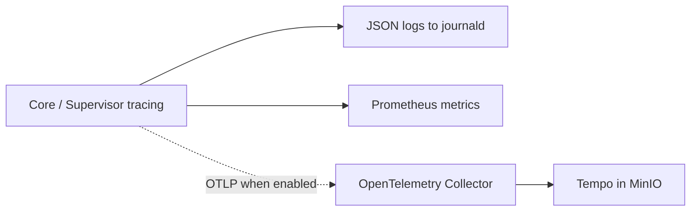

# Forge: Observability Model

**Статус:** Draft 0.1, принято для local MVP
**Дата:** 4 сентября 2026
**Область:** диагностика процессов, logs, metrics, traces и health checks.

## 1. Четыре разных слоя

| Слой | Хранилище | Отвечает на вопрос |
|---|---|---|
| Domain audit | PostgreSQL immutable Event | кто и почему изменил canonical Task/Run state |
| Technical Run evidence | MinIO + PostgreSQL metadata | что реально вывели process, tool или provider |
| Process diagnostics | `tracing` JSON в journald | что делали Core, Supervisor и adapters во время сбоя |
| Operational metrics | Prometheus | сколько работы, ошибок и задержек наблюдается во времени |

Ни один слой не подменяет другой. Domain Event не является debug log, raw
stdout/stderr не является Task Artifact, а метрика не является доказательством
конкретного Run outcome.

## 2. Structured diagnostics и correlation

Core и Supervisor используют Rust `tracing`. Каждый command, scheduler action,
gRPC call, provision, provider request, Tool Gateway call и recovery action
создаёт structured span/event с известным component name и result class.

Correlation fields доступны в logs и traces, но не как Prometheus labels:

- `command_id`, `project_id`, `task_id`, `run_id`, `lease_id` и `outbox_id`;
- `environment_epoch`, `host_boot_id`, adapter/profile revision и selected
  transport engine;
- `trace_id`, `span_id` и typed failure/incident code.

W3C trace context передаётся по Core ↔ Supervisor gRPC, Supervisor ↔ adapter и
разрешённым HTTP boundaries, включая Provider Gateway. Отсутствие downstream
trace support не отменяет локальный span: boundary записывает parent context и
свой результат.

JSON diagnostics идут в stdout native services и собираются journald. Raw
prompt, provider response, secret, OAuth material, Tool request body и query
parameters URL не записываются в these events. Для каждого sanctioned exception
нужны явные redaction rule и test.

## 3. Metrics

Core и Supervisor expose local `/metrics` в Prometheus exposition format.
Installer запускает один Prometheus container с local persistent volume и
15-day retention. Prometheus не принимает внешние writes и не доступен Run
Environment.

MVP metrics ограничены заранее известными dimensions:

- service/process health, uptime и restart count;
- queue depth, active Lease/Run count и scheduler latency;
- command, gRPC, adapter и Tool Gateway duration/error counters;
- RunIncident, policy denial, forced stop и recovery counters по typed reason;
- hard/soft/observed budget signal counters и remaining capacity gauges;
- outbox age, consumer lag и SummarizationJob backlog.

Запрещённые labels: `task_id`, `run_id`, `employee_id`, command id, arbitrary
provider error text, model id from untrusted input, prompt, path, URL и secret.
Новая metric или label проходит review как storage/cardinality contract.

## 4. Health and readiness

| Endpoint | Проверяет | Не проверяет |
|---|---|---|
| `/healthz` | process event loop и локальная способность отвечать | PostgreSQL, provider, gateway, Run success |
| `/readyz` | обязательные local dependencies и authenticated Core/Supervisor channel | доступность модели или право начать новую Task |
| `/metrics` | только metrics exposition | auth UI или domain command API |

Core readiness проверяет PostgreSQL, NATS, MinIO и обязательные configured
services. Provider-specific availability остаётся adapter preflight/Run
evidence: health check не делает платный inference и не выдаёт credential
готовность за успешный Run.

## 5. Trace backend evolution

Local MVP не поднимает OpenTelemetry Collector, Tempo, Loki или Grafana.
`tracing` spans и W3C propagation создаются с первого дня, поэтому переход не
меняет application contracts:

При multi-host execution или доказанной необходимости query trace history
installer добавляет Collector и monolithic Tempo с отдельным MinIO prefix и
retention. Loki добавляется только если system diagnostics перестанут помещаться
в journald/`forge logs`; он не дублирует raw Run logs.

## 6. Access and retention

Process diagnostics наследуют host service access. Technical Run logs и traces
видимы только actor с Task/Run diagnostic capability; их retention отделена от
Task history. Prometheus хранит только агрегаты и удаляет их по 15-day retention.
Удаление technical logs не удаляет Domain Event или accepted Artifact.

## 7. Неподвижные правила

1. Observability data не может менять lifecycle, Pipeline или Task outcome.
2. Core не считает отсутствие metric/log/trace доказательством, что Run не
   начинался; для этого существует RunRecoveryAssessment.
3. Secrets и raw model contents исключены из diagnostics by default.
4. High-cardinality identity живёт в logs/traces, а не в Prometheus labels.
5. Failure of Prometheus, journald export или будущего trace backend не отменяет
   canonical command и не блокирует Core transaction.

## 8. Реализация M1

Native Core/Supervisor пишут JSON в stdout. Metrics-only loopback listeners:
`127.0.0.1:9878` и `127.0.0.1:9879`, флаг `--observability-address`.
Невозможность bind отмечается безопасным warning, но не останавливает
canonical service. Те же endpoints доступны через owner-only Core UDS.
Порты не публикуют management/Gateway API. Опциональный rootless Prometheus
dev adjunct, pinned image и команды описаны в
[`infra/dev/observability.md`](../infra/dev/observability.md).

В M1 Core экспортирует uptime, fixed-class operation counts/duration, здоровье
PostgreSQL/Supervisor, queued entries, active Leases/Runs, unknown environments,
open incidents, pending/dead-letter outbox, oldest outbox age и local evidence
spool bytes. Supervisor экспортирует uptime, Core connection, journal health,
active/unknown/quiescent environment counts и pending observations. Labels
операций — только закрытые enums; ID, свободные причины, пути и модели в labels
не попадают. Метрики ещё не существующих consumer/Summarizer компонентов не
выдумываются: их instrumentation добавляется вместе с компонентами.

Readiness возвращает только `up/down/disabled`, без endpoint, credential или
текста ошибки. PostgreSQL проверяется `SELECT 1`, NATS — JetStream account info,
MinIO — read-only listing зарезервированного `forge-health-probe/` prefix
настроенного bucket (нужно право list). Ненастроенный NATS/object store отмечен
`disabled`; настроенный недоступный — `down`. Live Supervisor требует завершённой
inventory reconciliation. Каждый dependency probe имеет timeout 2 секунды;
они выполняются параллельно. Не более двух HTTP probes одновременно используют
БД; лишние получают 503, не занимая очередь canonical commands. Эти проверки
никогда не вызывают provider inference. При недоступной БД count gauges могут
быть stale, что явно отмечает `forge_core_postgres_up=0`.

W3C version-00 `traceparent` проверяется на формат и ненулевые IDs; сырой
некорректный header не логируется и заменяется новым контекстом. Контекст проходит
HTTP command → materialized Run grant → gRPC `ProvisionRun` → Supervisor
observations → Core ingress, а также managed adapter environment и MCP headers
→ Tool Gateway. OpenCode managed provider headers сохраняют локальную
корреляцию inference ingress. Trace metadata не участвует в execution identity
и не позволяет повторно запустить Run. Native provider TLS внутри CONNECT tunnel
не переписывается ради tracing: downstream support не предполагается.

Diagnostics не записывают request URI/query, headers, prompt или response body.
JSON format и отсутствие synthetic secrets проверяются отдельным acceptance
test. Точный момент canonical события остаётся в PostgreSQL audit; trace и
summary не меняют и не заменяют этот факт.
