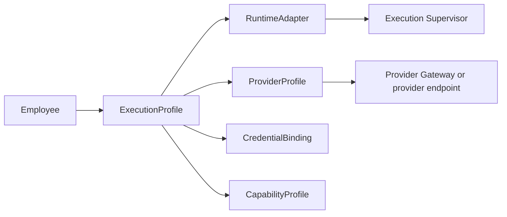

# Forge: Provider and Runtime Model

**Статус:** Draft 0.1, принято как направление MVP
**Дата:** 4 сентября 2026
**Область:** provider access, agent runtimes, credentials, capabilities и
наблюдаемый расход LLM.

## 1. Граница

Forge не приравнивает model provider к исполняемому агенту. `Codex CLI` —
runtime, который умеет работать с одним или несколькими provider paths;
`OpenRouter` — provider endpoint, который может быть использован разными
runtimes. Employee и Task не хранят секрет, модельный protocol или путь к
бинарнику.

`ExecutionProfile` versioned и выбирается при выдаче Run. Его immutable
snapshot входит в `RunSpec`; смена profile не переписывает уже начатую попытку.

## 2. Объекты

| Объект | Содержит | Не содержит |
|---|---|---|
| `RuntimeAdapter` | launcher, protocol translation, event parser, stop/resume strategy, preflight | ключи provider, Task lifecycle rules |
| `ProviderProfile` | provider id, endpoint route, allowed models и provider-specific request options | plaintext credential, shell command |
| `CredentialBinding` | secret reference, account/instance id, Project scope, allowed delivery modes | plaintext key или OAuth token в canonical record |
| `CapabilityProfile` | проверяемые свойства выбранного runtime/version | обещание, что неподдерживаемая функция будет эмулирована |
| `ExecutionProfile` | pinned комбинацию adapter, provider, credential binding, model policy и capability requirements | право обходить Project ceiling или Tool Policy |

Один Employee может иметь несколько ExecutionProfile. Scheduler выбирает только
profile, удовлетворяющий stage requirements, Project policy и доступный budget;
он не меняет provider самостоятельно после ошибки. Такая смена — явное
решение Manager/human или заранее определённая Pipeline policy.

## 3. Общий adapter contract

Каждый adapter реализует один provider-neutral contract:

1. `preflight` проверяет binary/image, auth readiness, sandbox compatibility и
   declared capabilities до выдачи полезной работы;
2. `prepare` materializes только разрешённый runtime configuration в
   RunEnvironment;
3. `start`, `request_stop` и, когда поддержано, `resume` управляют одной
   попыткой;
4. `observe` преобразует provider/runtime signals в ordered RunEvent;
5. `collect` возвращает structured outcome, usage evidence, diagnostics и
   references на технические логи;
6. `cleanup` удаляет ephemeral runtime state и сообщает результат Supervisor.

Adapter не создаёт Task, не применяет Pipeline transition и не принимает
собственный natural-language verdict как domain truth. Он может приложить
Artifact candidate или StageOutcome только через Core command с lease fencing.

Минимально нормализуемые RunEvent: `runtime_started`, `heartbeat`,
`assistant_output`, `tool_activity`, `usage_observed`, `stop_acknowledged`,
`runtime_exited` и `adapter_error`. Runtime с raw stdout/stderr не выдаёт
вымышленный structured tool event: он сообщает свой capability level и
сохраняет raw evidence отдельно.

### 3.1 Transport engines

Forge contract не является ACP и не передаёт доменные команды через provider
protocol. Adapter выбирает один из transport engines для своего runtime:

| Engine | Когда применяется | Что даёт Forge |
|---|---|---|
| `acp` | CLI/runtime предоставляет совместимый Agent Client Protocol | rich lifecycle/tool stream и, если runtime объявляет, session resume |
| `cli_wrapper` | adapter запускает headless CLI и читает его documented machine output либо raw logs | normal start/stop/exit control; только подтверждённые capabilities |
| `api_runtime` | bundled runtime, например `opencode_runtime`, имеет собственный API/process protocol | provider-normalized events в границе этого adapter |

Profile может явно потребовать engine либо задать `auto`. В `auto` adapter
вправе предпочесть ACP и перейти на `cli_wrapper` только с записанными причиной
и фактически выбранным engine. Такой fallback не добавляет capabilities:
например, session resume или structured tool events остаются недоступны, если
CLI wrapper их не подтверждает. Он также не меняет provider, model или
credential delivery mode.

## 4. CapabilityProfile

CapabilityProfile фиксируется для конкретных adapter version и execution target.
Основные признаки:

| Capability | Значение |
|---|---|
| `structured_events` | adapter получает machine-readable lifecycle/tool stream |
| `session_resume` | runtime может безопасно продолжить provider session |
| `model_selection` | model/provider можно выбрать без неявного default |
| `usage_reporting` | доступны tokens, cost или provider usage evidence |
| `controlled_stop` | adapter поддерживает graceful stop до force-stop |
| `gateway_auth` | runtime способен ходить к Provider Gateway без upstream key |
| `native_mcp` | runtime может получить Forge-managed MCP transport |
| `credential_exposed_to_run` | process внутри Run может прочитать auth material |

`transport_engine` (`acp`, `cli_wrapper` или `api_runtime`) и причина fallback
также фиксируются в RunSpec/RunEvent. Они являются наблюдаемым свойством попытки,
а не скрытой деталью adapter implementation.

Stage может потребовать конкретные capabilities. Если profile их не имеет,
Core не запускает Run и создаёт понятный `policy_denied`/preflight Incident;
никакого молчаливого fallback на другой provider, model или auth mode нет.

## 5. Credential delivery

Все source credentials хранятся в host-side Forge Secret Store. Canonical
records содержат только `CredentialBinding` и audit metadata. Секрет не попадает
в Task, Artifact, employee memory, ContextSnapshot, event payload или logs.

### 5.1 Forge Secret Store

Secret Store держит ciphertext, nonce, key version, scope и audit metadata в
PostgreSQL. Plaintext существует только на коротком in-process пути create,
rotate или materialize. Используется стандартное library-provided AEAD; Forge не
создаёт собственный криптографический protocol.

`MasterKeyProvider` разрешает key в фиксированном порядке:

1. Linux keyring для интерактивного local host;
2. generated file в Forge state directory с owner-only mode `0600` для headless
   service host.

Installer создаёт key один раз и проверяет права файла до старта Core. Потеря
master key делает ciphertext намеренно невосстановимым; backup procedure должна
сохранять его отдельно от PostgreSQL dump. File fallback защищает от утечки
database/backup и случайного чтения другим OS user, но не от компрометации того
же OS user или root. Это заявленная граница угроз local MVP.

LiteLLM получает upstream credential только через короткоживущую host-side
materialization Secret Store. Он не получает доступ к Secret Store API, master
key или Forge canonical tables. Его container config и structured logs не
содержат plaintext.

### `proxy_only`

Для API lane Core выдаёт LiteLLM virtual key, ограниченный конкретным Run,
разрешёнными models, rate/budget policy и сроком действия. OpenCode или иной
совместимый API runtime обращается только к Provider Gateway; upstream OpenAI,
Anthropic, Gemini, OpenRouter или xAI credential остаётся в gateway.

LiteLLM применяет свой технический limit и возвращает usage/cost. Core сохраняет
это как `gateway_observed` evidence и сопоставляет с Run budget. Core не
делегирует LiteLLM право менять Task, Lease или Task lifecycle. Если gateway
недоступен, adapter сообщает failure, а Core применяет обычную Incident policy.

### `isolated_runtime_secret`

Некоторые CLI поддерживают только auth file, OAuth state или environment key.
Для них Supervisor создаёт fresh managed provider home и кладёт ровно
allowlisted credential snapshot и runtime configuration. Host home, SSH keys,
browser profile, кэш и неразрешённые provider files не пересекают границу.
Snapshot удаляется при cleanup и не становится частью TaskWorkSurface.

Это **не** криптографическая гарантия неразглашения: agent process может
прочитать выданный material. Profile обязательно объявляет
`credential_exposed_to_run = true`; Project policy и human видят этот риск до
запуска. Сеть остаётся ограниченной RunSpec, но ограничение доменов не отменяет
риск, что процесс передаст credential через разрешённый provider request.

### `trusted_host`

Adapter, который требует host credential home или не проходит sandbox preflight,
работает только в явно выбранном trusted execution profile. Он не является
fallback для `sandboxed_local`.

## 6. Runtime lanes MVP

| Lane | RuntimeAdapter | Provider path |
|---|---|---|
| Native coding CLI | `codex_cli`, `claude_code_cli`, `cursor_cli`, `gemini_cli`, `grok_cli` | vendor-native auth/session protocol; credential mode объявлен profile |
| Multi-provider API agent | `opencode_runtime` | OpenAI API, Anthropic API, Gemini API, OpenRouter и xAI через Provider Gateway |

`opencode_runtime` — pinned external runtime, а не библиотека доменной логики
Forge. Он даёт готовый coding-agent loop и multi-provider protocol support;
Forge adapter управляет его image/config, Run boundary, Tool Catalog transport,
events и cleanup. Поддержка конкретного provider считается готовой только после
adapter contract test на выбранной pinned версии.

Vendor CLI и OpenCode не обязаны выдавать одинаковую детализацию transcript или
usage. Forge обещает общий control contract, одинаковые Task/Pipeline rules и
явно видимые capabilities, а не ложную идентичность внутренних возможностей.

## 7. Provider Gateway ownership

LiteLLM работает отдельным local container и получает upstream credentials
только из host-side materialization Forge Secret Store. Его internal database
или schema изолированы от Forge PostgreSQL tables. Core хранит mapping:

- `run_id` и immutable ExecutionProfile revision;
- gateway virtual-key reference, expiry и allowed models;
- budget reservation и final observed usage references;
- gateway failure/limit evidence.

Gateway может ограничить вызов раньше Core, но не может сам перевести Task в
`waiting`, создать Handoff или решить, что Run завершён. Core материализует
gateway limit/error как RunEvent/RunIncident и применяет policy.

## 8. Неподвижные правила

1. Provider, runtime и credential binding никогда не склеиваются в один
   нерасширяемый enum.
2. ExecutionProfile pin-ится в RunSpec; уже запущенный Run не получает другую
   модель или credential instance неявно.
3. Profile без нужной capability fail-fast проходит preflight, а не деградирует
   в менее безопасный режим.
4. `proxy_only` — default для API-key lane; `isolated_runtime_secret` и
   `trusted_host` — явные, аудируемые исключения.
5. Raw credential не попадает в canonical Forge state и observability data.
6. Gateway usage — evidence для budget/reconciliation, но Task state меняет
   только Core.
7. Поддержка нового CLI/API добавляется adapter contract test, а не только
   названием в provider catalog.
