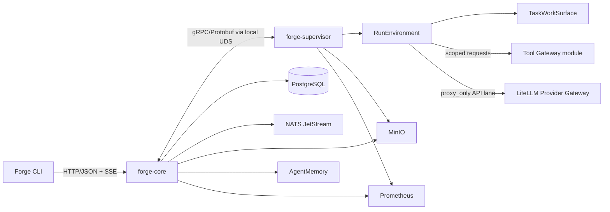
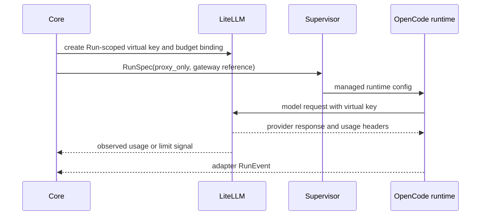

# Forge: Architecture

**Статус:** Draft 0.1, принято для local MVP
**Дата:** 4 сентября 2026
**Граница:** реализация границ между компонентами. Доменные инварианты живут в
`*-domain-model.md`, стек — в `STACK.md`.

## 1. Контекст

Forge — Linux-first local control plane для автономной AI-команды. Backend
M0–M3 использует CLI и local HTTP API; Core запускает изолированные Employee
Runs, хранит их durable историю и управляет очередью. По решению 11 сентября
2026 [Control Room UI0–UI4](UI_IMPLEMENTATION_PLAN.md) подключается до installer
M4. Browser hosting/security boundary проектируется в UI0; диаграммы ниже
описывают существующий backend, не уже реализованный web ingress.

Источники истины:

- `forge-prd-v0.1.md` — продуктовая рамка;
- `STACK.md` — технологии и local installation shape;
- `2026-09-03-*-domain-model.md` — Task, Pipeline, dependencies, Employee,
  System Manager и Summarizer;
- `2026-09-04-*-domain-model.md` — Core, runtime, provider/runtime и
  observability contracts.

Ключевые ограничения: один canonical writer, явные команды, versioned Pipeline,
Task-owned WorkSurface, provider neutrality, no silent host fallback и no direct
Employee access к canonical store.

## 2. Architectural style

Forge MVP — **modular monolith plus isolated execution supervisor**.

| Стиль | Почему не выбираем как основу |
|---|---|
| Один неразделённый daemon | смешивает durable state machine, sandbox lifecycle и provider processes в одной failure/security boundary |
| Микросервисы | не дают ценности на одном local host, но усложняют contracts, deployment и debug |
| Модульный Core + Supervisor | сохраняет простой local install и даёт отдельную boundary для provision/stop/Run observation |

Core и Supervisor — два native Rust service processes. PostgreSQL, NATS
JetStream, Redis, MinIO, AgentMemory, LiteLLM и Prometheus — local dependencies,
не самостоятельные доменные services.

## 3. System shape



## 4. Repository and module boundaries

Forge is a Cargo workspace. A dependency may point only toward lower layers;
domain code never imports HTTP, SQLx, Podman or a provider SDK.

| Crate/group | Responsibility |
|---|---|
| `forge-domain` | Task/Pipeline/Employee/Run value types, invariants и domain events |
| `forge-application` | named commands, authorization, transaction orchestration и ports |
| `forge-storage` | SQLx repositories, migrations, outbox и object metadata persistence |
| `forge-protocol` | Protobuf, OpenAPI schema, shared command/event wire types |
| `forge-core` | Axum API, scheduler, outbox consumers, context compiler, Summarizer jobs и Tool Gateway policy |
| `forge-supervisor` | Podman backend, WorkSurface mount control, watchdog, log collection и adapter lifecycle |
| `forge-provider-*` | provider/runtime adapters; no canonical database authority |
| `forge-cli` | normal HTTP/SSE client; no direct Core function calls |
| `forge-testkit` | fake clocks, provider/supervisor fakes, container fixtures и contract-test helpers |

`forge-domain` exposes no repository implementation. `forge-application` owns
transactional command semantics; `forge-core` supplies adapters for its ports.
Supervisor imports `forge-protocol` and execution value types, but never storage
repositories.

### Command engine и reference persistence

`forge-application` исполняет 14 команд M0 через заимствованный
`CommandTransaction`. PostgreSQL adapter находится в `forge-storage`, а
in-memory adapter и `ManualClock` — в `forge-testkit`. Оба adapter используют
одни обработчики; reference backend не содержит второго command dispatch или
альтернативной Task state machine.

Core остаётся владельцем production transaction: prepare, применение команды
и receipt выполняются до единственного commit; dispatch и доставка stop — после
него, включая replay. Четыре runtime-команды M1 остаются расширениями Core с
общими prepare/idempotency/finalization. Scheduler и Supervisor не переносятся
в in-memory backend, нового режима deployment без PostgreSQL нет.

`CommandContext` приходит только от доверенного composition boundary: actor,
Project scope, Core actor и явно разрешённые именованные команды. Эти данные
не читаются из HTTP JSON. Полномочия проверяются до replay; типизированный
payload должен совпадать с исходным canonical request. Подготовленная команда
сохраняет привязку к запросу и actor и используется в той же транзакции.

Fingerprint сохраняет прежний формат и не включает набор capabilities. Replay
предшествует expected-revision check. Время мутации вычисляется после Project
lock как максимум wall clock и сохранённого Project timestamp; доступность
очереди использует raw wall clock. Runtime deadlines остаются отдельными.

Reference transaction сериализует writers и публикует изолированный снимок
только при commit. Общая conformance-suite сравнивает доменные эффекты,
упорядоченные Event/outbox и receipts, включая rollback и конкурирующие команды.
Runtime state для command-тестов задаётся явно как fixture; это не доказательство
физического исполнения. Память Employee и retrieval projections сюда не относятся.

## 5. Component responsibilities

### Forge Core

Core owns canonical state and is the only writer of Task lifecycle, Pipeline
stage, QueueEntry, Lease, Run, Artifact, Handoff, escalation and policy state.
It validates typed commands, writes current state + immutable Event + outbox in
one PostgreSQL transaction, and turns committed outbox records into asynchronous
work.

Core contains these modules: command/API boundary, authorization, Task/Pipeline
application services, scheduler, recovery coordinator, ContextSnapshot compiler,
Summarizer dispatcher, memory projection adapter, Provider Gateway control and
Tool Gateway policy. In-process modules use typed application ports; they do not
call one another through NATS.

### Execution Supervisor

Supervisor is the only component that provisions or stops a RunEnvironment. It
materializes immutable RunSpec, applies the selected Podman execution profile,
mounts the TaskWorkSurface, starts the RuntimeAdapter, enforces observable
resource controls and streams observed state back to Core. It has no PostgreSQL,
NATS or domain-write access.

Supervisor receives scoped write-only object storage credentials for raw log
chunks and reports references/hash/range to Core over gRPC. It never commits
Artifact or StageOutcome itself.

### Runtime adapters and provider paths

An ExecutionProfile binds separate `RuntimeAdapter`, `ProviderProfile`,
`CredentialBinding` and `CapabilityProfile`. Native CLI adapters cover Codex,
Claude Code, Cursor, Gemini and Grok. `opencode_runtime` covers the API-key lane
for OpenAI, Anthropic, Gemini, OpenRouter and xAI.

ACP is an adapter transport engine, not Forge's control protocol. A profile may
use `acp`, `cli_wrapper` or `api_runtime`; fallback is observed and cannot add
capabilities or change credentials/provider/model.

### Tool and Provider gateways

Tool Gateway is a Core module. It mediates cross-boundary tools, MCP, project
memory, external integrations and allowed network. It checks capability, policy,
Project boundary and budget before execution. Shell inside the issued sandbox
remains direct within its own WorkSurface.

LiteLLM is a separate local Provider Gateway service for `proxy_only` API lane.
It holds upstream API credentials host-side, creates Run-scoped virtual keys and
returns observed usage/cost. It has its own schema and never writes Forge tables.

## 6. Interfaces and compatibility

| Boundary | Contract | Authority rule |
|---|---|---|
| CLI → Core | HTTP/JSON named commands with idempotency key | Core validates actor, revision and policy |
| Core → CLI | SSE domain/operational stream | stream is projection, not command authority |
| Core ↔ Supervisor | authenticated local UDS gRPC/Protobuf | Core sets desired state; Supervisor reports observed state |
| Supervisor ↔ adapter | provider-neutral RunEnvelope and ordered RunEvent | adapter has no Task/Pipeline write authority |
| Run → Tool Gateway | scoped typed ToolRequest | Gateway enforces policy and audit |
| Run → LiteLLM | Run-scoped virtual key | gateway enforces technical budget; Core decides Task state |

All mutable public commands carry an idempotency key and expected revision. All
Run write-effect messages carry current `run_id`, lease fencing token,
environment epoch and monotonic sequence. W3C trace context is propagated across
gRPC and allowed HTTP boundaries.

## 7. State, data and transactions

PostgreSQL stores canonical state, immutable Events, outbox, Artifact metadata,
secret ciphertext/metadata and object references. An accepted command commits
state, Event and outbox together; external work always begins after commit.

NATS JetStream transports committed outbox records at least once. Scheduler,
Summarizer and projections deduplicate by stable event id. NATS loss or replay
cannot create a second domain transition.

MinIO stores artifact bodies, raw log chunks and retained WorkSurface archives.
Redis supports cache and short-lived coordination only. AgentMemory is a retrieval
projection; Core rechecks scope/visibility/revision before context injection.
LiteLLM and Prometheus use isolated service schemas/volumes.

M2 source inputs are separate from the retained TaskWorkSurface and GitCandidate.
Versioned Task Git source policy freezes into each new writer Run; Supervisor
journals the exact selected revision before exporting a read-only bundle. A true
unborn repository needs no synthetic commit: first publication uses create-only
CAS, while established targets keep exact-candidate merge/CAS semantics. See
[Git source policy](M2_GIT_SOURCE_POLICY.md).

Selected-file snapshots use immutable Artifact manifests in PostgreSQL and
byte-exact bodies through the existing object_store adapter. Pending captures
reserve stopped surfaces against writer and Integration admission. Future RunSpec
v6 freezes attached inputs for a separate read-only mount; imports never overlay
the WorkSurface or become candidate approvals. Legacy Task RunSpec v2 remains
readable; Communication, Resolution and Hook retain v3/v4/v5. See
[file snapshots](M2_FILE_SNAPSHOTS.md).

## 8. Execution, async work and failure handling

The synchronous path is only validation and a short database transaction. The
asynchronous path issues QueueEntry → Lease → Run → immutable RunSpec and asks
Supervisor to provision. Supervisor events become Core commands; Core validates
fencing before updating observed state, accepting evidence or creating Incident.

Summarizer, memory indexing, SSE projections and Scheduler wake-ups consume
outbox records. They are at-least-once and idempotent. Their failure does not
roll back a committed command. Summarizer has independent capacity/budget policy
and cannot change Task, Pipeline or Artifact canonical records.

An interrupted Run never retries silently after possible side effect. Core creates
RunRecoveryAssessment and interrupted handoff. Manager/human, or an explicitly
pre-authorized Project BootRecoveryPolicy, chooses safe recovery.

## 9. Configuration, credentials and environments

Local MVP has one production-like Linux environment and foreground development
mode. Installer owns non-secret host configuration, persistent volumes, rootless
Podman prerequisites and user-level systemd units. Project operational state,
PipelineVersions and ExecutionProfiles are canonical PostgreSQL data, not loose
environment variables.

Forge Secret Store writes AEAD-encrypted blobs to PostgreSQL. Master key resolves
from Linux keyring or owner-only headless fallback file. Secret values are
materialized only in host-side Provider Gateway or the explicit credential mode
of one Run; they never appear in Task, Event, Artifact, prompt, metric or log.

## 10. Observability and operations

Domain audit, raw Run evidence, process diagnostics and metrics have separate
storage and retention. Core/Supervisor emit `tracing` JSON to journald and expose
bounded-cardinality Prometheus metrics. Prometheus retains 15 days locally.

`/healthz` tests local process liveness. `/readyz` tests required local
dependencies and Core/Supervisor channel, but never performs paid provider
inference. `/metrics` is local operational exposition only.

OpenTelemetry Collector, Tempo, Loki and Grafana do not run in the default MVP.
OTel-compatible spans and W3C context make them additive when multi-host or
trace-query needs justify them.

## 11. Deployment shape

Installer creates user-level `forge-core.service` and `forge-supervisor.service`
with linger, `Restart=on-failure`, bounded backoff and start limits. Rootless
Podman runs PostgreSQL, NATS JetStream, Redis, MinIO, AgentMemory, LiteLLM and
Prometheus with persistent volumes. Core/Supervisor remain host binaries and
never receive a container socket from a container.

After host reboot Core compares `boot_id`, enters reconciliation and applies
Project BootRecoveryPolicy. It never treats a pre-boot process as a continuing
Run. Foreground `forge daemon` is a distinct development mode.

## 12. Key flows

### 12.1 Command to execution

```mermaid
sequenceDiagram
    participant U as CLI/System Manager
    participant C as Core
    participant DB as PostgreSQL
    participant S as Scheduler
    participant X as Supervisor
    participant A as Runtime adapter

    U->>C: approve_task(command id, expected revision)
    C->>DB: state + Event + outbox transaction
    C-->>U: accepted command result
    S->>C: claim committed QueueEntry
    C->>DB: Lease + Run + RunSpec + ContextSnapshot
    C->>X: desired RunEnvelope
    X->>A: provisioned RunEnvironment
    A-->>C: ordered RunEvent / submitted evidence
    C->>DB: validate fencing; commit outcome or Incident
```

### 12.2 API-key provider Run



### 12.3 Host reboot

```mermaid
sequenceDiagram
    participant SD as systemd
    participant C as Core
    participant X as Supervisor
    participant M as Manager/Human

    SD->>C: start after reboot
    SD->>X: start after reboot
    X-->>C: new host boot_id
    C->>C: revoke pre-boot leases; create assessment/handoff
    C->>C: apply BootRecoveryPolicy
    C-->>M: unresolved Runs remain waiting
```

## 13. Implementation constraints

1. No module may bypass Core transaction or mutate canonical tables directly.
2. No broker event is a synchronous command channel or source of truth.
3. No Run gets host home, arbitrary network or container socket by default.
4. No provider/runtime fallback changes security, capability or billing path
   silently.
5. No telemetry payload contains secrets, prompts or high-cardinality IDs as
   metric labels.
6. No recovery rule reports a pre-boot/interrupted stage as successful without
   accepted evidence and Pipeline transition.
