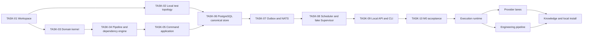

# Forge: Implementation Plan

**Статус:** приёмочные сценарии M0 и M1 пройдены, включая live Codex; отклонение TASK-05 требует отдельного решения
**Дата обновления:** 6 сентября 2026
**Граница:** local Linux-first MVP. План покрывает control plane, execution
runtime, provider boundary, local install и knowledge loop. Existing `frontend/`
не является его workstream: UI подключается позднее к стабильным HTTP/SSE
контрактам отдельным планом.

## 1. Входные решения

| Источник | Роль в плане |
|---|---|
| `../forge-prd-v0.1.md` | MVP, milestones и сквозной acceptance scenario |
| `PROJECT_RULES.md` | обязательные границы, quality gates и DoD |
| `STACK.md` | Rust/Tokio/Axum/Tonic/SQLx, PostgreSQL/NATS/Redis/MinIO/AgentMemory/LiteLLM/Prometheus и rootless Podman |
| `ARCHITECTURE.md` | modular monolith + Supervisor, Cargo workspace и interfaces |
| `2026-09-03-*-domain-model.md` | Task, Pipeline, dependencies, Manager, Employee и Summarizer contracts |
| `2026-09-04-*-domain-model.md` | Core, runtime, providers, credentials, observability и recovery |

### Фактическая исходная точка

- В root есть Rust workspace, canonical migrations, Core/CLI/Supervisor и test harness.
- M0 simulator имеет автоматический acceptance gate; реальный runtime включается явно.
- Реализация TASK-11–19 и границы её проверки описаны в [M1_RUNTIME.md](M1_RUNTIME.md).
- UI не входит в текущий checkout/workstream и не блокирует backend MVP.
- Нет права заменять утверждённые доменные контракты кодом. Неясность сначала
  становится коротким research spike или proposal, а не скрытым допущением.

## 2. Delivery context

### Первый usable slice

**Milestone 0 — deterministic core simulator.** Через CLI или test harness
можно создать Project, immutable PipelineVersion с несколькими stage, Employee
и две Task. Core одобряет Task, создаёт QueueEntry, выдаёт fake Lease/Run,
принимает typed stage outcome, делает retry и доводит одну Task до `done` без
создания второй карточки. Вторая Task остаётся в очереди при capacity = 1.

Этот slice намеренно не требует LLM, Git, Podman или UI. Он проверяет именно
ценность Forge: canonical state machine, durable history и deterministic
scheduling. Реальный provider нельзя добавлять до его прохождения.

### Не входит в активный execution plan

- remote control, distributed runners, cloud multi-tenancy и human-team RBAC;
- web UI implementation и прямое изменение existing `frontend/`;
- собственная RAG/graph database или самописный provider agent loop;
- production deployment вне одного Linux host.

### Правило параллелизма

Задачи помечены parallelizable только когда не конкурируют за один и тот же
canonical contract, migration или bootstrap file. До появления TASK-07 параллель
ограничен документацией, test fixtures и независимыми adapter probes.

## 3. Целевая последовательность

## 4. Task decomposition principles

- **Milestone** — доказанный продуктовый результат. Он закрывается exit gate, а
  не оценкой длительности.
- **Epic** — связная инженерная способность внутри Milestone. Epic не является
  runtime-сущностью Forge и не создаёт Task на доске.
- **Task** — ограниченная исполнимая работа внутри Epic с собственными scope,
  non-goals, DoD и validation.
- Один task даёт проверяемый результат одному инженеру или coding agent.
- Schema/protocol changes предшествуют независимым consumers.
- Domain behavior сначала доказывается pure/fake tests, затем реальными
  PostgreSQL, NATS, Podman и provider boundaries.
- Поддержка provider означает pinned-version adapter contract test, а не запись
  в registry.
- Каждый P0 task имеет scope, non-goals, DoD и runnable validation.

## 5. Milestones, epics and tasks

### Milestone 0 — Deterministic Core Simulator

**Exit gate:** fake Pipeline с retry, dependency gate и capacity = 1 проходит
через Core, сохраняя одну Task, canonical Event history и durable queue без LLM,
Git, Podman или UI.

#### [Epic M0.1 — Базовый workspace и локальная test topology](epics/m0-e1-workspace-test-topology.md)

##### TASK-01 — Bootstrap Cargo workspace и единый developer workflow

- **Type / priority:** foundation / P0.
- **Goal:** создать минимальный Cargo workspace и повторяемый локальный workflow.
- **Scope:** workspace crates из `ARCHITECTURE.md`; pinned Rust toolchain;
  workspace lints; `cargo fmt`, Clippy и test aliases; `.gitignore`; короткий
  README для development mode.
- **Non-goals:** domain code, database schema, containers и installer.
- **Depends on:** нет.
- **Outputs / likely areas:** root `Cargo.toml`, `rust-toolchain.toml`, crate
  manifests, `crates/*/src/lib.rs`, `README.md`, CI-neutral local commands.
- **Definition of Done:** пустой workspace собирается offline после dependency
  fetch; shared lints не обходятся crate-local overrides; `Cargo.lock` создан.
- **Validation:** `cargo fmt --check`; `cargo clippy --workspace --all-targets
  --all-features --locked -- -D warnings`; `cargo test --workspace --locked`.
- **Parallelizable / delegate:** да, только с TASK-02; да.
- **Risk:** не добавлять premature `xtask`, codegen или runtime dependencies.

##### TASK-02 — Local data-service и integration-test topology

- **Type / priority:** infra / P0.
- **Goal:** дать тестам повторяемые PostgreSQL, NATS JetStream, Redis и MinIO,
  не создавая production installer.
- **Scope:** rootless Podman compose/quadlet-compatible development topology,
  named volumes, isolated test namespace, readiness scripts и synthetic config.
- **Non-goals:** AgentMemory, LiteLLM, Prometheus, user systemd units и remote
  deployment.
- **Depends on:** TASK-01.
- **Outputs / likely areas:** `infra/dev/`, `infra/test/`, config examples,
  `scripts/` или Rust testkit helpers, setup documentation.
- **Definition of Done:** clean host can start/stop the four services without
  root; test run receives isolated endpoint names; no credential enters git.
- **Validation:** documented `forge-dev up` equivalent; readiness probes;
  disposable integration test creates and removes a schema/bucket/stream.
- **Parallelizable / delegate:** после TASK-01, параллельно с TASK-03; да.
- **Risk:** compose must not become installer contract or expose containers to
  RunEnvironment.

#### [Epic M0.2 — Canonical domain and command model](epics/m0-e2-domain-command-model.md)

##### TASK-03 — Pure domain kernel Task, Employee, Artifact и Event

- **Type / priority:** foundation / P0.
- **Goal:** выразить Task lifecycle, Employee eligibility, typed properties,
  priority/cancellation catalogs, Artifact links и immutable Event без storage
  или transport.
- **Scope:** stable ids, revisions, `delivery`/`analysis`, lifecycle transition
  validators, terminal data, Employee identity/enabled state/stage eligibility,
  errors and event vocabulary in `forge-domain`.
- **Non-goals:** SQLx types, HTTP DTOs, queue dispatch и LLM semantics.
- **Depends on:** TASK-01.
- **Outputs / likely areas:** `crates/forge-domain/src/task*`, `employee*`,
  `artifact*`, `event*`, domain fixtures and unit tests.
- **Definition of Done:** every transition from the Task model is represented;
  cancelled without reason, terminal mutation and invalid properties are rejected
  by tests; domain crate has no infrastructure imports.
- **Validation:** focused lifecycle/property tests plus workspace quality gates.
- **Parallelizable / delegate:** да, параллельно с TASK-02; да.
- **Risk:** do not encode board columns or provider statuses as lifecycle.

##### TASK-04 — Pipeline, dependency и escalation domain engine

- **Type / priority:** foundation / P0.
- **Goal:** make immutable PipelineVersion, stage transition matrix,
  TaskDependency gates and resolver-safe outcomes executable as pure rules.
- **Scope:** version publication/pinning, stage contracts, artifact requirement
  mechanics, dependency cycle validation, wait conditions and escalation outcome
  validation.
- **Non-goals:** pipeline visual editor, semantic Artifact correctness or human
  resolution UI.
- **Depends on:** TASK-03.
- **Outputs / likely areas:** `forge-domain` pipeline/dependency/escalation
  modules, table-driven transition tests and fixtures.
- **Definition of Done:** Task cannot dispatch through an unsatisfied gate;
  resolver cannot select an outcome outside paused stage’s Pipeline; version
  changes cannot rewrite pinned Task behavior.
- **Validation:** cycle, gate, migration and lifecycle/stage-mapping tests.
- **Parallelizable / delegate:** нет; да.
- **Risk:** Pipeline owns stage presentation; Core owns lifecycle only.

##### TASK-05 — Application command boundary и in-memory reference engine

**Сверка реализации, 6 сентября 2026:** named commands, revision/idempotency и
атомарная запись state/Event/outbox реализованы через PostgreSQL. Отдельного
in-memory reference engine с repository ports и fake-clock conformance harness
в текущем checkout нет: `forge-application` разбирает typed commands, а
`M0Harness` использует `PostgresStore`, PostgreSQL и NATS. Функциональный M0
acceptance пройден, но эта часть TASK-05 не выполнена буквально. Требуется
отдельно согласовать изменение подхода либо реализацию reference engine;
приведённый ниже scope пока не отменён.

- **Type / priority:** capability / P0.
- **Goal:** implement named command handling before real persistence so all
  mutations have one testable semantic path.
- **Scope:** application ports, actor/capability checks, expected revision,
  idempotency record, command result/error shape; commands for Project, Task,
  Pipeline, dependency and basic Manager actions against in-memory repositories.
- **Non-goals:** Axum handlers, SQLx implementation, NATS delivery or arbitrary
  manager scripting.
- **Depends on:** TASK-03, TASK-04.
- **Outputs / likely areas:** `forge-application`, domain ports, fake stores in
  `forge-testkit`, command conformance suite.
- **Definition of Done:** duplicate command cannot duplicate state/Event;
  unauthorized Employee cannot mutate lifecycle; command creates state, Event
  and planned outbox intent atomically in the reference engine.
- **Validation:** command-table tests, idempotency/revision conflict tests and
  fake-clock scenarios.
- **Parallelizable / delegate:** нет; да.
- **Risk:** no direct repository mutation may be added as a shortcut later.

#### [Epic M0.3 — Durable scheduling and simulator acceptance](epics/m0-e3-durable-scheduling-simulator.md)

##### TASK-06 — PostgreSQL canonical schema, migrations и transactional store

- **Type / priority:** foundation / P0.
- **Goal:** replace reference persistence with canonical PostgreSQL storage
  without changing application command semantics.
- **Scope:** migrations for Project, Task, PipelineVersion, Event, outbox,
  QueueEntry, Lease, Run, Artifact and dependency projection; SQLx repositories;
  transaction boundary and concurrency locks.
- **Non-goals:** Redis cache, AgentMemory index, raw object bodies or provider
  secret materialization.
- **Depends on:** TASK-02, TASK-05.
- **Outputs / likely areas:** `migrations/`, `forge-storage`, integration
  fixtures and repository conformance tests.
- **Definition of Done:** command state/Event/outbox commit or roll back as one
  transaction; concurrent expected-revision conflict is deterministic; migration
  applies to a clean database.
- **Validation:** integration tests against disposable PostgreSQL; migration
  apply smoke test; transaction rollback/fencing test.
- **Parallelizable / delegate:** нет; да.
- **Risk:** schema must retain audit history and never serialize secrets into
  Event payloads.

##### TASK-07 — Transactional outbox и NATS JetStream delivery

- **Type / priority:** integration / P0.
- **Goal:** deliver committed events to asynchronous consumers without making
  NATS a command authority.
- **Scope:** outbox polling/publisher, stable event ids, JetStream stream setup,
  consumer deduplication and replay-safe consumer contract.
- **Non-goals:** distributed runner transport, Kafka/Redpanda or consumer UI.
- **Depends on:** TASK-02, TASK-06.
- **Outputs / likely areas:** `forge-core` outbox module, NATS adapter,
  migration additions, testkit fake/broker fixtures.
- **Definition of Done:** crash between commit and publish is recovered; replay
  cannot create second domain transition or QueueEntry; consumer lag is visible
  to the later metrics boundary.
- **Validation:** PostgreSQL+NATS failure-injection integration tests and replay
  smoke scenario.
- **Parallelizable / delegate:** нет; да.
- **Risk:** in-process application modules still use ports, not NATS RPC.

##### TASK-08 — Deterministic scheduler, Lease и fake Supervisor

- **Type / priority:** capability / P0.
- **Goal:** make Core choose runnable work, enforce capacity and produce one
  fence-protected fake Run per attempt.
- **Scope:** QueueEntry claim, priority/age ordering, dependency gates, Project
  execution gate, Employee eligibility, resource reservation, Lease/fencing,
  fake Supervisor events and stop acknowledgement.
- **Non-goals:** Podman, real provider processes, token budgets or UI board.
- **Depends on:** TASK-04, TASK-06, TASK-07.
- **Outputs / likely areas:** `forge-core` scheduler/lease modules,
  `forge-testkit` fake Supervisor and deterministic clock tests.
- **Definition of Done:** capacity one keeps the second Task queued; stale
  fence/epoch event is audited but not applied; Project stop prevents all new
  dispatch; safe stop leaves the Task waiting.
- **Validation:** deterministic multi-Task scheduler suite, duplicate-delivery
  suite and stop/retry scenarios.
- **Parallelizable / delegate:** нет; да.
- **Risk:** scheduler output is a QueueEntry/Lease decision, never Employee
  ownership of a Task.

##### TASK-09 — Local API, CLI and SSE projection baseline

- **Type / priority:** component / P0.
- **Goal:** expose the same named commands and read models used by the simulator
  through a real local interface.
- **Scope:** Axum HTTP/JSON command endpoint, idempotency header/body contract,
  typed error responses, read endpoints for Task/Pipeline/Run, bounded SSE
  stream and Rust CLI subcommands.
- **Non-goals:** web UI, remote auth/RBAC, WebSocket, generic CRUD bypass.
- **Depends on:** TASK-05, TASK-08.
- **Outputs / likely areas:** `forge-protocol`, `forge-core` API, `forge-cli`,
  API examples and contract tests.
- **Definition of Done:** CLI creates/approves a Task and observes its Event;
  SSE reconnect can re-read authoritative state; every mutation reaches the same
  application command handler as tests.
- **Validation:** API contract tests; CLI subprocess smoke test; SSE reconnect
  test against local Core.
- **Parallelizable / delegate:** нет; да.
- **Risk:** SSE is projection only and never a command channel.

##### TASK-10 — Milestone 0 end-to-end acceptance harness

- **Type / priority:** testing / P0.
- **Goal:** lock the first usable slice before execution/runtime work begins.
- **Scope:** one versioned fake Pipeline with implementation, verification,
  review and integration stages; retry; Task history; capacity contention;
  cancellation and dependency-gate negative paths.
- **Non-goals:** Git merge, real LLM, Podman or production installer.
- **Depends on:** TASK-08, TASK-09.
- **Outputs / likely areas:** `forge-testkit` scenario DSL/fixtures and
  `tests/milestone0_*` executable acceptance suite.
- **Definition of Done:** the PRD M0 exit criterion passes from a clean local
  data topology and produces one Task with multiple Runs/Artifacts/Events.
- **Validation:** one documented command executes the suite; deliberate stale
  event, retry and unsatisfied dependency failures have asserted outcomes.
- **Parallelizable / delegate:** нет; да.
- **Risk:** failure here blocks all real-provider work; fix the contract, do not
  weaken the scenario.

### Milestone 1 — Первый реальный Employee в изолированном Run

**Exit gate:** Codex CLI получает одну Task из Core, работает только в выданной
TaskWorkSurface, выдаёт наблюдаемое evidence и может быть безопасно остановлен
или reconciled без duplicate write-Run.

#### [Epic M1.1 — Supervisor, sandbox and failure boundary](epics/m1-e1-supervisor-sandbox-failure-boundary.md)

##### TASK-11 — Core–Supervisor gRPC protocol and service skeleton

- **Type / priority:** foundation / P0.
- **Goal:** replace fake execution transport with authenticated local UDS gRPC
  while preserving Core’s desired-state authority.
- **Scope:** Protobuf schemas, code generation, UDS authentication, RunEnvelope,
  ordered RunEvent, desired/observed reconciliation and service lifecycle.
- **Non-goals:** Podman provision, provider adapter or remote network RPC.
- **Depends on:** TASK-01, TASK-08.
- **Outputs / likely areas:** `forge-protocol`, `forge-core`,
  `forge-supervisor`, contract compatibility tests.
- **Definition of Done:** Supervisor cannot call a domain-write API; Core rejects
  stale epoch/sequence event over gRPC; restart reconciles observed state.
- **Validation:** two-process UDS integration test and protocol golden/codegen
  check.
- **Parallelizable / delegate:** после TASK-08, параллельно с TASK-12; да.
- **Risk:** no container socket or PostgreSQL credentials cross this boundary.

##### TASK-12 — TaskWorkSurface manager и rootless Podman provision

- **Type / priority:** capability / P0.
- **Goal:** provision one sandboxed Run with a Task-owned work surface safely.
- **Scope:** `git_worktree`, `filesystem_sandbox` and `none` initial backends;
  read/write mode; rootless Podman image/mount/network policy; cgroup controls;
  cleanup eligibility without deletion.
- **Non-goals:** external binding, arbitrary host process fallback or actual
  coding provider.
- **Depends on:** TASK-02, TASK-11.
- **Outputs / likely areas:** `forge-supervisor` Podman/WorkSurface modules,
  test image and rootless integration fixtures.
- **Definition of Done:** no two write Runs receive the same surface; Run lacks
  host home/container socket/network by default; unavailable sandbox returns a
  typed incident rather than host execution.
- **Validation:** rootless Podman integration tests for mounts, read-only review,
  network denial and duplicate-write rejection.
- **Parallelizable / delegate:** после TASK-11; да.
- **Risk:** shell inside the issued surface remains intentionally unrestricted.

##### TASK-13 — RunSpec, ContextSnapshot, Handoff и raw-evidence collection

- **Type / priority:** capability / P0.
- **Goal:** produce immutable, inspectable attempt context and retain technical
  evidence separately from Task artifacts.
- **Scope:** RunSpec budget/profile snapshot, ContextSnapshot assembly,
  TaskHandoff, interrupted handoff, MinIO raw log chunks, object metadata/hash
  and access/redaction references.
- **Non-goals:** LLM summarization, memory retrieval quality or semantic review
  of an Artifact.
- **Depends on:** TASK-06, TASK-11, TASK-12.
- **Outputs / likely areas:** `forge-core` context/handoff modules,
  `forge-storage` object metadata, Supervisor log collector, MinIO tests.
- **Definition of Done:** next Run can obtain canonical handoff before any
  summary; raw stdout cannot masquerade as accepted Artifact; force-stop creates
  interrupted handoff without Pipeline success transition.
- **Validation:** MinIO integration test, snapshot immutability test and
  force-stop/reassign scenario.
- **Parallelizable / delegate:** после TASK-12; да.
- **Risk:** no prompts/secrets in raw diagnostics by default.

##### TASK-14 — Tool Gateway and provider-neutral adapter contract

- **Type / priority:** integration / P0.
- **Goal:** give every Run the same capability-checked tool boundary regardless
  of MCP support or adapter transport.
- **Scope:** Tool Catalog, scoped ToolRequest, capability/policy/budget audit,
  Gateway MCP adapter, RunEnvelope adapter trait, `acp`/`cli_wrapper`/
  `api_runtime` engine selection and normalized event model.
- **Non-goals:** implementation of every provider adapter or unrestricted shell
  mediation inside WorkSurface.
- **Depends on:** TASK-11, TASK-13.
- **Outputs / likely areas:** `forge-core` gateway policy, `forge-provider-*`
  trait crate, test MCP server and adapter conformance harness skeleton.
- **Definition of Done:** native MCP cannot bypass Gateway; adapter with raw
  stdout declares limited capabilities rather than invented tool events;
  prohibited tool request is audited and denied.
- **Validation:** fake MCP/adapter contract tests and capability-denial smoke.
- **Parallelizable / delegate:** после TASK-13; да.
- **Risk:** shell to own WorkSurface is intentionally outside Gateway scope.

##### TASK-15 — Watchdog, incident and recovery implementation

- **Type / priority:** capability / P0.
- **Goal:** make unavailable provider, budget exhaustion, lost environment and
  reboot observable, actionable and non-duplicating.
- **Scope:** liveness/start deadlines, typed RunIncident, graceful then forced
  stop, recovery assessment candidates, boot-id reconciliation and all three
  BootRecoveryPolicy behaviors.
- **Non-goals:** judging semantic quality of work or automatic retry after an
  unknown side effect.
- **Depends on:** TASK-08, TASK-11, TASK-13.
- **Outputs / likely areas:** Core recovery coordinator, Supervisor watchdog,
  fake boot-id harness and incident tests.
- **Definition of Done:** progress silence alone does not mark a Run lost;
  pre-boot lease is revoked; only accepted `not_started_confirmed` re-executes
  automatically under the default policy.
- **Validation:** failure-injection tests for provider loss, heartbeat loss,
  budget stop and host reboot; audited handoff assertions.
- **Parallelizable / delegate:** после TASK-13; да.
- **Risk:** recovery must not become a hidden second scheduler.

##### TASK-16 — Observability and health baseline

- **Type / priority:** infra / P1.
- **Goal:** make local operation diagnosable from the first real process.
- **Scope:** `tracing` JSON, correlation fields, W3C propagation, `/healthz`,
  `/readyz`, `/metrics`, Prometheus container/config and bounded metric set.
- **Non-goals:** Grafana, Loki, Tempo, paid provider health probes or detailed
  UI dashboards.
- **Depends on:** TASK-02, TASK-11, TASK-15.
- **Outputs / likely areas:** Core/Supervisor instrumentation, Prometheus dev
  topology, metrics registry and operational smoke tests.
- **Definition of Done:** logs redact forbidden data; metrics have no high-card
  identity label; readiness checks local dependencies but performs no inference.
- **Validation:** integration test scrapes metrics, asserts redaction and
  readiness failure paths.
- **Parallelizable / delegate:** после TASK-11; да.
- **Risk:** observability failure never rolls back a command.

#### [Epic M1.2 — Credential-safe first provider lanes](epics/m1-e2-credential-safe-provider-lanes.md)

##### TASK-17 — Secret Store, profiles and credential-delivery policy

- **Type / priority:** security / P0.
- **Goal:** implement versioned ExecutionProfile and secure credential material
  before any real provider receives work.
- **Scope:** encrypted secret records, Linux keyring/fallback owner-only key,
  CredentialBinding, CapabilityProfile, profile preflight and audit metadata.
- **Non-goals:** Vault, cloud KMS, importing arbitrary host provider homes or
  multi-user secret sharing.
- **Depends on:** TASK-06, TASK-14.
- **Outputs / likely areas:** storage migrations, secret service, profile
  domain/application modules and security test fixtures.
- **Definition of Done:** plaintext is absent from canonical state/logs/events;
  lost master key fails closed; profile requires explicit
  `credential_exposed_to_run` when applicable.
- **Validation:** encryption round-trip/rotation tests, log-scan regression
  test, file-mode test and denied-profile scenario.
- **Parallelizable / delegate:** после TASK-14; да.
- **Risk:** use standard AEAD library only; no custom cryptography.

##### TASK-18 — LiteLLM Provider Gateway and `opencode_runtime` API lane

- **Type / priority:** integration / P0.
- **Goal:** provide one proxy-only multi-provider path with Run-scoped budget
  evidence.
- **Scope:** LiteLLM local service, host-side secret materialization, virtual
  key lifecycle, allowed-model binding, observed usage import and pinned
  OpenCode runtime adapter.
- **Non-goals:** provider auto-fallback, vendor CLI support or treating gateway
  usage as Task state authority.
- **Depends on:** TASK-02, TASK-14, TASK-17.
- **Outputs / likely areas:** LiteLLM config/template, `forge-provider-opencode`,
  gateway client, test provider stub and contract tests.
- **Definition of Done:** OpenCode sees only a Run-scoped key; expired/over-limit
  key creates evidence/incident; Core, not LiteLLM, decides Task transition.
- **Validation:** stub-provider end-to-end run, virtual-key expiry/budget tests,
  secrets-redaction test.
- **Parallelizable / delegate:** после TASK-17; да.
- **Risk:** real upstream credentials are optional for tests and never printed.

##### TASK-19 — Adapter conformance harness and Codex CLI lane

- **Type / priority:** integration / P0.
- **Goal:** establish the native CLI adapter standard with the first real coding
  runtime.
- **Scope:** pinned CLI discovery/preflight, isolated managed provider home,
  `cli_wrapper` or ACP selection, controlled stop, normalized events, cleanup
  and Codex adapter contract suite.
- **Non-goals:** claiming structured events/session resume when CLI cannot prove
  them; cross-provider fallback.
- **Depends on:** TASK-12, TASK-14, TASK-17.
- **Outputs / likely areas:** adapter harness, `forge-provider-codex`, fake CLI
  fixture and optional credential-mode test profile.
- **Definition of Done:** adapter can start/stop/collect a sandboxed Run; actual
  engine and capabilities are recorded; unsupported capability fails preflight.
- **Validation:** fake-CLI deterministic contract suite plus opt-in local real
  CLI smoke that skips safely without credentials.
- **Parallelizable / delegate:** после TASK-17; да.
- **Risk:** adapter support is never inferred from human CLI interaction alone.

### Milestone 2 — Полный engineering Pipeline и provider matrix

**Exit gate:** delivery Task проходит реальный Git worktree, verification,
independent review и Integration; каждый заявленный provider lane либо проходит
один adapter contract, либо явно недоступен с объяснением capability/preflight.

#### [Epic M2.1 — Расширение provider catalog по единому contract](epics/m2-e1-provider-catalog.md)

##### TASK-20 — Claude Code CLI adapter

- **Type / priority:** integration / P1.
- **Goal:** add independently tested Claude native CLI support through the same
  adapter contract.
- **Scope:** adapter-specific preflight/config/credential mode/event parser and
  pinned-version contract fixtures.
- **Non-goals:** changes to Core scheduling or a shared unsafe auth home.
- **Depends on:** TASK-19.
- **Outputs / likely areas:** `forge-provider-claude`, fixture and profile docs.
- **Definition of Done:** adapter declares an explicit capability matrix and
  passes the common fake-CLI conformance suite.
- **Validation:** opt-in real CLI smoke proves declared start, stop and evidence
  collection behavior without requiring a committed credential.
- **Parallelizable / delegate:** after TASK-19, parallel with TASK-21/22/23; да.
- **Risk:** capability differences remain visible, not normalized away.

##### TASK-21 — Cursor CLI adapter

- **Type / priority:** integration / P1.
- **Goal / scope:** add Cursor CLI using the pinned adapter contract and
  isolated credential delivery.
- **Non-goals:** Cursor-specific domain behavior or project-wide runtime policy.
- **Depends on:** TASK-19.
- **Outputs:** `forge-provider-cursor`, fixtures, capability/profile docs.
- **Definition of Done:** adapter passes the common conformance suite with its
  own pinned-runtime fixture and isolated credential profile.
- **Validation:** opt-in real CLI smoke proves start, stop, evidence collection
  and declared capabilities.
- **Parallelizable / delegate:** yes after TASK-19; да.
- **Risk:** no host Cursor profile mount by default.

##### TASK-22 — Gemini CLI adapter

- **Type / priority:** integration / P1.
- **Goal / scope:** add Gemini CLI through the established adapter contract.
- **Non-goals:** provider switching or unscoped network credentials.
- **Depends on:** TASK-19.
- **Outputs:** `forge-provider-gemini`, fixtures and capability/profile docs.
- **Definition of Done:** adapter passes the common conformance suite and fails
  preflight rather than claiming an unavailable capability.
- **Validation:** opt-in real CLI smoke proves supported behavior and records
  the selected transport engine.
- **Parallelizable / delegate:** yes after TASK-19; да.
- **Risk:** provider setup variability belongs in profile preflight, not Core.

##### TASK-23 — Grok CLI adapter

- **Type / priority:** integration / P1.
- **Goal / scope:** add Grok CLI via the established adapter contract.
- **Non-goals:** generic vendor SDK abstraction or Core changes.
- **Depends on:** TASK-19.
- **Outputs:** `forge-provider-grok`, fixtures and capability/profile docs.
- **Definition of Done:** adapter passes the common conformance suite with a
  pinned fixture and explicit capability profile.
- **Validation:** opt-in real CLI smoke proves start, controlled stop and
  evidence collection.
- **Parallelizable / delegate:** yes after TASK-19; да.
- **Risk:** do not claim parity with richer runtimes.

#### [Epic M2.2 — Git delivery, verification and review](epics/m2-e2-git-delivery-verification-review.md)

##### TASK-24 — Git worktree, verification and Integration Controller

- **Type / priority:** capability / P0.
- **Goal:** replace fake delivery stages with a safe real Git engineering loop.
- **Scope:** Task Git surface creation, base/final SHA, versioned verification
  profiles, deterministic command runner, Integration lock, rebase/merge and
  final verification.
- **Non-goals:** external CI import, arbitrary deployment stage or bypassing a
  protected branch.
- **Depends on:** TASK-12, TASK-13, TASK-15, TASK-19.
- **Outputs / likely areas:** WorkSurface Git backend, verification runner,
  Integration controller and temporary Git-repository fixtures.
- **Definition of Done:** one Task retains one worktree across retry; failed
  verification returns through its configured Pipeline transition; only
  Integration changes protected `main` and records final SHA.
- **Validation:** isolated Git repository end-to-end test with failed test,
  retry, merge conflict and successful final merge.
- **Parallelizable / delegate:** after TASK-19; да.
- **Risk:** no task ownership transfer or new FixTask for review feedback.

##### TASK-25 — Independent Review and artifact acceptance

- **Type / priority:** capability / P1.
- **Goal:** add Pipeline-enforced review without confusing review as a separate
  Task.
- **Scope:** reviewer eligibility/independence, read-only surface snapshot,
  typed review verdict, comments as Artifact, acceptance policy and return
  transition.
- **Non-goals:** semantic truth evaluation by Summarizer or UI review editor.
- **Depends on:** TASK-14, TASK-24.
- **Outputs / likely areas:** Pipeline executor rules, review artifact types,
  reviewer fixtures and contract tests.
- **Definition of Done:** same Employee cannot approve own work where policy
  forbids it; `changes_requested` creates a new attempt of the same Task; no
  write mount is given to reviewer.
- **Validation:** Git fixture review loop and invalid-independence negative test.
- **Parallelizable / delegate:** after TASK-24; да.
- **Risk:** acceptance checks structure/authority, not an LLM’s unverified prose.

#### [Epic M2.3 — Project management and resolver queues](epics/m2-e3-project-management-resolver-queues.md)

##### TASK-26 — Employee, System Manager and resolver queue capabilities

- **Type / priority:** capability / P1.
- **Goal:** make Employee identity/configuration, named Manager commands and
  queue-based escalation operational.
- **Scope:** Employee lifecycle/profile/prompt records, eligibility, Manager
  command registry, control-message/stop/reassign, resolver queue,
  ResolutionLease and human/employee resolution submission.
- **Non-goals:** autonomous manager LLM, strict reporting hierarchy or direct
  Employee lifecycle mutation.
- **Depends on:** TASK-05, TASK-08, TASK-13, TASK-17.
- **Outputs / likely areas:** employee/manager application modules, schema,
  resolver tests and CLI commands.
- **Definition of Done:** a busy resolver does not block queue routing; Employee
  can inspect scoped status and escalate, but cannot directly move Task; Manager
  control stop defaults Task to waiting.
- **Validation:** resolver failover, retirement, control-message and escalation
  transition integration tests.
- **Parallelizable / delegate:** after TASK-17; да.
- **Risk:** Manager command is deterministic authorization, not model judgment.

### Milestone 3 — Knowledge loop

**Exit gate:** следующий Run получает canonical handoff сразу и только
разрешённое derived knowledge позднее; summarization не блокирует stage
transition и не получает domain-write authority.

#### [Epic M3.1 — Derived memory and retrieval projection](epics/m3-e1-derived-memory-retrieval.md)

##### TASK-27 — Summarization dispatcher, derived memory and AgentMemory projection

- **Type / priority:** capability / P1.
- **Goal:** build useful handoffs and retrieval without letting an LLM become
  canonical authority.
- **Scope:** outbox-triggered SummarizationJob, coalescing/capacity budget,
  TaskSummary/EmployeeMemoryEntry/ProjectKnowledgeEntry, source links,
  AgentMemory indexing/retrieval adapter and ContextSnapshot revalidation.
- **Non-goals:** custom RAG engine, automatic acceptance of knowledge or
  semantic verification of reports.
- **Depends on:** TASK-07, TASK-13, TASK-16, TASK-18 or TASK-19.
- **Outputs / likely areas:** summarizer modules, AgentMemory adapter, mock
  summarizer, derived-entry schema and retrieval tests.
- **Definition of Done:** a handoff exists synchronously before summary; delayed
  summary cannot block stage transition; stop gate suppresses new summarization
  dispatch; retrieved stale/invisible entry is rejected by Core.
- **Validation:** coalescing/budget tests, delayed-summary race test,
  source-link/audit test and AgentMemory integration smoke.
- **Parallelizable / delegate:** after TASK-13; да.
- **Risk:** provider/model choice for semantic summarization remains configurable
  and is not hard-coded into domain logic.

### Milestone 4 — Local product proof and interface readiness

**Exit gate:** чистый Linux host устанавливает Forge одной командой/wizard,
после reboot корректно применяет BootRecoveryPolicy, а operator может завершить
MVP acceptance через CLI. Web Control Room использует эти stable contracts в
отдельном workstream.

#### [Epic M4.1 — Installer, operator workflow and MVP acceptance](epics/m4-e1-installer-operator-acceptance.md)

##### TASK-28 — Linux local installer, wizard and user systemd services

**К обсуждению:** wizard должен позволять настроить bundle среды разработки
проекта. Набор toolchains и зависимостей нельзя ограничить заранее известным
списком. Формат bundle, подготовка зависимостей, package-registry policy и
кеширование требуют отдельного дизайна; это не дополнительный exit gate M1.

- **Type / priority:** infra / P0.
- **Goal:** make Forge installable and restartable without manually assembling
  services.
- **Scope:** prerequisite check, data-service provisioning, initial wizard,
  state directories/permissions, Core/Supervisor binaries, user systemd units
  with linger/backoff and foreground development mode.
- **Non-goals:** remote deployment, Kubernetes, external S3 or desktop bundle.
- **Depends on:** TASK-02, TASK-11, TASK-16, TASK-17, TASK-18.
- **Outputs / likely areas:** `forge-install`/CLI install flow, unit templates,
  config generator, local runbook and clean-host test script.
- **Definition of Done:** one documented command validates prerequisites, starts
  all local services and reaches `/readyz`; reboot starts services and applies
  BootRecoveryPolicy; secrets files have correct ownership/modes.
- **Validation:** clean Linux VM/container-host smoke, user service restart and
  simulated reboot/recovery test.
- **Parallelizable / delegate:** after listed dependencies; да.
- **Risk:** installer must not grant Core/Supervisor a container socket.

##### TASK-29 — Local MVP acceptance, failure matrix and operator runbook

- **Type / priority:** testing / P0.
- **Goal:** prove the full local product contract before UI or remote work.
- **Scope:** automated happy path plus failure matrix: provider unavailable,
  exhausted budget, graceful/forced stop, stale event, dependency gate,
  review return, merge conflict, summarizer lag and host reboot; operator CLI
  walkthrough and evidence checklist.
- **Non-goals:** broad performance benchmark, cloud load test or UI acceptance.
- **Depends on:** TASK-18, TASK-20–23, TASK-24–28.
- **Outputs / likely areas:** end-to-end suite, fixture repositories/provider
  stubs, operator runbook and release checklist.
- **Definition of Done:** PRD acceptance scenario passes with at least one real
  configured provider lane and the provider conformance matrix is explicit;
  all failures end in known RunIncident/Task state without duplicate write Run.
- **Validation:** documented `cargo test`/integration command set, clean-host
  installer smoke and manual CLI evidence walkthrough.
- **Parallelizable / delegate:** нет; да.
- **Risk:** unsupported provider capability must be reported as unavailable, not
  silently approximated.

## 6. Execution order and workstreams

### 6.1 Critical path

`01 → 03 → 04 → 05 → 06 → 07 → 08 → 09 → 10 → 11 → 12 → 13 → 14 → 17 → 19 → 24 → 28 → 29`.

This order intentionally proves state and failure semantics before expensive
provider/runtime work. A failure in TASK-10 sends work back to the responsible
Core task; it is not papered over in Supervisor or adapter code.

### 6.2 Genuine parallelism

| After | Parallel work | Shared boundary that must remain frozen |
|---|---|---|
| TASK-01 | TASK-02 and TASK-03 | workspace lint/toolchain only |
| TASK-11 | TASK-12 and protocol-only observability scaffolding | Protobuf RunEnvelope |
| TASK-13 | TASK-14, TASK-15 and TASK-16 | RunSpec, RunEvent and Handoff |
| TASK-17 | TASK-18 and TASK-19 | ExecutionProfile/CredentialBinding |
| TASK-19 | TASK-20, TASK-21, TASK-22 and TASK-23 | adapter conformance harness |
| TASK-24 | TASK-25 and TASK-26 | Pipeline/Artifact/Run contracts |
| TASK-13 | TASK-27 discovery and mock implementation | canonical handoff and outbox event ids |

### 6.3 Early integration gates

1. TASK-06 proves PostgreSQL transaction semantics before queue work.
2. TASK-10 proves simulator behavior before real processes.
3. TASK-12 proves rootless isolation before provider credentials.
4. TASK-17 proves secret boundary before any configured real provider.
5. TASK-19 establishes a reusable adapter contract before provider expansion.
6. TASK-24 proves a real Git change/retry/integration loop before acceptance.

## 7. Milestone roadmap

| Milestone | Epics | Demonstrated result |
|---|---|---|
| M0: Deterministic Core Simulator | M0.1 workspace/test topology; M0.2 domain/commands; M0.3 durable scheduler | TASK-10 acceptance passes without real runtime |
| M1: Первый Employee | M1.1 Supervisor/sandbox/recovery; M1.2 credentials and first lanes | isolated Codex Run and API lane have evidence-backed control |
| M2: Engineering Pipeline | M2.1 provider catalog; M2.2 Git/review/Integration; M2.3 management/resolvers | real delivery Task completes one engineering loop and every provider is contract-tested or explicitly unavailable |
| M3: Knowledge loop | M3.1 derived memory/retrieval | handoff is immediate, retrieval is derived and bounded |
| M4: Local product proof | M4.1 installer/operator acceptance | one-command local installation and full failure matrix pass |

### Current execution focus

Функциональный M0 acceptance пройден; отличие TASK-05 от первоначального
in-memory подхода отмечено в самой задаче и требует решения. Для M1 / TASK-11–19
завершены реализация, независимое review с исправлением findings, общий integration
target и отдельные проверки
реальных CLI/API-компонентов с локальным upstream stub. Результаты и ограничения
зафиксированы в [M1_RUNTIME.md](M1_RUNTIME.md).

6 сентября 2026 прошли одиночный Codex Run с принятым Artifact/outcome и
`just test-codex-live`: два одновременных Run через выбранную подписку,
раздельные surfaces/homes, named stop и сбор interrupted evidence. Тест завершился
с `1 passed; 0 failed` за 28.61 секунды; оба контейнера остановлены с exit 0,
исходный auth не изменился. Live acceptance blocker M1 снят. Это проверка
конкретного Codex profile, а не всех моделей и provider lanes.
TASK-20–29 остаются roadmap; наличие их описаний не означает реализацию.

## 8. Task readiness notes

### Ready now

M1 runtime прошёл operator-approved live acceptance на проверенных M0 contracts.
Следующий продуктовый этап — M2. Отклонение TASK-05 остаётся явным вопросом
сверки плана; выбор стека не переоткрывается.

### Explicit configuration work, not architecture blockers

- exact pinned versions/images for Podman, CLI runtimes, OpenCode and LiteLLM;
- test-only provider stubs and opt-in real credentials;
- package registry/network proxy policy for a target Linux environment;
- repository-specific protected-branch policy used by TASK-24 fixtures.

### Deferred decisions

The exact summarizer model, provider session-retention policy, cross-project
Employee scope and UI rendering stay configurable or deferred as recorded in
the PRD. They do not block the deterministic Core or execution boundary.

## 9. Risks and control points

| Risk | Control in plan |
|---|---|
| State model is duplicated between fake and SQL implementations | TASK-05 command conformance suite precedes TASK-06 |
| Provider work hides a Core bug | TASK-10 is a hard gate before Phase B/C |
| Sandbox silently degrades to host execution | TASK-12 requires typed failure and integration proof |
| CLI differences create false common abstraction | TASK-19 conformance harness before TASK-20–23 |
| Secret leaks in logs or artifacts | TASK-17 security tests and TASK-16 redaction tests |
| Summaries delay a stage or become authority | TASK-13 handoff precedes TASK-27; summarizer is derived only |
| Installer becomes a second orchestrator | TASK-28 configures services but does not own domain state |

## 10. Plan approval boundary

After approval, this document is converted into individual files under `tasks/`.
Each task file will retain its scope, dependencies, DoD and validation, then add
exact implementation files, commands and any task-local research needed. No
implementation starts merely because a later task is listed here.
