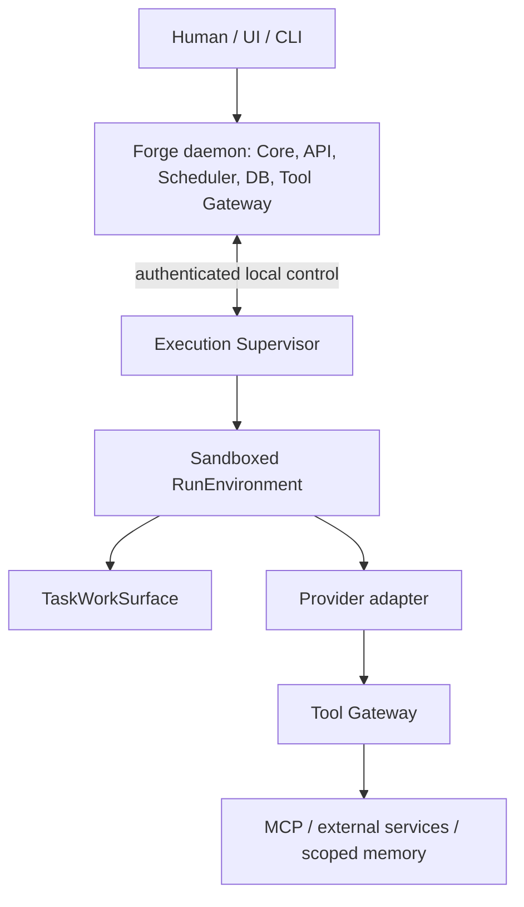
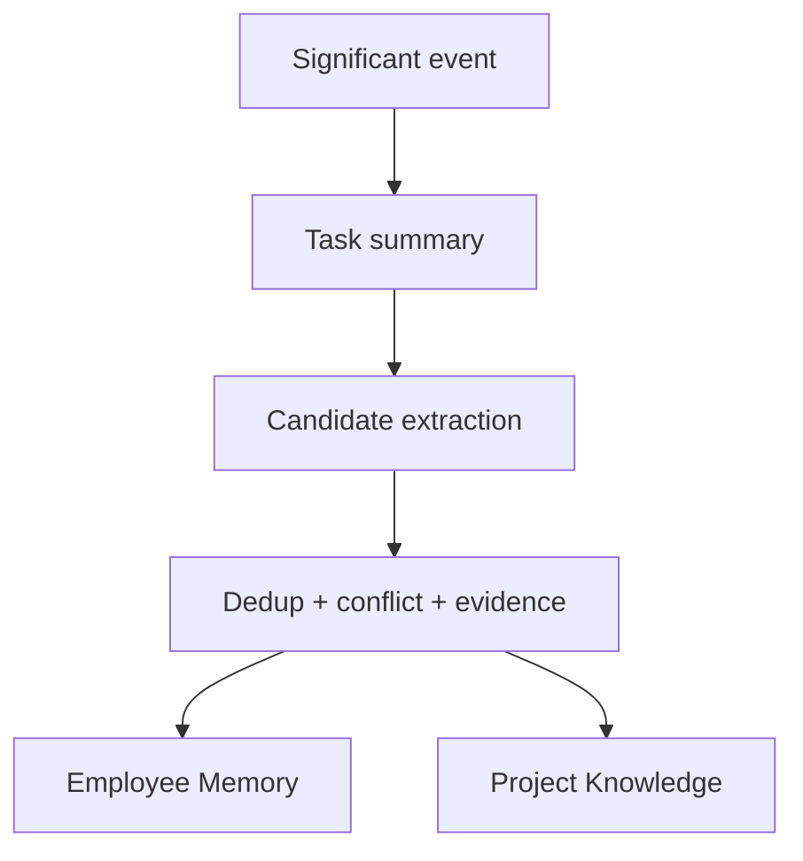

# Forge — PRD системы управляемой автономной разработки

**Статус:** Draft
**Версия:** 0.4
**Дата:** 6 сентября 2026
**Рабочее название:** Forge; название не является финальным
**Область документа:** продукт, core/runtime, пользовательские сценарии и границы MVP

**Уточнение порядка поставки, 11 сентября 2026:** после backend M3 выполняется
[Control Room workstream UI0–UI4](docs/UI_IMPLEMENTATION_PLAN.md), затем installer
M4 и clean-host proof. UI адаптируется к этой модели, а не наоборот; новые
домены EXT имеют отдельный design gate. Это изменение delivery order, не
утверждение готовности UI или расширения authority Employee.

**Нормативные уточнения:** этот PRD задаёт продуктовую рамку. Детальные
контракты Task, Pipeline, Employee, System Manager, Summarizer, Core и execution
runtime находятся в `docs/2026-09-03-*-domain-model.md` и
`docs/2026-09-04-*-domain-model.md`. Выбранные технологии и границы интеграций
зафиксированы в `docs/STACK.md` и `docs/ARCHITECTURE.md`. При противоречии
доменный смысл определяется domain-model документами; техническая реализация и
развёртывание — STACK и ARCHITECTURE.

---

## 1. Резюме

Forge — локальная система управления автономной AI-командой разработки. Человек задаёт цели, формирует команду постоянных AI-сотрудников, определяет инженерные пайплайны и наблюдает за работой через доску и чат с Lead-сотрудником.

Главное отличие Forge от «виртуальной компании из агентов»: жизненным циклом
работы управляет не LLM, а детерминированный Core. LLM запускается только там,
где требуется интеллектуальная работа: реализовать изменение, провести review,
исследовать проблему, составить summary или предложить решение.

Ключевая формула продукта:

> Детерминированная машина состояний в нужных точках арендует интеллект конкретного Employee на один Run.

Система должна обеспечивать автономность без роста организационной энтропии:

- одна инженерная Task остаётся одной карточкой на протяжении любых стадий её Pipeline;
- неудачные тесты, review comments и merge conflicts создают новые попытки и артефакты, но не новые задачи;
- сотрудники не опрашивают доску и не будят друг друга — Core выдаёт работу из очередей;
- число задач не связано с количеством одновременно запущенных LLM;
- ограничения ресурсов, права, переходы по пайплайну и merge контролируются кодом;
- память извлекается только из значимых событий, имеет источники и не смешивается с обязательными Policies и Decisions;
- человек может разговаривать с Lead без обязательного создания задачи.

Первая версия ориентирована на одного технически опытного пользователя, локальный или выделенный Linux-хост, один или несколько Git-проектов и CLI-провайдеры вроде Codex CLI и Claude Code.

---

## 2. Контекст и проблема

Существующие системы автономных AI-команд доказывают, что LLM умеют самостоятельно декомпозировать работу и продолжительное время выполнять задачи. Однако при длительной работе проявляются системные проблемы:

1. **Организационная энтропия.** Агенты создают служебные задачи, подзадачи, сообщения и роли быстрее, чем человек способен их осмыслить.
2. **Размытая ответственность.** Каждый агент постепенно превращается в mini-PM, самостоятельно меняющий порядок и смысл работы.
3. **Размножение карточек.** Повторная реализация после упавших тестов, исправление review comments и rebase оформляются как новые задачи, хотя являются попытками одной работы.
4. **Отсутствие настоящего scheduler.** Наличие большого backlog легко приводит к избыточному числу параллельных LLM, тестов и worktree.
5. **Самоуправление через LLM.** Критические операции — запуск, остановка, приоритеты, переходы, retries — зависят от интерпретации модели.
6. **Неструктурированная память.** Один глобальный memory-файл быстро становится противоречивым, устаревшим и слишком большим для полезного retrieval.
7. **Слабая наблюдаемость.** Человеку сложно быстро ответить: что сейчас выполняется, почему задача стоит, сколько было попыток и что именно произошло.

Forge должен сохранить полезную автономность AI-разработчиков, но заменить их организационную свободу строгим runtime-контуром.

---

## 3. Видение продукта

Forge — это **AI Engineering Control Room**, объединяющая:

- инженерную доску;
- чат человека с Lead;
- persistent identity сотрудников;
- настраиваемые и версионируемые пайплайны;
- durable queues и resource pools;
- изолированные TaskWorkSurface: обычно Git worktree, но также filesystem sandbox, external binding или отсутствие рабочей поверхности;
- историю Run, тестов, review и integration;
- структурированную память и знания проекта;
- управление AI-провайдерами и лимитами.

По модели управления продукт ближе к сочетанию GitHub Actions, Buildkite и Kubernetes scheduler, чем к симулятору компании или универсальному таск-трекеру.

### 3.1. Обещание пользователю

Пользователь может дать команде цель, разрешить ей выполнить ограниченный объём работы и в любой момент понять:

- что происходит прямо сейчас;
- кто и зачем запущен;
- где находится каждая задача;
- почему она вернулась на предыдущую стадию;
- какие проверки уже выполнены;
- чего система ждёт от человека;
- какие знания были извлечены;
- какие ресурсы и лимиты потребляются.

### 3.2. Основная продуктовая метафора

- **Доска** — удобная проекция состояния работы.
- **Очереди и state machine** — реальная модель исполнения.
- **Employee** — исполнитель с постоянной identity.
- **Run** — одна ограниченная аренда Employee для конкретной цели.
- **Execution Supervisor** — отдельная локальная плоскость provision, stop и наблюдения за средой Run.
- **Core** — единственный хозяин lifecycle и Pipeline transitions.

---

## 4. Цели

### 4.1. Цели v0.1

1. Обеспечить автономное прохождение Task через выбранный versioned Pipeline.
2. Гарантировать сохранение идентичности одной задачи при любых retries и возвратах.
3. Запускать Employee Run и фоновые system workers только через детерминированный scheduler/Core.
4. Разделить backlog, очереди и фактическую параллельность.
5. Дать сотрудникам постоянную identity, специализацию и память, не связывая их жёстко с одним AI-провайдером.
6. Формировать контекст Run из минимально необходимого набора authoritative и retrieved данных.
7. Сохранять полную наблюдаемую историю без показа скрытой цепочки рассуждений модели.
8. Давать человеку единый интерфейс контроля: Overview, Board, Task Detail, Chat, Team, Pipelines, Knowledge, Resources и Activity.
9. Переживать перезапуск Core или Execution Supervisor без потери задач, очередей и результатов завершённых действий.

### 4.2. Долгосрочные цели

- управлять несколькими проектами и хостами;
- подключать разные CLI и API-провайдеры через адаптеры;
- обучать команду на накопленном опыте без бесконтрольного роста контекста;
- предлагать улучшения пайплайна на основе наблюдаемой статистики;
- поддерживать распределённые runners;
- позволять команде выполнять длительные цели с редкими вмешательствами человека.

---

## 5. Не-цели

Forge v0.1 не должен быть:

- универсальной заменой Jira, Linear или Slack;
- симулятором компании с отделами, совещаниями и искусственной бюрократией;
- свободным swarm, где агенты сами создают роли и бесконтрольно делегируют работу;
- платформой для произвольного agent-to-agent чата;
- системой, в которой LLM самостоятельно применяет опасные изменения пайплайна;
- автономным production deployment manager;
- облачным multi-tenant SaaS;
- биллинговой системой AI-провайдеров;
- единым гигантским `MEMORY.md`;
- заменой Git, CI или code review — Forge оркестрирует их и хранит их результаты.

---

## 6. Пользователи и роли

### 6.1. Основной пользователь

Технический владелец проекта, lead или архитектор, который:

- понимает структуру репозитория и инженерные ограничения;
- хочет передать AI-команде реализацию ограниченных целей;
- готов утверждать архитектурные решения и опасные изменения;
- хочет видеть агрегированный статус вместо чтения всех логов;
- контролирует локальные вычислительные ресурсы и доступ к провайдерам.

### 6.2. Классы runtime-субъектов

В runtime существуют два класса внутренних субъектов:

| Класс | Смысл | Состояние между запусками | Пример |
|---|---|---:|---|
| `Employee` | Постоянный AI-сотрудник с identity, ролью, правами и памятью | Да | Bob, Alice, Max |
| `System` | Служебный субъект с минимальными capability; обычно `SystemJob` или deterministic controller | Нет для SystemJob | memory extraction, stall analysis |

Человек является внешним actor и не входит в эти два runtime-класса.

`Lead`, `Developer`, `Reviewer`, `QA` и `Researcher` — роли внутри класса `Employee`, а не отдельные типы runtime.

### 6.3. Lead

Lead — обычный Employee с расширенным project-level scope. Он может:

- получать агрегированное состояние проекта;
- обсуждать с человеком текущую работу;
- декомпозировать Goal в ограниченную planning wave;
- предлагать Task;
- предлагать назначение работы в рамках permissions;
- triage Findings;
- запрашивать Decision у человека.

Lead не должен обходить scheduler, вручную запускать процессы, merge-ить вне Integration или изменять опасные правила без разрешения.

---

## 7. Неподвижные продуктовые принципы

Эти правила являются обязательными для MVP.

1. **One task, one card.** Попытки, проверки и review — история Task, а не отдельные карточки.
2. **Core owns lifecycle.** Только Core выдаёт Lease, применяет lifecycle/Pipeline transitions и создаёт Run; Supervisor сообщает лишь observed state среды.
3. **Employees sleep by default.** Employee не polling-ит доску и не ищет себе работу.
4. **Agents do semantic work.** Планирование на смысловом уровне, код, review и summarization могут использовать LLM; scheduling, locks, timeouts и transition validation выполняются кодом.
5. **Queues are first-class.** Backlog может содержать сотни задач при двух активных Run.
6. **Least privilege.** Каждый Employee Run и SystemJob получает только нужные capability и scope.
7. **Findings are not tasks.** Employee может зафиксировать Finding, но только человек или уполномоченный actor превращает его в Task.
8. **Only Integration merges.** Ни Implementation, ни Review не могут изменить `main` напрямую.
9. **Memory is evidence-backed and non-authoritative.** Policies и Decisions всегда имеют более высокий приоритет.
10. **Pipeline changes are proposed first.** Структурные изменения требуют approval; автоматизация допустима только для заранее разрешённых low-risk параметров.
11. **TaskWorkSurface belongs to Task.** Run арендует поверхность Task, а не создаёт собственную бесконтрольную ветку или общий writable root.
12. **Observable, not introspective.** Пользователь видит команды, файлы, summaries и результаты, но не скрытую chain of thought.
13. **Rolling-wave planning.** Система подробно планирует ближайший ограниченный набор работы, а дальнюю часть цели хранит на уровне Epic/идей.

---

## 8. Концептуальная архитектура



### 8.1. Core daemon

Forge daemon содержит долгоживущий детерминированный Core и является единственной
точкой управления доменным исполнением. Execution Supervisor — отдельный
локальный процесс: он provision-ит и наблюдает RunEnvironment, но не меняет Task
или Pipeline.

Обязанности:

- принимать команды пользователя и результаты Run;
- валидировать права и переходы;
- сохранять доменное состояние и append-only события;
- вычислять runnable work;
- управлять durable queues;
- распределять resource pools;
- выдавать и отзывать leases;
- формировать RunSpec и требовать provision/stop у Supervisor;
- восстанавливаться после crash/restart;
- ставить SystemJob по значимым событиям;
- публиковать projections для UI.

Daemon не принимает семантические архитектурные решения и не генерирует текст сам.

### 8.2. Employee runtime

Supervisor запускает provider adapter внутри краткоживущего RunEnvironment по
immutable RunSpec. Default Employee Run — `sandboxed_local`; тихий fallback в
host-process запрещён. Shell внутри выданной среды и её TaskWorkSurface остаётся
обычным инструментом Employee. Доступ за её границу — к сети, MCP, secrets,
памяти Project или другой Task — проходит через Tool Gateway.

Employee не является постоянно работающим процессом. Постоянными являются его identity, configuration, rights и memory. Вычислительный процесс существует только во время Run.

### 8.3. System processors

System processors делятся на два вида:

- **deterministic services:** scheduler, transition validator, resource allocator, lease manager, WorkSurface manager, watchdog и recovery;
- **semantic worker:** Summarizer и другие ограниченные proposal-only evaluators.

Semantic worker получает ограниченный input, возвращает structured result и не
меняет canonical Task state. Summarizer имеет отдельный Project budget и может
coalesce события; он не обязан вызывать модель на каждый Event.

### 8.4. Хранилище и инфраструктура MVP

MVP использует Rust как единый язык Core и Execution Supervisor: Tokio как async
runtime, Axum для HTTP/JSON/SSE API, Tonic/Protobuf для внутреннего gRPC control
protocol и SQLx для явного async PostgreSQL доступа. Core и Supervisor работают
как host services; wizard поднимает data services контейнерами.

PostgreSQL хранит canonical state, Events, outbox и metadata. NATS JetStream
доставляет durable operational events; Redis обслуживает только cache и
ephemeral coordination. MinIO предоставляет локальный S3-compatible слой для
Artifacts и chunked logs. AgentMemory используется как сменная retrieval
projection, а не как источник истины или единственная человекочитаемая база
знаний. Redpanda/Kafka остаётся будущим backend для долгого partitioned replay
и высокой telemetry-нагрузки, но не входит в MVP.

Внешняя работа не выполняется внутри Core transaction. Внешний API local-only
по умолчанию: HTTP commands с idempotency key и SSE для event streams. Remote
control отложен; локальный web UI выделен в workstream UI0–UI4 перед M4. Базовые решения по
изоляции, хранилищу и наблюдаемости закреплены в STACK и ARCHITECTURE; этот PRD
не дублирует их реализацию.

---

## 9. Доменная модель

### 9.1. Группы объектов

| Группа | Объекты |
|---|---|
| Основные агрегаты | `Project`, optional `Goal`/`Epic`, `Task`, `Employee`, `Pipeline` |
| Исполнение | `Run`, `RunSpec`, `RunIncident`, `RunRecoveryAssessment`, `TaskWorkSurface`, `QueueEntry`, `Lease` |
| Результаты и authority | `Artifact`, `ArtifactAcceptance`, `TaskHandoff`, `Decision`, memory/knowledge entries |
| История и UI | `Event`, projections, metrics |

Не каждый объект обязан быть отдельной таблицей или aggregate root. Финальная storage model определяется при техническом проектировании.

### 9.2. Project

Boundary изоляции данных, repository scope, сотрудников, пайплайнов, знаний, секретов и ресурсов.

Ключевые поля:

- `id`;
- `name`;
- `description`;
- `repository_config`;
- `default_branch`;
- `status`;
- `resource_policy_id`;
- `knowledge_retrieval_config`;
- `created_at`, `updated_at`.

### 9.3. Goal и Epic

`Goal` описывает желаемый продуктовый или инженерный результат. `Epic` группирует крупные направления внутри Goal. Они не исполняются напрямую и не попадают в runtime queue.

Иерархия:

```text
Goal → Epic → Task
```

Детально создаётся только текущая planning wave. Future work может оставаться в виде кратких Epic notes без десятков преждевременных Task.

### 9.4. Task

Единственная исполняемая единица инженерной работы и единственная карточка на доске.

Ключевые поля:

- `id`, `project_id`, `goal_id`, `epic_id`;
- `title`, `description`, `why`;
- `definition_of_done`;
- `kind: delivery | analysis`;
- typed `properties`, включая Project-настраиваемый priority;
- `pipeline_id`, `pipeline_version`;
- `current_stage_id`;
- `lifecycle: draft | ready | in_progress | waiting | done | cancelled`;
- assignment/reviewer policy; фактический Employee принадлежит Run/Lease history, а не Task;
- `attempt_count`;
- `base_sha`;
- optional `task_work_surface_id`;
- `waiting_reason`;
- `created_by`, `created_at`, `updated_at`, `terminal_at`.

Инварианты:

- повторная попытка не меняет `Task.id`;
- одновременно допустим не более одного active write-Run на TaskWorkSurface;
- Task выбирает и сохраняет конкретную PipelineVersion при создании; approval
  закрепляет уже выбранную версию в execution-spec revision, а смена default
  не меняет существующие Task, включая draft;
- `done` допустим только после terminal success contract закреплённого Pipeline;
- изменения `main` возможны только из Integration;
- Finding не становится Task без отдельной promote-команды.

### 9.5. Employee

Persistent AI-worker, отделённый от конкретного провайдера.

Состав Employee хранится раздельно:

- `identity` — имя и постоянная персона;
- `role` — назначение и правила поведения;
- `responsibilities`;
- `permissions`;
- `skills`;
- `project_scope`;
- `repository_path_scope`;
- membership в одной или нескольких resolver queues; единственный manager не задаёт иерархию;
- `provider_preference`;
- `provider_fallbacks`;
- `runtime_policy`;
- `memory_scope`;
- `state`;
- `familiarity`.

Перед Run эти части компилируются в provider-specific context. Один гигантский неструктурированный system prompt не является source of truth.

### 9.6. Run

Один запуск provider adapter от имени Employee с одной причиной и bounded scope.

Run хранит:

- Employee и provider/model;
- Task и stage;
- reason и номер attempt;
- выданные permissions;
- hash/версию собранного context manifest;
- TaskWorkSurface, режим доступа и Lease;
- timestamps и status;
- наблюдаемые tool calls, commands и файлы;
- structured outcome;
- usage, cost и resource metrics;
- artifacts и итоговый summary.

Run не хранит и не показывает hidden chain of thought.

### 9.7. SystemJob

Одноразовая служебная работа с typed input/output.

Ключевые поля:

- `job_type`;
- `trigger_event_id`;
- `executor_kind: deterministic | llm`;
- `required_capabilities`;
- `resource_class`;
- `priority`;
- `input_ref`;
- `output_ref`;
- `status`;
- `attempt_count`;
- `deduplication_key`.

Примеры:

- `employee_onboarding`;
- `summarize_task`;
- `extract_memory_candidates`;
- `inspect_stalled_work`;
- `suggest_priorities`;
- `propose_pipeline_change`;
- `plan_next_wave`.

### 9.8. TaskWorkSurface

Task-scoped рабочая поверхность: `git_worktree`, `filesystem_sandbox`,
`external_binding` или `none`. Она принадлежит Task, не Employee, переживает
Run и выдаётся в режиме `read_write` или `read_only`. Git surface может хранить
branch/base SHA; это не требование для остальных backend. После terminal Task
surface становится `eligible_for_cleanup`; retention policy или Manager удаляет
её только после безопасной проверки результатов.

### 9.9. Finding

Наблюдение, проблема или потенциальная работа, обнаруженная во время выполнения текущей Task.

Finding содержит:

- описание и severity;
- автора и исходный Run;
- evidence: файлы, команды, тесты, ссылки на Artifact;
- relation к исходной Task;
- статус: `open`, `attached`, `promoted`, `ignored`;
- решение triage.

Создание Finding не меняет backlog. Promote создаёт новую Task отдельной явной операцией с audit trail.

### 9.10. Verification и Review

Это pipeline artifacts, а не задачи.

`Verification` хранит профиль проверок, команды, результаты, duration и ссылки на logs. `Review` хранит reviewer, verdict, findings/comments и scope рассмотренного ChangeSet.

Повторные Verification и Review нумеруются и отображаются в timeline Task.

### 9.11. Decision, Policy и MemoryItem

- `Policy` — обязательное правило проекта.
- `Decision` — принятое и версионируемое архитектурное или организационное решение.
- `MemoryItem` — извлечённое, полезное, но не authoritative знание с evidence, confidence и scope.

При конфликте действует приоритет:

```text
Policy → active Decision → Task instructions → retrieved MemoryItem
```

### 9.12. Event

Неизменяемый факт о произошедшем действии:

- `TaskCreated`;
- `StageQueued`;
- `RunStarted`;
- `ImplementationAttemptFinished`;
- `VerificationFailed`;
- `ReviewChangesRequested`;
- `DecisionAccepted`;
- `TaskCompleted`;
- `FindingReported`.

Event используется для audit, projections и запуска реакций. Event не является командой и не переписывается задним числом.

---

## 10. Lifecycle Task

### 10.1. Два измерения состояния

Task имеет три несмешиваемых измерения:

1. **Lifecycle:** `draft`, `ready`, `in_progress`, `waiting`, `done`, `cancelled`.
2. **Pipeline stage:** произвольная stage закреплённой PipelineVersion.
3. **Activity:** QueueEntry, Lease и Run (`queued`, `leased`, `running`,
   `interrupted`, `reconciling`) принадлежат попытке, а не lifecycle Task.

`waiting` содержит typed conditions и `resume_to`; Pipeline stages и board
columns не являются lifecycle status.

### 10.2. Pipeline

Forge не имеет обязательного default pipeline. Project создаёт immutable
PipelineVersion с entry stage, outcomes, transitions, artifact/acceptance
contracts, capabilities, resource profile и presentation. `work`, `review`,
`test`, `deploy`, `integration` и `investigation` — примеры stage names, а не
встроенные статусы. Terminal success или cancellation определяет Pipeline.

### 10.3. Переходы

Employee не изменяет state напрямую. Он отправляет typed command, например
`submit_stage_outcome`, `raise_escalation` или `attach_artifact`. Core:

1. проверяет Lease и права;
2. валидирует structured outcome;
3. сохраняет Artifact/Event;
4. применяет разрешённый переход;
5. освобождает ресурсы;
6. ставит следующий QueueEntry;
7. публикует Event/outbox для Scheduler, Summarizer и projections.

### 10.4. Повторные попытки

Пример истории одной задачи:

```text
Implementation #1 completed
Verification #1 failed
Implementation #2 completed
Verification #2 passed
Review #1 requested changes
Implementation #3 completed
Verification #3 passed
Review #2 approved
Integration #1 passed
```

На доске всё это время существует одна карточка.

Retry policy должна ограничивать:

- число последовательных попыток;
- число повторений одного и того же failure signature;
- суммарную стоимость/время;
- автоматическое продолжение после определённых классов ошибок.

После превышения policy Task переходит в `waiting` с typed reason и требует
Manager или human action. Потерянный/interrupted Run после возможного side effect
не retry-ится молча: сначала формируется RunRecoveryAssessment.

### 10.5. Pipeline versioning

- каждое изменение Pipeline создаёт новую immutable version;
- новая Task с выбранным Pipeline закрепляет его актуальную опубликованную версию;
- уже запущенная Task продолжает закреплённую версию;
- миграция активной Task выполняется отдельной явной операцией с preview перехода;
- PipelineVersion не редактируется; новая версия или новый Pipeline создаются явно;
- Pipeline с историческими Task может быть только мягко удалён и не назначается новым Task;
- SystemJob может создать `PipelineChangeProposal`, но не применяет структурное изменение сам;
- заранее разрешённые low-risk runtime adjustments могут применяться автоматически в будущих версиях.

К high-risk относятся удаление обязательной проверки, изменение merge conditions, смена reviewer independence и добавление команд с расширенными правами.

---

## 11. Очереди, scheduler и ресурсы

### 11.1. Очереди

Минимальный набор логических очередей:

- implementation;
- verification;
- review;
- integration;
- system jobs.

Физически они могут быть реализованы одной durable таблицей с typed queue и priority.

### 11.2. Scheduler

Scheduler работает детерминированно и учитывает:

- готовность Task;
- зависимости;
- priority и age;
- требуемую Employee role/skill;
- доступность Employee;
- resource class;
- project и global concurrency;
- exclusive locks;
- Workspace Lease;
- retry/backoff policy;
- pause state проекта и системы.

Ни Employee, ни Lead не вызывает другого Employee напрямую. Они создают допустимый результат или command; daemon решает, когда и кого запустить.

### 11.3. Resource pools

Пример конфигурации:

| Pool | Capacity | Назначение |
|---|---:|---|
| Normal Agent Runs | 3 | Implementation и research |
| Heavy Tests | 1 | Полные test suites |
| Reviews | 1 | Независимое AI-review |
| Integration | 1 | Rebase, final checks, merge |
| Memory Processing | 1 | Фоновые SystemJob |

Pool поддерживает:

- concurrency;
- priority;
- CPU weight;
- memory budget;
- IO weight;
- exclusive execution;
- per-project quota;
- optional cost/token budget.

### 11.4. Lease и recovery

Каждый active Run получает Lease и наблюдается Supervisor через heartbeat,
environment epoch и monotonic RunEvent sequence. После crash Core reconciles
desired/observed state, не создаёт второй write-Run на TaskWorkSurface и создаёт
RunIncident. System evaluator может подготовить RunRecoveryAssessment из events,
provider status, Tool Gateway audit, WorkSurface diff, Artifacts и разрешённых
log excerpts; только Manager/human принимает assessment и выбирает re-execute,
resume, reassign или waiting.

Запуск Run и фиксация QueueEntry должны быть идемпотентными. Duplicate delivery события не должна приводить к duplicate Run.

---

## 12. Employee: identity, provider и context

### 12.1. Identity отдельно от provider

`Bob` не равен `Codex`.

Пример конфигурации:

```yaml
employee:
  name: Bob
  role: Compiler Developer
  provider_preference: codex
  provider_fallbacks:
    - claude
  stage_overrides:
    research: claude
    implementation: codex
```

Смена provider не сбрасывает identity, history, permissions, familiarity или memory Employee.

### 12.2. Context Compiler

Context каждого Run собирается из независимых слоёв:

1. identity;
2. role и responsibilities;
3. разрешённые skills/tools;
4. текущая Task и Definition of Done;
5. Pipeline stage contract;
6. релевантные Policies;
7. активные Decisions;
8. предыдущие attempts текущей Task;
9. relevant code intelligence;
10. Employee Memory;
11. Project Knowledge;
12. runtime constraints и доступные capabilities.

Context Compiler обязан соблюдать token budget, порядок authority, freshness и scope. Для воспроизводимости Run сохраняет manifest использованных context items и их версии.

### 12.3. Onboarding

После `EmployeeCreated` daemon ставит onboarding Run/SystemJob. Новый Employee получает:

- Project Introduction;
- Architecture Summary;
- Current Goal;
- основные Policies;
- актуальные Decisions;
- собственную роль и ограничения;
- список доступных skills и инструментов.

После успешного onboarding выставляется familiarity marker. Полный introduction не вставляется в каждую следующую задачу; далее используется targeted retrieval.

### 12.4. Permissions

Permissions задаются capabilities и scope, а не только названием роли.

Примеры Employee capabilities:

- `work_item.read_assigned`;
- `work_item.report_progress`;
- `stage.submit_outcome`;
- `finding.create`;
- `artifact.attach`;
- `repository.read`;
- `repository.write_workspace`;
- `review.submit`;
- `task.propose`;
- `task.promote_finding`;
- `decision.propose`;
- `project.read_aggregate`.

Примеры system capabilities:

- `queue.inspect`;
- `queue.reprioritize`;
- `execution.pause`;
- `execution.resume`;
- `pipeline.inspect`;
- `pipeline.propose_change`;
- `memory.propose`;
- `memory.consolidate`.

Наличие класса `System` не означает superuser. Каждый SystemJob получает минимальный allowlist. Например stall analyzer может читать queue и runs, но не менять Pipeline и не отменять Run.

### 12.5. Provider adapter contract

Adapter должен уметь:

- проверить доступность и авторизацию CLI;
- запустить процесс с подготовленным context;
- подключить ограниченный MCP/toolset;
- стримить observable events;
- отменить процесс;
- собрать structured outcome и usage;
- нормализовать provider-specific ошибки;
- определить возможность resume, если она поддерживается.

Provider fallback не выполняется бесшумно, если смена модели может изменить стоимость, права или reproducibility. Правило fallback задаётся runtime policy.

---

## 13. Память и знания

### 13.1. Слои знаний

| Слой | Содержимое | Authority |
|---|---|---:|
| Project Authority | Policies, accepted Decisions/ADR | Высокий |
| Task Context | Description, DoD, Task Summary, artifacts | Высокий внутри задачи |
| Employee Memory | Опыт, lessons, familiarity конкретного Employee | Низкий |
| Project Knowledge | Lessons, observations, episodic history | Низкий |

Не существует одного редактируемого глобального memory-текста.

### 13.2. Когда запускается extraction

Memory processing запускается на значимых lifecycle events:

- `ImplementationAttemptFinished`;
- `ReviewCompleted`;
- `DecisionAccepted`;
- `TaskCompleted`;
- `IncidentResolved`.

Не следует запускать extraction на каждое перемещение карточки, heartbeat, комментарий или пробуждение Employee.

### 13.3. Memory pipeline



Summarizer может создавать source-linked `derived` summaries и observations
напрямую, но не authoritative knowledge. Human или уполномоченный Manager
принимает observation как operating rule. Memory service применяет scope,
visibility, redaction, deduplication и retrieval policy; derived entry не
подменяет Policy или accepted Decision.

### 13.4. Три результата завершённой задачи

После завершения Task формируются разные представления:

1. **Task Summary** — что произошло именно в этой задаче.
2. **Employee Memory candidate** — какой опыт получил конкретный Employee.
3. **Project Knowledge candidate** — что команда узнала о проекте в целом.

Один и тот же текст не копируется во все три места.

Пример:

```text
Task Summary:
Ownership-state representation changed; 14 tests added; first ABI check failed.

Bob Memory:
Worked with semantic ownership metadata; previously missed ABI verification once.

Project Knowledge:
Ownership metadata changes may require runtime ABI compatibility checks.
```

### 13.5. MemoryItem

Минимальные поля:

- `scope: employee | project`;
- `subject_id`;
- `kind: experience | lesson | observation | episodic`;
- `content`;
- `evidence_refs`;
- `confidence`;
- `importance`;
- `valid_from`, `valid_until`;
- `supersedes_id`;
- `created_by_job_id`;
- `status`.

Memory без evidence не должна автоматически попадать в активный retrieval.

---

## 14. Работа с Git, проверками и integration

### 14.1. Git model

- каждая Task получает branch/worktree, если её WorkSurface — Git worktree;
- все Implementation attempts продолжают одну историю ChangeSet;
- базовый SHA фиксируется;
- Employee сам создаёт commit; Core принимает candidate после подтверждённой
  остановки writer и проверки HEAD/чистоты;
- Integration сохраняет точный merge intent и меняет выбранный target ref через
  compare-and-swap; устаревшая база возвращает ту же Task в доработку;
- Forge не выполняет скрытые commit, reset или rebase за Employee;
- прямой push в защищённую ветку запрещён capability model и Git policy.

### 14.2. Необязательные project hooks и QA

Владелец может явно настроить immutable project hook и закрепить его версию
в System stage Pipeline. Без такой настройки Forge ничего не запускает и не
ищет автоматически. Это не обязательная «run all tests» функция. Hook задаёт:

- команды;
- working directory;
- timeout;
- digest-pinned image и ограничения ресурсов;
- применимость и признак required/optional;
- outcome mapping для passed, failed, timed_out и skipped;
- artifact retention.

Hook исполняется provider-free Run в отдельной копии конкретного Git candidate,
без Employee и Gateway. Обязательный результат не переносится на другой
candidate. QA — отдельная роль Employee: он исследует поведение и оставляет
отчёт; разработка дополнительных тестов явно использует writer stage. Тесты,
которые Employee сам запускает в ходе своей задачи, не становятся автоматически
обязательным правилом Forge.

### 14.3. Review

- reviewer не может совпадать с implementer, если Pipeline требует independent review;
- review получает task context, diff, verification results и relevant Policies;
- verdict строго типизирован: `approved`, `changes_requested`, `blocked`;
- comments являются Review artifacts;
- `changes_requested` возвращает исходную Task в Implementation;
- review не создаёт `FixReviewTask`.

### 14.4. Integration

Integration Controller:

1. блокирует параллельную integration в пределах заданного scope;
2. проверяет target SHA и принятый candidate;
3. подготавливает и сохраняет точный merge intent без скрытого rebase;
4. проверяет только настроенные required reviews/hooks для этого candidate;
5. применяет target compare-and-swap либо возвращает ту же Task на доработку;
6. фиксирует final SHA;
7. применяет outcome по закреплённому Pipeline, который может вести в `done`;
8. сохраняет артефакт, handoff и соответствующие Events.

---

## 15. Пользовательские сценарии

### 15.1. Создание проекта

Пользователь:

1. добавляет Git repository;
2. выбирает default branch;
3. задаёт Project Introduction и Architecture Summary;
4. подключает AI provider;
5. задаёт resource limits;
6. создаёт или выбирает Pipeline;
7. нанимает Lead/Employees;
8. запускает onboarding.

### 15.2. Постановка цели

Пользователь создаёт Goal, обсуждает его с Lead и подтверждает первую planning wave. Lead может предложить несколько Epic и 3–7 ближайших Task, но не разворачивает весь дальний roadmap в сотню задач.

### 15.3. Выполнение задачи

1. Task становится `ready`.
2. Scheduler создаёт QueueEntry.
3. При наличии ресурсов daemon выбирает Employee и выдаёт Lease.
4. Context Compiler собирает bounded context.
5. Provider adapter запускает Employee Run в Workspace.
6. Employee отправляет structured stage outcome.
7. Daemon валидирует переход и ставит следующую стадию в очередь.
8. При failure та же Task возвращается на нужную стадию.
9. После Integration Task становится `done`.
10. В фоне создаются Task Summary и memory candidates.

### 15.4. Неожиданная проблема

Bob обнаруживает потенциально несвязанную ошибку. Он создаёт Finding с evidence и продолжает текущую задачу, если это безопасно. Lead или человек позже выбирает: attach, ignore или promote. Backlog не меняется автоматически.

### 15.5. Запрос решения

Если Employee сталкивается с несколькими архитектурными вариантами, Task переходит в `waiting` с condition `decision_required`. В Chat появляется structured Decision Request с вариантами, рисками и recommendation. После ответа создаётся Decision, Task возвращается в очередь по правилам Pipeline.

### 15.6. Разговор без задачи

Человек спрашивает Lead: «Что происходит прямо сейчас?» Lead получает агрегированную projection, а не читает весь event log, и отвечает текущими Run, очередями, failures, risks и pending decisions. Разговор сам по себе не создаёт Task.

### 15.7. Остановка системы

Пользователь отправляет именованную команду остановки проекта:

- execution gate перестаёт выдавать новые leases и Run, retries, resolver assignments и summarization dispatch;
- queued work сохраняется, а active Run получает request-stop; force-stop — отдельная команда;
- при обычной остановке связанная Task по умолчанию переходит в `waiting`;
- состояние и причина остановки видны в UI;
- Resume продолжает reconcile без duplicate запусков.

---

## 16. Функциональные требования

### 16.1. Проекты и планирование

- **FR-001:** пользователь может создать Project и при необходимости подключить Git repository или иной WorkSurface backend.
- **FR-002:** система поддерживает optional Goal → Epic → Task.
- **FR-003:** только Task является исполняемой единицей.
- **FR-004:** Lead может предложить planning wave; человек может подтвердить, изменить или отклонить её.
- **FR-005:** система не создаёт неограниченный backlog без explicit policy.

### 16.2. Employee и команда

- **FR-010:** пользователь может создать, изменить, suspend и reactivate Employee.
- **FR-011:** Employee configuration хранит identity, role, skills, permissions и provider preference раздельно.
- **FR-012:** система выполняет onboarding нового Employee.
- **FR-013:** provider может быть заменён без потери identity и memory.
- **FR-014:** repository path scope и capabilities применяются на каждом Run.

### 16.3. Pipeline и Task

- **FR-020:** пользователь может создавать versioned Pipeline из stages и transitions.
- **FR-021:** Task выбирает PipelineVersion при создании (явно либо current
  default выбранного Pipeline). Approval закрепляет эту версию в execution-spec
  revision; смена default не переназначает существующие Task, включая draft.
- **FR-022:** Core отклоняет недопустимый transition.
- **FR-023:** declared failure outcome возвращает ту же Task по transition выбранного Pipeline.
- **FR-024:** Pipeline поддерживает max attempts, timeout и failure transition.
- **FR-025:** структурное изменение Pipeline требует human approval в MVP.

### 16.4. Очереди и ресурсы

- **FR-030:** runnable stages сохраняются в durable queue.
- **FR-031:** scheduler соблюдает global, project, employee и resource-pool concurrency.
- **FR-032:** пользователь может менять priority, остановить/возобновить Project, мягко остановить Run и отдельно force-stop Run.
- **FR-033:** backlog size не влияет напрямую на число active Run.
- **FR-034:** после restart Core/Supervisor reconciling-ят desired/observed state, отзывают устаревшие Lease и не создают duplicate write-Run; продолжение подчиняется boot policy.

### 16.5. Run и провайдеры

- **FR-040:** каждый запуск Employee создаёт отдельный Run record.
- **FR-041:** Run имеет один reason, stage, Task, immutable RunSpec и bounded permissions.
- **FR-042:** Context Compiler сохраняет manifest использованного контекста.
- **FR-043:** UI показывает observable actions, output summaries, files, commands и usage.
- **FR-044:** система не сохраняет hidden chain of thought как продуктовый artifact.
- **FR-045:** provider adapter нормализует start, available events, controlled stop, outcome и error без выдумывания отсутствующих provider capabilities.
- **FR-046:** каждый Run фиксирует неизменный ExecutionProfile: Provider, Runtime, CredentialBinding и CapabilityProfile.

### 16.6. TaskWorkSurface и Git

- **FR-050:** Task может использовать `git_worktree`, `filesystem_sandbox`, `external_binding` или `none`; Git не является обязательным.
- **FR-051:** одновременно разрешён один write-Run на TaskWorkSurface.
- **FR-052:** только Integration может merge в protected branch.
- **FR-053:** TaskWorkSurface сохраняется между Run одной Task.
- **FR-054:** после terminal Task surface только помечается `eligible_for_cleanup`; cleanup управляется retention policy или Manager.
- **FR-055:** default Run исполняется в rootless Podman; host-process требует явного trusted profile.

### 16.7. Verification и Review

- **FR-060:** deterministic project hook запускается только при явной настройке
  владельца и pin версии в Pipeline; отсутствие hooks не блокирует обычную работу.
- **FR-061:** Artifacts, acceptance и handoff образуют доменную историю Task; raw technical logs хранятся отдельно с redaction и retention.
- **FR-062:** Pipeline может требовать независимого reviewer.
- **FR-063:** reviewer не может approve собственную реализацию при включённом запрете.
- **FR-064:** review feedback не создаёт новую Task автоматически.

### 16.8. Findings, decisions и knowledge

- **FR-070:** Employee может создать Finding с evidence.
- **FR-071:** только разрешённый actor может promote Finding в Task.
- **FR-072:** Decision Request поддерживает варианты, recommendation и human response.
- **FR-073:** Policies и Decisions versioned и выше MemoryItem по authority.
- **FR-074:** Summarizer создаёт только derived, source-linked summaries и observations в пределах SummarizationPolicy budget; accepted knowledge требует отдельного authority.
- **FR-075:** каждый активный MemoryItem имеет evidence refs, scope и confidence.
- **FR-076:** Employee или System Manager может создать escalation для resolver queue или человека; resolver выбирает только варианты, разрешённые Pipeline и Core.

### 16.9. Chat и наблюдаемость

- **FR-080:** человек может общаться с Lead без создания Task.
- **FR-081:** Chat поддерживает structured cards: Decision Required, Verification Failed, Review Requested, Risk Detected, Finding Reported и Task Completed.
- **FR-082:** Overview показывает активные Run, queues, failures, pending decisions и ресурсы.
- **FR-083:** Task Detail показывает полную timeline attempts и artifacts.
- **FR-084:** Activity предоставляет фильтруемый event timeline.
- **FR-085:** Run Detail показывает контекстные источники и наблюдаемые действия.

---

## 17. Интерфейс продукта

### 17.1. Application shell

Основная навигация:

- Overview;
- Board;
- Goals;
- Team;
- Pipelines;
- Chat;
- Activity;
- Knowledge;
- Resources;
- Settings.

В shell постоянно видны system status, active runs, resource usage и project selector.

### 17.2. Overview / Control Room

Экран отвечает на вопрос «что происходит прямо сейчас?» и показывает:

- текущий Goal и progress;
- active, queued и waiting Task;
- текущие Employee Run;
- занятость resource pools;
- recent failures и integrations;
- pending human decisions;
- risks;
- usage/cost по providers.

### 17.3. Engineering Board

Board — projection Task по stage/lifecycle. Рекомендуемые колонки:

- Planned;
- Ready;
- Implementation;
- Verification;
- Review;
- Integration;
- Waiting;
- Done.

Карточка показывает current stage, Employee, attempt count, priority, pipeline, verification/review indicators, findings и active Run. Attempts никогда не представлены отдельными карточками.

### 17.4. Task Detail

Обязательные блоки:

- header и current state;
- Description и Why/ancestry;
- Definition of Done;
- Pipeline Timeline;
- current/previous Runs;
- Findings;
- commits/diff/ChangeSet;
- Verification и Review artifacts;
- decisions и comments;
- Workspace/base SHA.

### 17.5. Chat

Основной диалог — Human ↔ Lead. Дополнительно доступны разговоры с Employee и системные notifications. Structured cards должны позволять принять решение, открыть Task или обсудить проблему в контексте.

### 17.6. Team и Hire Employee

Team отображает identity, role, provider, state, current task, manager, specialization и usage. Wizard найма настраивает:

1. identity;
2. role;
3. provider preferences;
4. responsibilities/capabilities;
5. skills;
6. project/path scope;
7. runtime/resource policy;
8. итоговый preview.

### 17.7. Pipeline Designer

Визуальный versioned state-machine editor. Для каждого stage настраиваются executor policy, checks, resource class, concurrency, attempt limits, transition on success/failure и approval requirements.

### 17.8. Knowledge

Раздельные вкладки:

- Policies;
- Decisions;
- Employee Memory;
- Project Knowledge;
- Skills;
- Code Intelligence.

UI обязан визуально отличать authoritative и retrieved knowledge.

### 17.9. Resources

Экран показывает pools, capacity, active leases, queues, CPU/RAM/IO, provider limits, cost и причины ожидания. Пользователь видит, почему runnable Task ещё не запущена.

### 17.10. Activity и Run Detail

Activity — фильтруемый event timeline. Run Detail — техническая наблюдаемость одного процесса: purpose, Employee, provider, context manifest, tools, commands, changed files, output summary, duration, usage и resource metrics.

---

## 18. Внешние интерфейсы

### 18.1. UI/API

Для web UI используется REST API с live updates через SSE.

Группы API:

- projects/goals/epics/tasks;
- employees/roles/skills;
- pipelines/versions;
- queues/resources/runs;
- workspaces/artifacts;
- findings/reviews/verifications;
- decisions/policies/knowledge;
- conversations/messages;
- system pause/resume/health.

### 18.2. Employee MCP

Employee Run получает MCP façade с capability-filtered tools. Минимальный набор:

- получить назначенную Task и stage contract;
- прочитать разрешённый project/task context;
- сообщить progress;
- приложить Artifact;
- создать Finding;
- запросить Decision/wait;
- отправить structured stage outcome.

Employee MCP не предоставляет generic queue control, запуск других Employee или прямое изменение Pipeline.

### 18.3. Внутренние сервисы

System workers и controllers используют внутренние typed interfaces, а не
публичный MCP. Это уменьшает поверхность прав и не фиксирует язык реализации.

### 18.4. Events

Команды меняют состояние; события фиксируют результат. Для операций, порождающих queue/event, должна использоваться одна транзакция или transactional outbox, чтобы исключить «состояние изменилось, job потерялся».

---

## 19. Нефункциональные требования

### 19.1. Надёжность

- durable canonical state, Events и queues;
- идемпотентные команды и event handlers;
- restart-safe leases;
- отсутствие двух одновременных write-Run на одном TaskWorkSurface;
- transactional state transition + event publication;
- явные timeout, retry и dead-letter/waiting состояния;
- audit всех административных и agent-команд.

### 19.2. Безопасность

- deny-by-default capabilities;
- path-scoped repository access;
- secrets не включаются в prompt, logs и memory;
- default Employee Run исполняется в sandboxed environment без тихого host fallback; сеть deny-by-default, а sandboxed credentials run-scoped;
- destructive operations требуют отдельной capability и policy;
- protected branches недоступны Implementation/Review;
- все provider adapters имеют единый cancellation boundary;
- SystemJob не наследует полномочия generic System superuser.

### 19.3. Наблюдаемость

Минимальные metrics:

- queue depth и wait time по stage/pool;
- active/failed/interrupted Run;
- stage duration;
- attempts per Task;
- provider usage/cost;
- CPU/RAM/IO;
- Lease expirations;
- verification failure signatures;
- review return rate;
- memory candidate acceptance/rejection.

Logs должны иметь correlation по Project, Task, Run, SystemJob и Event.

### 19.4. Производительность MVP

Предварительные цели для одного хоста:

- не менее 1 000 Task в Project без деградации основных экранов;
- не менее 20 настроенных Employee;
- не менее 10 concurrent Run при достаточных ресурсах;
- публикация UI update не позднее 2 секунд после commit события;
- scheduler reconcile не позднее 1 секунды для обычной очереди;
- восстановление состояния после restart без ручного ремонта очереди.

### 19.5. Переносимость

Первая поддерживаемая среда — Linux, включая Ubuntu/WSL2 для разработки. Provider-specific логика находится за adapter interface. Core не должен зависеть от формата сессий одного CLI.

---

## 20. Метрики успеха

### 20.1. Инвариантные метрики

- 0 автоматически созданных Task из verification/review/integration retry;
- 0 merge в protected branch вне Integration;
- 0 превышений настроенной capacity scheduler;
- 100% state transitions имеют actor, reason и Event;
- 100% active MemoryItem имеют evidence и scope;
- 100% Run связаны с причиной запуска и context manifest;
- после restart отсутствуют duplicate write-Run.

### 20.2. Продуктовые метрики

- доля Task, завершённых без ручного операционного вмешательства;
- медианное human attention time на завершённую Task;
- time-to-understand: пользователь понимает состояние проекта по Overview менее чем за 30 секунд;
- среднее число attempts до success;
- доля Task, зависших из-за отсутствующего Decision или ресурса;
- полезность retrieved memory по feedback/фактическому использованию;
- стоимость на завершённую Task;
- доля Finding, корректно attached/promoted/ignored без backlog noise.

Цель продукта — не максимальное число действий агентов, а предсказуемое завершение полезной инженерной работы.

---

## 21. Объём MVP

### 21.1. Входит

- Core daemon + локальный Execution Supervisor как один устанавливаемый продукт;
- transactional state, Events, outbox и durable queues;
- Project, optional Goal/Epic и Task;
- Employee identity/role/skills/permissions;
- provider surface: Codex CLI, Claude Code CLI; Cursor CLI, Gemini CLI и Grok
  Build CLI остаются расширением после текущей матрицы M2;
- API-провайдеры OpenAI, Anthropic, Gemini, OpenRouter и xAI через единый API runtime;
- onboarding и Context Compiler;
- явно выбранный versioned Pipeline без обязательных встроенных stages;
- implementation, необязательные настроенные hooks, Employee QA, review и integration;
- TaskWorkSurface backends, включая Git worktree;
- resource profiles, priority, Lease, pause/resume, Watchdog и recovery assessment;
- Findings и human/Manager triage;
- Policies и Decisions;
- Task Summary, memory candidates, Employee Memory и Project Knowledge;
- Lead chat;
- Overview, Board, Task Detail, Team, Pipeline, Knowledge, Resources, Activity и Run Detail;
- observable run log без chain of thought;
- ручное подтверждение structural Pipeline changes.

### 21.2. Не входит

- distributed runners;
- cloud multi-tenancy и RBAC для команды людей;
- автоматическое применение structural Pipeline changes;
- свободное создание Employee другими Employee;
- сложная оргструктура и «совещания агентов»;
- deployment в production;
- marketplace skills/providers;
- полноценный финансовый биллинг;
- автоматический импорт всех внешних CI/CD систем;
- обязательная зависимость от конкретного memory/code-index продукта;
- autonomous backlog generation beyond bounded planning wave.

---

## 22. Этапы реализации

Текущий Linux-first backend delivery plan и критерии проверки детализированы
в `docs/IMPLEMENTATION_PLAN.md`. UI подключается отдельным workstream после
стабилизации backend contracts и не блокирует M0–M1.

### Milestone 0 — Deterministic core simulator

- доменная модель;
- state machine;
- events;
- durable queues;
- scheduler/resource pools;
- fake adapters;
- тест end-to-end lifecycle без LLM.

**Exit criterion:** одна fake-задача проходит retries, review и integration, оставаясь одной Task.

### Milestone 1 — Первый настоящий Employee

- Codex CLI adapter;
- Workspace manager;
- MCP façade;
- Context Compiler;
- Run logging/cancellation;
- CLI и read models Task/Run для локального наблюдения.

**Exit criterion:** Bob получает задачу через daemon, работает только в выданной
TaskWorkSurface и отдаёт structured outcome. Core может безопасно остановить
Run или сверить его состояние после сбоя без duplicate write-Run. Git worktree —
одна из реализаций TaskWorkSurface; полный Git engineering loop относится к M2.

### Milestone 2 — Полный инженерный цикл

- Codex CLI, Claude CLI, OpenRouter API и OpenAI API; другие lanes отложены;
- явные immutable project hooks, без автоматического обнаружения тестов;
- Inbox, native input, Employee capacity и taskless Communication;
- Task/Communication escalation и management-owned Resolution Run;
- independent review;
- Integration Controller;
- retry/waiting policies;
- Findings;
- crash recovery.

**Exit criterion:** реальная Task проходит несколько неудачных попыток и merge без создания служебных задач.

Детальный scope и фактические проверки: `docs/2026-09-06-m2-specs.md` и
`docs/2026-09-06-m2-tasks.md`. Эта продуктовая рамка не заменяет execution ledger
и не утверждает, что платные live-проверки уже проведены.

### Milestone 3 — Knowledge loop

- onboarding;
- Task Summary;
- memory extraction candidates;
- dedup/conflict/evidence validation;
- targeted retrieval;
- Policies/Decisions.

**Exit criterion:** следующий Run получает релевантный опыт, но не получает неструктурированный полный history.

### Milestone 4 — Local product proof и interface readiness

- Linux installer и initial wizard;
- user systemd services и BootRecoveryPolicy при restart;
- operator CLI workflow и failure matrix;
- полный локальный MVP acceptance и stable HTTP/SSE contracts.

**Exit criterion:** чистый Linux host устанавливает Forge одной командой/wizard,
корректно восстанавливает сервисы после reboot, а operator проходит полный
acceptance через CLI без ручного изменения БД.

Control Room подключается отдельным UI workstream: Lead chat, Overview,
Team/Hire Employee, Pipeline Designer, Resources/Activity/Run Detail и planning
wave используют backend contracts. UI acceptance не входит в этот backend этап.

---

## 23. Сквозной acceptance scenario MVP

Система считается доказавшей основной концепт, если выполняется следующий сценарий:

1. Пользователь создаёт Goal и Task `TASK-142`.
2. `TASK-142` получает выбранный Project Pipeline и становится `ready`.
3. При capacity `implementation = 1` daemon запускает Bob, а вторая готовая задача остаётся в очереди.
4. Bob получает introduction при первом Run и targeted context при следующих.
5. Daemon создаёт task Workspace и фиксирует base SHA.
6. Bob завершает Implementation #1.
7. Verification #1 падает; daemon возвращает `TASK-142` в Implementation.
8. На доске по-прежнему одна карточка `TASK-142`, attempts = 2.
9. Bob выполняет Implementation #2 в том же Workspace.
10. Verification #2 проходит.
11. Alice выполняет независимый Review #1 и запрашивает изменения.
12. `TASK-142` возвращается Bob без создания `FixReviewTask`.
13. После следующей реализации Verification проходит, Review approves.
14. Integration проверяет принятый candidate и настроенные required reviews/hooks,
    сохраняет точный merge intent и применяет compare-and-swap к `main` без скрытого
    rebase. Устаревшая база возвращает ту же Task в доработку.
15. `TASK-142` становится Done с final SHA и полной timeline.
16. `TaskCompleted` создаёт background SystemJob для Task Summary и memory candidates.
17. Memory Service сохраняет evidence-backed Employee Memory и Project Knowledge отдельно от Policies.
18. После restart daemon восстанавливает состояние без повторного merge или duplicate Run.
19. На вопрос в Chat Lead кратко и правильно объясняет всю историю `TASK-142` на основе projection.

---

## 24. Риски и меры контроля

| Риск | Последствие | Контроль |
|---|---|---|
| LLM пытается обойти Pipeline | Непроверенный код | Capability checks и daemon-owned transitions |
| Бесконечный retry loop | Расход токенов и ресурсов | Max attempts, repeated-failure detection, waiting state |
| Загрязнение памяти | Ошибочный будущий контекст | Candidates, evidence, dedup, confidence, authority ordering |
| Устаревшее знание | Неверные решения | Versioning, freshness, supersedes, active Decisions |
| Два Run пишут в worktree | Повреждение изменений | Exclusive Workspace Lease |
| Provider недоступен | Застой очереди | Explicit fallback policy и typed provider errors |
| Merge конфликтует с main | Потеря/ошибка интеграции | Возврат той же Task в Implementation |
| Lead создаёт огромный backlog | Организационная энтропия | Rolling-wave limit и approval policy |
| SystemJob получает слишком много прав | Опасная мутация системы | Per-job capability allowlist; proposal-first |
| Crash между transition и enqueue | Потерянная работа | Transaction/outbox и idempotent reconciliation |
| Контекст становится слишком большим | Цена и ухудшение качества | Context budgets и targeted retrieval |
| UI скрывает реальное ожидание | Непонятные зависания | Typed waiting reasons, queue position и resource view |

---

## 25. Зафиксированные решения v0.3

1. Core реализуется как детерминированный daemon, а не Lead/System LLM.
2. Employee — persistent identity; provider — сменный runtime adapter.
3. System semantic work выполняется stateless SystemJob.
4. Employee не polling-ит board и не запускает других Employee.
5. Queue и resource scheduler являются source of execution truth; Board — projection.
6. Task не размножается при retries.
7. TaskWorkSurface принадлежит Task и не ограничен Git worktree.
8. Verification по возможности deterministic.
9. Только Integration имеет merge capability.
10. Findings требуют promote.
11. Pipeline immutable/versioned; structural changes approval-first.
12. Summarizer создаёт только source-linked derived memory; accepted knowledge
    требует отдельного authority.
13. Employee Memory, Project Knowledge и Project Authority разделены.
14. HTTP/JSON commands и SSE используются для local API; Tool Gateway даёт
    provider-neutral logical tools, включая MCP adapter.
15. MVP foundation: Rust/Tokio, Axum, Tonic/Protobuf, SQLx/PostgreSQL, NATS
    JetStream, Redis cache, MinIO/S3 и AgentMemory retrieval projection.
16. Default execution backend — rootless Podman; host-process разрешён только
    явным trusted profile, без тихого fallback.
17. Execution profile неизменно фиксирует Provider, Runtime, CredentialBinding
    и CapabilityProfile; credential exposure в Run допускается только как
    явно аудируемое исключение.
18. После перезагрузки хоста Core сначала reconciling-ит активные Run; default
    boot policy — безопасное recovery и удержание очереди до явного решения.

---

## 26. Открытые вопросы

Эти решения не блокируют формулировку продукта, но должны быть закрыты до или во время технического дизайна:

1. Финальное название продукта.
2. Один ли Lead разрешён на Project или возможны несколько Lead с разными scope.
3. Какой provider и model используются для дешёвых memory/summarization SystemJob.
4. Как хранить и очищать provider session state, если CLI поддерживает resume.
5. Какие low-risk system adjustments можно auto-apply в первой публичной версии.
6. Нужны ли cross-project Employee и memory в ближайшей версии или Employee всегда project-scoped.
7. Нужна ли Conversation memory и при каких событиях сообщения Lead становятся knowledge candidates.
8. Как рассчитывать progress Goal/Epic: вручную, по весам Task или гибридно.
9. Какой provider/model использовать для Summarizer и RunRecoveryAssessment.
10. Как UX должен показывать partial WorkSurface и evidence interrupted handoff.

---

## 27. Критерий правильности архитектуры

После трёх неудачных тестов, двух review и одного merge conflict система должна показывать:

- одну инженерную карточку;
- богатую и понятную timeline;
- несколько Run и artifacts;
- точную причину текущего состояния;
- соблюдённые resource и permission constraints;
- отсутствие скрытой служебной бюрократии.

Если объём организационных объектов растёт быстрее объёма реальной инженерной работы, Forge нарушает собственную продуктовую идею.

---

## 28. Короткая формулировка продукта

> Forge — это управляемая AI-команда разработки, где сотрудники сохраняют identity и опыт, но их запуск, права, очереди, проверки и жизненный цикл задач контролирует детерминированный runtime.
